# WIP Case Management Service — Database Design (Oracle)

**Target:** Oracle 19c+ · JSON stored as `CLOB` with `IS JSON` check constraints (switch to the native `JSON` datatype on 21c+) · Companion to the API design document and OpenAPI spec.

## 1. Conventions

- **Schema:** all tables prefixed `CM_`, deployed as its **own schema in the same database** as the Camunda 7 engine (design doc §10.2): one transaction manager, clean upgrade boundary.
- **Camunda references are loose.** Task and process-instance IDs are stored as plain `VARCHAR2` **without foreign keys** — Camunda deletes runtime rows on completion, so hard FKs would break. Correlation is by ID + history.
- **Primary keys** are application-generated `VARCHAR2` IDs. Case IDs are globally unique: `{engineId}:{uuid}` (design principle 6 / Appendix F).
- **Optimistic locking:** every mutable resource carries `VERSION_ (NUMBER)`; the REST layer derives the ETag from it (principle 2 / Appendix B).
- **Timestamps** are `TIMESTAMP WITH TIME ZONE` throughout — engines run in different regions.
- **Naming:** trailing underscore (`VERSION_`, `KEY_`) avoids Oracle keyword clashes, mirroring Camunda's own style.

## 2. Entity-Relationship Diagram

Solid lines are enforced foreign keys; **dashed lines are deliberate loose references** (Camunda IDs, cross-engine case links, audit entries that must survive case purges, identity links bound to a definition *key* across versions).

```mermaid
erDiagram
    CM_CASE_DEF {
        varchar ID_ PK "key:version"
        varchar KEY_
        number VERSION_NO_
        varchar TENANT_ID_
        varchar SLA_POLICY_ID_
        clob FORMS_JSON_ "formKey -> JSON Schema"
        clob ROUTING_JSON_
    }
    CM_PLAN_ITEM_DEF {
        varchar ID_ PK
        varchar CASE_DEF_ID_ FK
        varchar DEF_KEY_
        varchar TYPE_ "STAGE|HUMAN_TASK|PROCESS_TASK|MILESTONE"
        number MANUAL_ACT_
        number REQUIRED_
        number REPETITION_
        clob ENTRY_CRIT_JSON_
        clob EXIT_CRIT_JSON_
    }
    CM_DEF_IDENTITY_LINK {
        varchar ID_ PK
        varchar DEF_KEY_ "binds to key, not version"
        varchar USER_ID_
        varchar GROUP_ID_
        varchar TYPE_ "candidateStarter|administrator"
    }
    CM_CASE {
        varchar ID_ PK "engineId:uuid (global)"
        varchar ENGINE_ID_
        varchar TENANT_ID_
        varchar CASE_DEF_ID_ FK
        varchar BUSINESS_KEY_
        varchar STATE_ "CREATED..CANCELLED"
        varchar ASSIGNEE_
        varchar QUEUE_ID_
        varchar SLA_STATUS_ "denormalized"
        clob VARIABLES_JSON_
        number VERSION_ "optimistic lock = ETag"
    }
    CM_PLAN_ITEM {
        varchar ID_ PK
        varchar CASE_ID_ FK
        varchar PI_DEF_ID_ FK "null = ad hoc"
        varchar PARENT_STAGE_ID_ FK "self-ref"
        varchar STATE_ "AVAILABLE..TERMINATED"
        varchar CAMUNDA_TASK_ID_ "loose ref"
        varchar PROC_INST_ID_ "loose ref"
        number VERSION_
    }
    CM_TASK {
        varchar ID_ PK
        varchar CASE_ID_ FK
        varchar PLAN_ITEM_ID_ FK
        varchar CAMUNDA_TASK_ID_ "loose ref"
        varchar STATE_ "OPEN|CLAIMED|COMPLETED|TERMINATED"
        varchar ASSIGNEE_
        varchar FORM_KEY_
        timestamp DUE_AT_
        number VERSION_
    }
    CM_LINKED_PROCESS {
        varchar ID_ PK
        varchar CASE_ID_ FK
        varchar PLAN_ITEM_ID_
        varchar PROC_INST_ID_ UK "Camunda id, loose ref"
        varchar STATE_
    }
    CM_MILESTONE {
        varchar ID_ PK
        varchar CASE_ID_ FK
        varchar PLAN_ITEM_ID_ FK
        number ACHIEVED_
        timestamp ACHIEVED_AT_
    }
    CM_BUSINESS_CALENDAR {
        varchar ID_ PK
        clob DEFINITION_JSON_ "hours, holidays, tz"
    }
    CM_SLA_POLICY {
        varchar ID_ PK
        varchar SELECTOR_ "FEEL/JUEL expr"
        varchar CALENDAR_ID_ FK
    }
    CM_SLA_TARGET {
        varchar ID_ PK
        varchar POLICY_ID_ FK
        varchar TARGET_KEY_ "firstResponse, resolution"
        varchar DURATION_ISO_ "PT8H"
        clob PAUSED_STATES_JSON_
        clob BREACH_ACTIONS_JSON_
    }
    CM_SLA_RECORD {
        varchar ID_ PK
        varchar CASE_ID_ FK
        varchar TARGET_ID_ FK
        varchar STATUS_ "RUNNING|PAUSED|MET|BREACHED"
        timestamp DUE_AT_
        timestamp PAUSED_AT_
        number PAUSED_TOTAL_SECS_
        number VERSION_
    }
    CM_PARTICIPANT {
        varchar ID_ PK
        varchar CASE_ID_ FK
        varchar USER_ID_
        varchar GROUP_ID_
        varchar ROLE_ "owner|handler|reviewer|watcher"
    }
    CM_COMMENT {
        varchar ID_ PK
        varchar CASE_ID_ FK
        varchar VISIBILITY_ "internal|external"
        clob TEXT_
    }
    CM_DOCUMENT {
        varchar ID_ PK
        varchar CASE_ID_ FK
        varchar CATEGORY_
        varchar CONTENT_URL_ "DMS/S3, no blobs"
    }
    CM_CASE_LINK {
        varchar ID_ PK
        varchar CASE_ID_ FK
        varchar TARGET_CASE_ID_ "no FK: may be other engine"
        varchar TYPE_ "parentOf|duplicateOf|..."
    }
    CM_QUEUE {
        varchar ID_ PK
        varchar NAME_
        clob CAND_GROUPS_JSON_
    }
    CM_SAVED_FILTER {
        varchar ID_ PK
        varchar OWNER_
        number SHARED_
        clob CRITERIA_JSON_ "GET /cases params"
        number VERSION_
    }
    CM_BULK_OPERATION {
        varchar ID_ PK
        varchar ACTION_ "ASSIGN|CLOSE|..."
        varchar STATUS_ "PENDING..CANCELLED"
        varchar FILTER_ID_
        varchar IDEMPOTENCY_KEY_
        number TOTAL_ITEMS_
        number PROCESSED_
    }
    CM_BULK_OPERATION_ITEM {
        varchar OPERATION_ID_ PK "composite"
        varchar CASE_ID_ PK "composite"
        varchar STATUS_ "PENDING|DONE|FAILED|SKIPPED"
        varchar ERROR_
    }
    CM_EVENT {
        number SEQ_ PK "cursor for GET /events"
        varchar ID_ UK "CloudEvents id (dedup)"
        varchar TYPE_
        varchar SUBJECT_ "usually case id"
        clob DATA_JSON_
    }
    CM_WEBHOOK_SUB {
        varchar ID_ PK
        varchar URL_
        clob EVENT_TYPES_JSON_
        varchar SECRET_HASH_
        number VERSION_
    }
    CM_WEBHOOK_DELIVERY {
        varchar ID_ PK
        varchar WEBHOOK_ID_ FK
        number EVENT_SEQ_ FK
        varchar STATUS_ "PENDING|RETRYING|DELIVERED|DEAD=DLQ"
        number ATTEMPTS_
        timestamp NEXT_ATTEMPT_AT_
    }
    CM_AUDIT_LOG {
        varchar ID_ PK
        varchar CASE_ID_ "no FK: survives purge"
        varchar ACTOR_
        varchar ACTION_
        clob BEFORE_JSON_
        clob AFTER_JSON_
    }
    CM_IDEMPOTENCY_KEY {
        varchar KEY_ PK "composite"
        varchar SCOPE_ PK "composite, e.g. POST/cases"
        varchar REQUEST_HASH_ "SHA-256, mismatch=409"
        clob RESPONSE_JSON_
    }

    CM_CASE_DEF ||--o{ CM_PLAN_ITEM_DEF : "plan model"
    CM_CASE_DEF ||--o{ CM_CASE : "instantiates"
    CM_CASE_DEF }o..o| CM_SLA_POLICY : "slaPolicyId"
    CM_DEF_IDENTITY_LINK }o..|| CM_CASE_DEF : "by KEY_"
    CM_CASE ||--o{ CM_PLAN_ITEM : "has"
    CM_PLAN_ITEM_DEF |o--o{ CM_PLAN_ITEM : "instantiates"
    CM_PLAN_ITEM |o--o{ CM_PLAN_ITEM : "parent stage"
    CM_CASE ||--o{ CM_TASK : "has"
    CM_PLAN_ITEM ||--o{ CM_TASK : "backs"
    CM_CASE ||--o{ CM_LINKED_PROCESS : "correlates"
    CM_CASE ||--o{ CM_MILESTONE : "has"
    CM_PLAN_ITEM ||--o| CM_MILESTONE : "backs"
    CM_SLA_POLICY }o--o| CM_BUSINESS_CALENDAR : "uses"
    CM_SLA_POLICY ||--o{ CM_SLA_TARGET : "targets"
    CM_CASE ||--o{ CM_SLA_RECORD : "clocks"
    CM_SLA_TARGET ||--o{ CM_SLA_RECORD : "instantiates"
    CM_CASE ||--o{ CM_PARTICIPANT : "has"
    CM_CASE ||--o{ CM_COMMENT : "has"
    CM_CASE ||--o{ CM_DOCUMENT : "has"
    CM_CASE ||--o{ CM_CASE_LINK : "links"
    CM_CASE_LINK }o..o| CM_CASE : "target (maybe remote)"
    CM_CASE }o..o| CM_QUEUE : "queueId"
    CM_BULK_OPERATION ||--o{ CM_BULK_OPERATION_ITEM : "items"
    CM_BULK_OPERATION_ITEM }o..|| CM_CASE : "targets"
    CM_BULK_OPERATION }o..o| CM_SAVED_FILTER : "selection"
    CM_WEBHOOK_SUB ||--o{ CM_WEBHOOK_DELIVERY : "deliveries"
    CM_EVENT ||--o{ CM_WEBHOOK_DELIVERY : "fan-out"
    CM_EVENT }o..o| CM_CASE : "subject"
    CM_AUDIT_LOG }o..o| CM_CASE : "records"
```

## 3. Table Reference

### 3.1 Case Definitions

**`CM_CASE_DEF`** — one row per deployed definition *version* (API `/case-definitions`).

| Column | Type | Key | Notes |
|---|---|---|---|
| `ID_` | VARCHAR2(64) | **PK** | `{tenant}:{key}:{version}` — corrected in Task 27; see below |
| `KEY_`, `VERSION_NO_`, `TENANT_ID_` | VARCHAR2 / NUMBER | UQ | Unique together |
| `NAME_`, `DESCRIPTION_` | VARCHAR2 | | |
| `SLA_POLICY_ID_` | VARCHAR2(64) | | Loose ref to `CM_SLA_POLICY` |
| `ROLES_JSON_` | CLOB (IS JSON) | | `["owner","handler",…]` |
| `ATTACH_CATS_JSON_` | CLOB (IS JSON) | | Attachment categories (API `/attachment-categories`) |
| `FORMS_JSON_` | CLOB (IS JSON) | | `{formKey: JSON Schema}` — served by `/forms/{formKey}` |
| `ROUTING_JSON_` | CLOB (IS JSON) | | `[{condition, queueId}]` |
| `DEPLOYED_AT_`, `DEPLOYED_BY_` | TSTZ / VARCHAR2 | | |

> **`ID_` derivation, corrected (Task 24 fix round 3, ruled by the human partner).** It was
> originally `{key}:{version}` — a primary key derived from a strict subset of the columns its own
> `UNIQUE(KEY_, VERSION_NO_, TENANT_ID_)` constraint spans, while `nextVersion` counts per tenant.
> Two tenants deploying their first version of the same key therefore both minted
> `widget-review:1` and collided (`ORA-00001`), which meant a multi-tenant deployment could host a
> given case-definition key in exactly one tenant. It is now `{tenant}:{key}:{version}`, with
> per-tenant version numbering kept.
>
> **`db-design.sql:27` still carries the old `-- {key}:{version}` comment and is deliberately left
> that way.** That file is executed by Liquibase as a `sqlFile` changeset whose checksum is
> computed over the file's bytes, comments included — editing one comment invalidates the
> already-applied `cm-schema-v1` changeset on every existing database. The alternative,
> `validCheckSum: ANY`, would permanently disable integrity checking on the schema's most
> important changeset to fix a comment. This note is the correction of record; see `FINDINGS.md`.

**`CM_PLAN_ITEM_DEF`** — normalized plan-item templates (queried per item during state-machine evaluation; forms/roles stay JSON because they're read whole).

| Column | Type | Key | Notes |
|---|---|---|---|
| `ID_` | VARCHAR2(64) | **PK** | |
| `CASE_DEF_ID_` | VARCHAR2(64) | FK → CM_CASE_DEF (cascade) | |
| `DEF_KEY_` | VARCHAR2(255) | UQ per definition | ID within the model |
| `TYPE_` | VARCHAR2(20) | CHECK | STAGE, HUMAN_TASK, PROCESS_TASK, MILESTONE |
| `PARENT_STAGE_KEY_` | VARCHAR2(255) | | Nesting |
| `MANUAL_ACT_`, `REQUIRED_`, `REPETITION_` | NUMBER(1) | | CMMN-subset flags (design doc §3.2) |
| `ENTRY_CRIT_JSON_`, `EXIT_CRIT_JSON_` | CLOB (IS JSON) | | Sentry expressions |
| `FORM_KEY_`, `PROC_DEF_KEY_`, `CAND_GROUPS_JSON_` | | | `PROC_DEF_KEY_` for PROCESS_TASK |
| `SORT_ORDER_` | NUMBER(10) | | Display order |

**`CM_DEF_IDENTITY_LINK`** — who may start/administer a case type (API `/identity-links`). Binds to `DEF_KEY_` (not a version row) so links survive redeployments — hence no FK. CHECK: user or group must be set; type in (`candidateStarter`, `administrator`).

### 3.2 Case Runtime

**`CM_CASE`** — the central entity (API `/cases`).

| Column | Type | Key | Notes |
|---|---|---|---|
| `ID_` | VARCHAR2(140) | **PK** | Globally unique `{engineId}:{uuid}` (Appendix F) |
| `ENGINE_ID_`, `TENANT_ID_` | VARCHAR2(64) | | Federation + authorization axes |
| `CASE_DEF_ID_` | VARCHAR2(64) | FK → CM_CASE_DEF | |
| `CASE_DEF_KEY_`, `CASE_DEF_VER_` | | | Denormalized for worklist queries |
| `BUSINESS_KEY_`, `TITLE_` | VARCHAR2 | IX | |
| `STATE_` | VARCHAR2(20) | CHECK | CREATED, ACTIVE, SUSPENDED, CLOSED, CANCELLED |
| `PRIORITY_` | VARCHAR2(20) | CHECK | LOW, MEDIUM, HIGH, CRITICAL |
| `ASSIGNEE_`, `QUEUE_ID_`, `INITIATOR_` | VARCHAR2 | IX | `QUEUE_ID_` is a loose ref to `CM_QUEUE` |
| `SLA_STATUS_` | VARCHAR2(20) | CHECK, IX | Denormalized from `CM_SLA_RECORD` for fast filtering |
| `OUTCOME_`, `CANCEL_REASON_` | VARCHAR2 | | |
| `VARIABLES_JSON_` | CLOB (IS JSON) | | One document, read/written whole |
| `VERSION_` | NUMBER(19) | | **Optimistic lock — source of the ETag** |
| `CREATED_AT_`, `UPDATED_AT_`, `CLOSED_AT_` | TSTZ | IX | `CLOSED_AT_` serves `/case-history` |

Indexes match the `GET /cases` query patterns: `(TENANT_ID_, STATE_, ASSIGNEE_)`, `(CASE_DEF_KEY_, STATE_)`, `(BUSINESS_KEY_)`, `(QUEUE_ID_, STATE_)`, `(SLA_STATUS_, STATE_)`, `(CREATED_AT_)`, `(CLOSED_AT_)`. Optional Oracle Text index on `TITLE_` for `freeText` search.

**`CM_PLAN_ITEM`** — runtime plan items (API `/cases/{id}/plan-items`). FK to case (cascade) and self-FK for parent stage; `PI_DEF_ID_` is NULL for ad-hoc items. `CAMUNDA_TASK_ID_` / `PROC_INST_ID_` are loose refs. `STATE_` CHECK: AVAILABLE, ENABLED, ACTIVE, COMPLETED, TERMINATED. Carries `VERSION_`, `REPETITION_NO_` (repeated instantiation counter), `TERM_REASON_`.

**`CM_TASK`** — case-context enrichment over Camunda's task service (API `/tasks`). Camunda's `ACT_RU_TASK` holds the live task; this row adds case context and **survives task completion** (Camunda moves rows to history). FKs to case (cascade) and plan item; `CAMUNDA_TASK_ID_` loose. `STATE_`: OPEN, CLAIMED, COMPLETED, TERMINATED. Includes `ASSIGNEE_`, `DELEGATED_BY_`, `CAND_GROUPS_JSON_`, `FORM_KEY_`, `PRIORITY_`, `DUE_AT_`, `OUTCOME_`, `VERSION_`. Indexes: `(ASSIGNEE_, STATE_)`, `(CASE_ID_)`, `(DUE_AT_, STATE_)`, `(CAMUNDA_TASK_ID_)`.

**`CM_LINKED_PROCESS`** — BPMN processes correlated to a case (API `/cases/{id}/processes`). `PROC_INST_ID_` unique, loose ref to Camunda. `STATE_`: ACTIVE, COMPLETED, TERMINATED, SUSPENDED.

**`CM_MILESTONE`** — achievement metadata for milestone plan items: `ACHIEVED_`, `ACHIEVED_AT_`, `ACHIEVED_BY_`. The milestone itself is a `CM_PLAN_ITEM` row.

### 3.3 SLA (design doc §7)

| Table | Purpose |
|---|---|
| **`CM_BUSINESS_CALENDAR`** | Working hours, holidays, timezone as one JSON document. |
| **`CM_SLA_POLICY`** | Named policy with `SELECTOR_` expression (priority/tier) and optional calendar FK. |
| **`CM_SLA_TARGET`** | Per-policy target (`firstResponse`, `resolution`, …): ISO-8601 `DURATION_ISO_`/`WARNING_ISO_`, `PAUSED_STATES_JSON_` (e.g. `["WAITING_ON_CUSTOMER"]`), `BREACH_ACTIONS_JSON_` (`ESCALATE`, `EMIT_EVENT`, …). Unique per (policy, target key). |
| **`CM_SLA_RECORD`** | Runtime clock per case per target. `STATUS_`: RUNNING, PAUSED, MET, BREACHED. `PAUSED_AT_`, `PAUSED_REASON_`, `PAUSED_TOTAL_SECS_` implement pause/resume: resuming shifts `DUE_AT_`/`WARN_AT_` by the pause length. `VERSION_` for concurrent pause/resume. |

The SLA scheduler scans `(STATUS_, DUE_AT_)` and `(STATUS_, WARN_AT_)` indexes for RUNNING records past their thresholds.

### 3.4 Participants & Collaboration

| Table | Key points |
|---|---|
| **`CM_PARTICIPANT`** | (user or group, role) per case; CHECK that one of user/group is set; unique per (case, user, group, role). Index on `USER_ID_` powers "my cases". |
| **`CM_COMMENT`** | `VISIBILITY_` CHECK (`internal`/`external`) separates worker notes from customer-facing communication (gap G13). |
| **`CM_DOCUMENT`** | Metadata only; `CONTENT_URL_` points at DMS/S3 — **no blobs in this schema**. `CATEGORY_` validated against the definition's categories in the service layer. |
| **`CM_CASE_LINK`** | Typed relations; `TARGET_CASE_ID_` has **no FK on purpose** — it may reference a case on another engine (globally unique IDs make this safe). Index on target supports reverse lookup. |

### 3.5 Queues, Filters, Bulk

**`CM_QUEUE`** — named queue with candidate groups. Membership is *derived* (`CM_CASE.QUEUE_ID_`), counts come from queries, not stored state — a materialized view is an option if `GET /queues` becomes hot.

**`CM_SAVED_FILTER`** — `CRITERIA_JSON_` stores the same parameters as `GET /cases`; `SHARED_` flag; `VERSION_` for ETag.

**`CM_BULK_OPERATION`** + **`CM_BULK_OPERATION_ITEM`** — the async pattern from Appendix G. The item table (composite PK operation+case) is simultaneously the background processor's work queue and the per-item error report of `GET /operations/{id}`. Item `STATUS_`: PENDING, DONE, FAILED, SKIPPED; operation `STATUS_` includes `COMPLETED_WITH_ERRORS` — no all-or-nothing rollback. `IDEMPOTENCY_KEY_` on the operation supports safe resubmission.

### 3.6 Events, Webhooks, Audit, Idempotency

**`CM_EVENT`** — append-only CloudEvents store. `SEQ_` (sequence-fed) is the **cursor for `GET /events?after=`**; `ID_` (unique) is the CloudEvents id consumers deduplicate on. Indexes on `(SUBJECT_, SEQ_)` (per-case event log) and `(TYPE_, SEQ_)`. Candidate for `INTERVAL` partitioning by `TIME_` for retention.

**`CM_WEBHOOK_SUB`** — subscription with `EVENT_TYPES_JSON_` filter and `SECRET_HASH_` (**hashed, never plain** — the plaintext secret is returned once at creation and used for HMAC signing).

**`CM_WEBHOOK_DELIVERY`** — delivery/retry state machine per (subscription, event), unique together. `STATUS_`: PENDING, RETRYING, DELIVERED, **DEAD — rows in DEAD state *are* the dead-letter queue** (`GET /webhooks/{id}/dead-letters`); redelivery resets them to PENDING. The dispatcher scans `(STATUS_, NEXT_ATTEMPT_AT_)`.

**`CM_AUDIT_LOG`** — append-only compliance record with before/after JSON images. Kept **separate from `CM_EVENT`**: events are an integration contract, audit is a compliance record with its own retention. `CASE_ID_` deliberately has no FK so audit survives case purges. Partition by month for retention.

**`CM_IDEMPOTENCY_KEY`** — composite PK (`KEY_`, `SCOPE_`); stores `REQUEST_HASH_` (SHA-256 — mismatch on replay ⇒ HTTP 409) and the original response for replay. Cleanup job deletes rows past the retention window (e.g. 48 h) via the `CREATED_AT_` index.

## 4. Implementation Notes

1. **Optimistic locking / ETag:** `UPDATE … SET VERSION_ = VERSION_ + 1 WHERE ID_ = :id AND VERSION_ = :expected` — zero rows updated ⇒ HTTP 412. Same semantics as JPA `@Version`; ETag = `VERSION_` (Appendix B.5).
2. **Transactional outbox:** case mutation + `CM_EVENT` insert + `CM_AUDIT_LOG` insert + `CM_WEBHOOK_DELIVERY` fan-out rows commit in **one local transaction**; the webhook dispatcher reads deliveries asynchronously. No event for a rolled-back change, no lost events.
3. **Variables:** one JSON document per case, read/written whole. If per-variable querying becomes hot: `CREATE SEARCH INDEX … FOR JSON`.
4. **Retention / GDPR (design doc §10.4):** interval partitioning on `CM_EVENT` and `CM_AUDIT_LOG` makes retention a cheap `DROP PARTITION`; anonymization updates `VARIABLES_JSON_`/`TITLE_`/comments in place and never deletes audit rows.
5. **Queue metrics:** derive with `SELECT QUEUE_ID_, COUNT(*), MIN(CREATED_AT_) FROM CM_CASE WHERE STATE_='ACTIVE' AND ASSIGNEE_ IS NULL GROUP BY QUEUE_ID_`.

The executable DDL for everything above is in `case-management-oracle.sql`.
