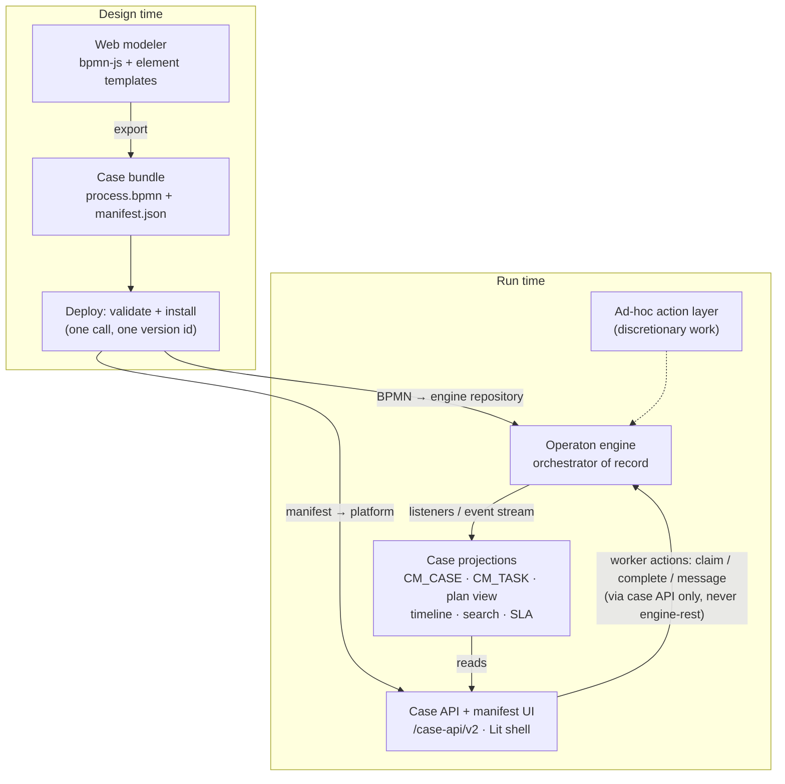

# BPMN-First Case Orchestration — Proposal

Today the platform's own plan model orchestrates and Operaton is a task-and-process utility
behind a six-method port. This document designs the inversion: processes authored in a BPMN web
modeler, Operaton driving and orchestrating them — while the declarative case model, the
declarative UI direction, and the case API contract all survive.

Status: for discussion. Companion to
[`declarative-case-ui-proposal.md`](declarative-case-ui-proposal.md) (PR #87).

## What "decoupled" means today — and what has to invert

The current architecture is deliberately platform-first. `PlanModelEvaluator` owns the case
lifecycle; the declarative case definition (stages, human tasks, milestones, JUEL criteria) is
the orchestration model; state lives in the platform's own `CM_*` tables. Operaton sits behind
`EngineGateway` — six methods, two adapters (in-process Java API, `engine-rest` + command
outbox) — and an architecture test forbids any `org.operaton.bpm.engine` type in core.
Crucially, work flows *into* the engine:

- When a `HUMAN_TASK` plan item activates, `TransitionApplier` **pushes** a task into Operaton
  and mirrors it as a `CM_TASK` row (with `engineSync` tracking).
- When a `PROCESS_TASK` activates, the platform starts a BPMN process — the engine runs a
  *segment*, the platform remains the conductor.
- Completion order runs platform-outward: validate form → complete engine task → mark `CM_TASK`
  → complete plan item → re-evaluate the model.

BPMN-first means the arrow reverses. The modeler-authored process is the orchestration model;
Operaton decides what work exists and when; and the platform's job becomes **projecting engine
state into the case contract** — worklist, plan-item view, timeline, search, SLA, permissions,
and the declarative UI all consuming projections instead of an internally-evaluated model. The
case API (`/case-api/v2`) does not change shape; what changes is who populates it.



## 1 · The modeling surface: declarative by construction

Operaton has no first-party web modeler yet (its web-app modernization is on the roadmap;
Camunda Desktop Modeler remains compatible). That is not a blocker — it is a choice between two
deliveries of the same contract:

- **Embed `bpmn-js` in a Case Studio page** — the bpmn.io toolkit Camunda's own modelers are
  built on, with a properties panel extension for the platform's vocabulary. This slots
  naturally into the "future studio" the Declarative Case UI proposal already anticipates (the
  studio edits the manifest; now it also edits the diagram).
- **Camunda Desktop Modeler + a distributed element-template catalog** as the day-one path —
  zero build effort, same authored artifact.

Either way, the declarative contract is enforced by an **element-template catalog**: a versioned
set of Camunda element templates that constrain what a modeler can express. Templates are
themselves declarative JSON — they put the platform's vocabulary into the modeler's properties
panel with validation, instead of trusting modelers to hand-type magic extension properties:

```
casemgmt-user-task template →
  casemgmt:formKey        # names a JSON Schema in the manifest (existing form machinery)
  casemgmt:queueId        # worklist routing
  casemgmt:slaTargetId    # binds the task to an SLA clock (existing SlaService)
  candidateGroups         # native BPMN — already the platform's group vocabulary

casemgmt-milestone template (on intermediate throw / none events) →
  casemgmt:milestone = "reviewed"   # projects to the milestone timeline + events

casemgmt-stage: an expanded subProcess with
  casemgmt:stage = "assessment"     # projects to the stage grouping in the plan view
```

The deploy endpoint lints the BPMN against this vocabulary — every `userTask` carries a
resolvable `formKey` or an explicit none, every milestone tag is unique, every SLA reference
resolves — the same fail-at-deploy philosophy the platform already applies to case definitions
(and the same class of check that would have caught the silent-`defKey`-typo problem, issue
#28).

## 2 · The case bundle: what stays declarative

The case definition JSON does not disappear — it sheds its `planItems` section (the BPMN now
says what work exists and when) and keeps everything the process model cannot say. One
deployable, versioned **case bundle**:

```
case-bundle/
  process.bpmn          # the orchestration model — modeler-authored, engine-executed
  manifest.json         # the case envelope — platform-interpreted:
    { "key": "complaint", "name": "Complaint",
      "processDefinitionKey": "complaint-process",
      "roles":   ["owner","handler","reviewer"],
      "forms":   { "reviewForm": { /* JSON Schema — unchanged machinery */ } },
      "slaPolicyId": "complaint-sla",
      "adHocActions": [ /* §5 — discretionary work the BPMN doesn't model */ ],
      "ui":      { /* the Declarative Case UI manifest, verbatim from that proposal */ } }
  decisions/*.dmn       # optional — Operaton executes DMN natively; gateways reference them
```

Deployment is one call: `POST /case-api/v2/case-definitions` takes the bundle, validates both
halves against each other, deploys the BPMN into Operaton and the manifest into the platform,
and mints one version id (`{tenant}:{key}:{version}`) pinning the pair. In embedded mode both
installs share a transaction; in remote mode the existing claim-token command outbox makes the
engine deploy a retried saga step — machinery the platform already trusts for engine writes.
Running instances stay on their pinned bundle; Operaton's process-instance migration API is
exposed as an admin action for deliberate upgrades.

**The Declarative Case UI proposal composes unchanged.** Its manifest was deliberately about
presentation over the case contract, not about who orchestrates. Whether the view composer reads
plan items produced by `PlanModelEvaluator` or projected from Operaton activity instances is
invisible to it — `AvailableAction` remains the action contract, now computed from engine
task/process state for BPMN-driven types.

## 3 · Concept mapping: CMMN-lite → BPMN

| Today (plan model) | BPMN-first equivalent | Fidelity |
|---|---|---|
| Case instance | Root process instance; `businessKey` = case id, engine `tenant-id` = platform tenant | Clean |
| `HUMAN_TASK` | Native `userTask` — engine creates it when flow arrives; projected into `CM_TASK` (direction inverted) | Clean |
| `PROCESS_TASK` | Dissolves — call activities / subprocesses inside the one model | Simpler |
| `MILESTONE` | Intermediate event tagged `casemgmt:milestone`; execution listener publishes the milestone event | Clean |
| `STAGE` | Expanded subprocess tagged `casemgmt:stage`; activity-instance tree projects the stage grouping | Clean |
| Entry criteria (JUEL on items/vars) | Sequence-flow conditions, event-based gateways, message/signal catches; DMN for rule-heavy gates | Different idiom, same power for *structured* flow |
| Exit criteria | Boundary events, event subprocesses (interrupting), terminate end events | Clean |
| `repetition` | Multi-instance activities, loop-back flows | Clean |
| `manualActivation` / discretionary items | **No native BPMN construct** — this is the real gap; see §5 | **Gap** |
| Case-level `required` blocking completion | Process completion is structural (all tokens consumed); case closure check stays a platform rule over projections | Split ownership |
| SLA clocks, pause/resume | Stays platform-owned (`SlaService` unchanged), bound via `casemgmt:slaTargetId`; BPMN timer events complement but don't replace it (timers can't pause) | Keep ours |
| Forms (JSON Schema) | Unchanged — `casemgmt:formKey` resolves into the manifest; validation stays at the case API on complete | Keep ours |

> **Why not CMMN, since Operaton still ships it?** Operaton inherits Camunda 7's CMMN 1.1
> runtime, and it would map our plan model almost one-to-one. Rejected deliberately: CMMN was
> already de-emphasized in late Camunda 7, tooling is effectively dead (`cmmn-js` unmaintained),
> and the Operaton community discussion treats the CMMN part as legacy to be evaluated, not
> invested in. Building the platform's future on the one part of the engine its own community is
> most likely to retire would recreate today's decoupling problem with worse odds. BPMN + a thin
> platform-owned ad-hoc layer is the durable shape.

## 4 · Runtime integration: projection, both deployment modes

The projection layer is the heart of the work — and it slots into machinery the platform already
has. The invariant to preserve: **core still imports no engine types**. Projection adapters live
beside the gateways in the engine modules; core gains only a `CaseProjectionPort` they call.

### Embedded mode (in-process engine)

- A `ProcessEnginePlugin` (in `engine-embedded`) registers task and execution listeners for the
  `casemgmt:`-tagged elements: task created/assigned/completed → upsert `CM_TASK`; stage
  subprocess entered/left → plan-view projection; milestone event → milestone timeline row.
- All of it runs **inside the engine's transaction**, and events publish through the existing
  `EventPublisher` — whose `beforeCommit` deferred flush (built for the lock-ordering fix in
  PR #82) already guarantees the append lock comes last. Projections, CloudEvents, webhooks, and
  search freshness stay exactly as consistent as today.

### Remote mode (engine-rest)

- **Commands out**: unchanged — the claim-token engine command outbox already built for remote
  mode carries claim/complete/message/deploy.
- **State in**: Camunda 7-lineage engines don't push. Two complementary channels: the
  **external-task pattern** for service work the platform executes (a `casemgmt-projection`
  worker can also be subscribed at key points), and a **history-event poller** with a durable
  cursor over the engine's history API — the same pull-cursor discipline the platform's own
  `CM_EVENT` feed already implements for its consumers, pointed the other way.
- Remote projections are eventually consistent (seconds, not milliseconds). The task worklist
  already has vocabulary for this — `engineSync` gating on `CM_TASK` exists today and simply
  gains the reverse meaning ("engine knows about it before the projection does").

### The security posture becomes load-bearing

With Operaton orchestrating, its own Tasklist/Cockpit become alternative write paths that would
bypass form validation, SLA, participants, audit, and events. The engine-rest write lockdown
hardened in PR #82 (writes reserved for the `engine:api` integration identity) graduates from
defense-in-depth to a core invariant: **workers act only through the case API**; the engine's
web apps are read/ops tooling for administrators.

## 5 · The ad-hoc layer: keeping what BPMN can't say

The one genuine loss in BPMN-first is CMMN's discretionary dynamism — work that isn't in the
flow but may be raised on a live case (today's `manualActivation` items, and any "add a task /
start a side process now" case behavior). Rather than contort the diagram, keep it declarative
in the manifest:

```json
"adHocActions": [
  { "id": "second-opinion", "label": "Request second opinion",
    "kind": "task",    "formKey": "secondOpinionForm",
    "candidateGroups": ["senior-reviewers"],
    "availableWhen": "${state == 'ACTIVE'}" },
  { "id": "escalate-fraud", "label": "Escalate to fraud",
    "kind": "process", "processDefinitionKey": "fraud-escalation",
    "roles": ["handler"] }
]
```

Mechanically this is the platform doing what it already does: an ad-hoc task is a standalone
engine task created via the existing `EngineGateway.createHumanTask` path (correlated to the
case by business key); an ad-hoc process is `startProcess`. They surface through
`AvailableAction` like every other action, render from the manifest like every other declarative
element, and project into the same worklist. BPMN escalation/message patterns remain available
for dynamism that *should* influence the flow — the ad-hoc layer is for work that deliberately
lives beside it.

## 6 · What stays, what changes, what retires

| Component | Fate | Notes |
|---|---|---|
| Case API contract (`/case-api/v2`) | Stays | Same resources; plan items become projections; `AvailableAction` semantics unchanged |
| Search, worker permissions, field masking | Stays | Providers read `CM_*` projections — indifferent to who writes them |
| EventPublisher outbox, webhooks, CloudEvents feed | Stays | Projection listeners publish through it; consumers see the same events |
| SLA service, business calendar, forms, participants, audit | Stays | Bound to BPMN elements via extension properties instead of plan-item defs |
| Engine command outbox (remote) | Stays | Gains deploy + message + migration commands |
| `EngineGateway` | Widens | Adds: deploy bundle, correlate message, activity-instance query, history cursor, instance migration |
| `TransitionApplier` task push | Inverts | Engine creates tasks; projection listener upserts `CM_TASK` |
| ETag/optimistic locking on flow actions | Narrows | Engine-owned transitions can't carry `VERSION_` semantics; task claim/complete keep idempotency keys + engine-side state checks, `If-Match` remains on platform-owned resources (case file, comments, definitions) |
| `PlanModelEvaluator` + JUEL criteria | **Retires per type** | Behind the SPI below — not deleted while plan-model case types exist |
| `planItems` in the definition JSON | **Superseded** | Replaced by `process.bpmn` for BPMN-driven types |

## Recommendation and delivery: two orchestrators behind one contract

**Introduce a `CaseOrchestration` SPI with two implementations — `plan-model` (today's
evaluator) and `bpmn` (Operaton-driven) — selected per case type by what the bundle contains
(`planItems` vs `process.bpmn`).** This is the same port-and-adapters move the platform already
made for `EngineGateway` and `SearchProvider`, and it converts a rewrite into a migration: both
orchestrators share the projections, the event outbox, the action policy, search, SLA, forms,
and the UI manifest. Existing case types keep running; new structured case types are authored in
the modeler; a plan-model type migrates when (and only when) its flow is worth a diagram.

The honest trade being accepted: for BPMN-driven types, flow truth moves into engine tables,
remote-mode projections become eventually consistent, and case dynamism narrows to the ad-hoc
layer plus BPMN's event vocabulary. In exchange: a real visual modeling surface for process
designers, engine-native versioning/migration/timers/compensation, DMN decisions, and one less
orchestration engine of our own to maintain and prove correct.

| Phase | Scope |
|---|---|
| 1 | Vocabulary + bundle: element-template catalog, bundle format, deploy endpoint with cross-validation (BPMN ↔ manifest), version pinning. No runtime change yet. |
| 2 | Embedded projection: engine plugin with listeners for tagged elements → `CM_TASK`/plan-view/milestone projections through the existing outbox; `CaseOrchestration` SPI extracted with `plan-model` as the first implementation. |
| 3 | `bpmn` orchestration implementation: case create = start root instance; ActionPolicy over engine state; ad-hoc action layer; first BPMN-driven case type end-to-end in embedded mode (the PoC complaint case re-authored as a diagram is the natural pilot). |
| 4 | Remote mode: history-cursor poller + external-task projection worker; command outbox gains deploy/message/migration; consistency semantics surfaced in the API (`engineSync`-style freshness on projections). |
| 5 | Modeling surface: Case Studio page embedding `bpmn-js` + properties panel for the template catalog (or continue with Desktop Modeler if the studio isn't yet warranted); instance-migration admin action. |

## Sources

- Operaton — [project site (Camunda 7 fork, community-driven)](https://operaton.org/) ·
  [Operaton 2.0 release](https://operaton.org/2026/03/20/operaton-2-0-released/) ·
  [roadmap (web-app modernization)](https://operaton.org/roadmap/) ·
  [FAQ](https://operaton.org/faq/)
- Operaton docs — [implemented standards (BPMN 2.0, CMMN 1.1, DMN 1.3)](https://docs.operaton.org/docs/documentation/introduction/implemented-standards/) ·
  [CMMN 1.1 reference](https://docs.operaton.org/docs/documentation/reference/cmmn11/) ·
  [forum: handling of the CMMN part](https://forum.operaton.org/t/handling-of-the-cmmn-part/69)
- Modeling — [operaton/operaton (GitHub)](https://github.com/operaton/operaton) ·
  [Operaton modeling capabilities (Camunda Desktop Modeler compatibility)](https://uubato.com/en/operaton/operaton-modeling-capabilities/) ·
  [bpmn-io/cmmn-js (archived tooling)](https://github.com/bpmn-io/cmmn-js)
- Companion proposal — [`declarative-case-ui-proposal.md`](declarative-case-ui-proposal.md) (PR #87)
