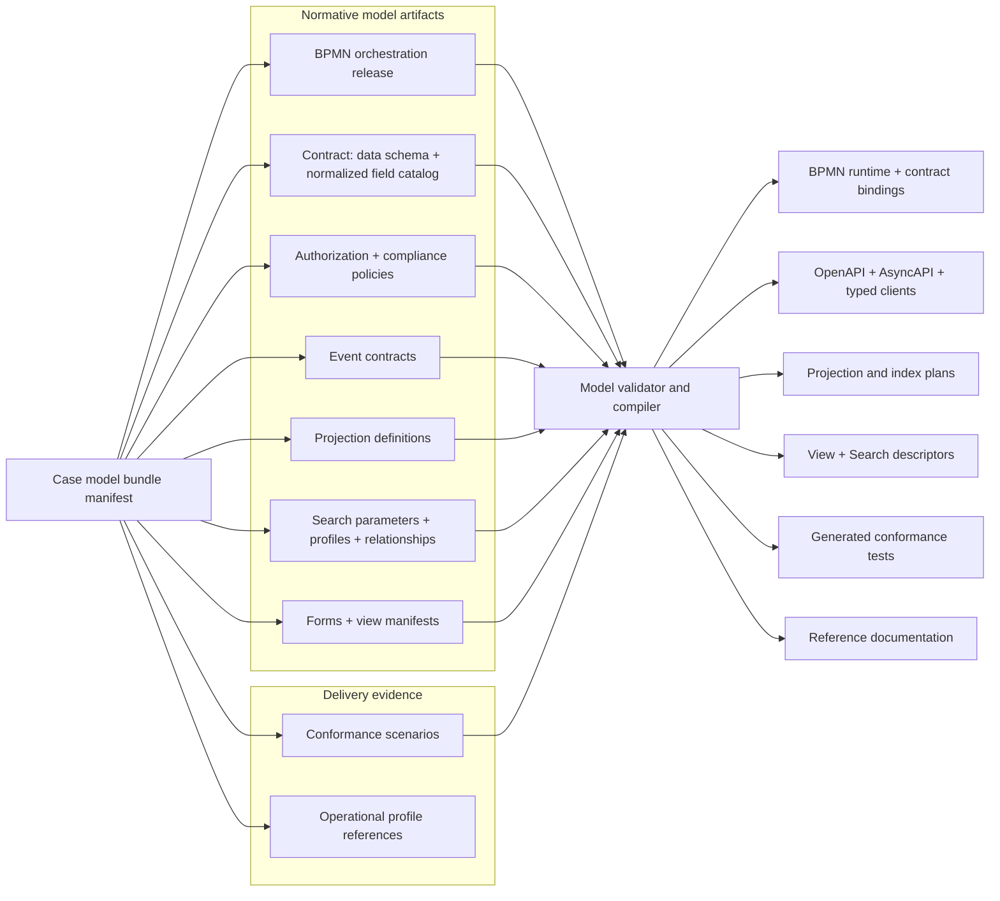
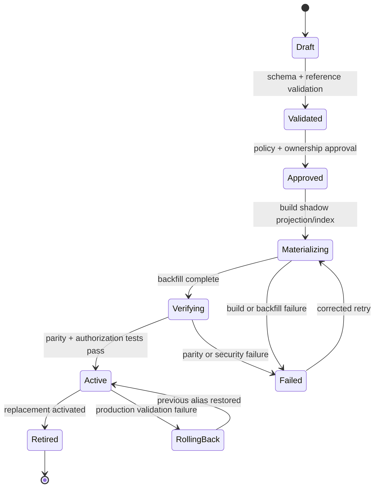

# Declarative Case Model Architecture

Status: target architecture for discussion, constrained by the implemented BPMN-only authority
boundary. Proposed artifacts beyond the published BPMN, contract, and presentation releases are
not runtime formats.

## Purpose

The declarative case model binds BPMN orchestration to data validation, authorization bindings,
search capabilities, presentation descriptors, projection plans, contracts, and conformance tests.
It must be precise enough for independent implementations and automation while remaining
understandable to domain teams. BPMN, not contract metadata, defines executable sequencing.

The source of truth is a **model bundle**, not one ever-growing YAML document. The bundle manifest
binds immutable, independently owned artifacts into one deployable case-type version.

## Design principles

| Principle | Requirement |
|---|---|
| One field source | Data shape, type, stable field id, classification, ownership, and maximum permitted use are defined once. |
| Stable public identity | APIs, UI, search, events, and policies refer to stable ids rather than storage columns or mutable JSON paths. |
| Intent before technology | The model describes query and presentation semantics; a compiler produces Oracle or other backend plans. |
| Policy by construction | Read, write, match, disclose, count, suggest, highlight, and semantic-use decisions are explicit and fail closed. |
| Immutable publication | Published bundle artifacts are content-addressed and cannot change in place. |
| Independent compatibility | Data, behavior, events, search, views, policy, and physical indexes have separate impact classifications. |
| Rebuildable discovery | Search indexes and projections are replaceable read models with provenance, lag, and rebuild contracts. |
| Host neutrality | A case model declares required frontend capabilities, never a named portal, route, token source, or theme implementation. |
| Bounded extension | Custom fields, components, composers, and providers use versioned registries and validated contracts. |

## Bundle architecture



## Suggested bundle layout

```text
case-models/widget-review/7/
  case-model.yaml
  orchestration/widget-review.bpmn
  contract/case-contract.schema.json
  contract/forms/
  presentation/views.yaml
  tests/conformance.yaml
```

The directory layout is an authoring convention. The deployable unit is a manifest plus immutable
artifact references and digests. Implementations may package it as an archive, registry object, or
signed release artifact without changing its logical contract.

```yaml
apiVersion: case-management.platform/v1alpha1
kind: CaseModelBundle
metadata:
  id: widget-review
  version: 7.0.0
  status: draft
  owner: widget-domain
compatibility:
  platform: ">=2.0 <3.0"
artifacts:
  orchestration: orchestration/widget-review.bpmn
  contract: contract/case-contract.schema.json
  presentation: presentation/views.yaml
  tests: tests/conformance.yaml
requirements:
  hostCapabilities: [navigation, notifications, file-upload, design-tokens]
  platformCapabilities: [worker-permissions, document-references, outbox]
```

## Canonical data and field catalog

`schemas/case-data.schema.json` is the only definition of case-variable structure and validation.
It uses JSON Schema 2020-12, `$defs`, `$ref`, and `unevaluatedProperties: false` where closed objects
are required. Forms reference schema fragments; they do not copy field schemas into form or UI
metadata.

The platform defines a required JSON Schema vocabulary for field-governance annotations. A validator
that does not understand the required vocabulary must reject the model rather than ignore security-
relevant annotations. The compiler normalizes these annotations into a field catalog for downstream
validation and tooling; that catalog is generated evidence, not a second authoring source.

Each governed field has a stable id that survives path changes. The normalized catalog maps the
stable id to the current JSON Pointer and defines the maximum uses any downstream profile may
request. The following YAML illustrates the compiler output, not an additional bundle artifact.

```yaml
fields:
  customer-id:
    pointer: /customer/id
    schemaRef: "schemas/case-data.schema.json#/$defs/customerId"
    owner: customer-domain
    classification: confidential
    purpose: case-handling
    policyRef: customer-identifier-policy
    mutability: create-only
    audit: value-changed
    discovery:
      queryModes: [exact]
      filterable: true
      sortable: false
      facetable: false
      suggestible: false
      highlightable: false
      resultDisclosure: masked
      semanticIndexing: forbidden
      matchRequiresRead: true

  decision-reason:
    pointer: /decision/reason
    schemaRef: "schemas/case-data.schema.json#/$defs/decisionReason"
    owner: widget-domain
    classification: confidential
    purpose: case-decision
    policyRef: decision-reason-policy
    mutability: task-output
    discovery:
      queryModes: [full-text]
      filterable: false
      sortable: false
      facetable: false
      suggestible: false
      highlightable: policy-controlled
      resultDisclosure: policy-controlled
      semanticIndexing: approval-required
      matchRequiresRead: true
```

Field-level discovery metadata is a **ceiling**, not an instruction to build an index. Search
profiles can select a permitted subset; they cannot enable a capability forbidden by the field.

Canonical field rules:

- Field ids are lowercase kebab-case, unique within the bundle namespace, and never reused.
- JSON Pointers are version-specific implementation details and are not public API parameter names.
- Nested objects and arrays define matching, replacement, and masking semantics explicitly.
- Read and write policies are distinct; discovery never implies write access.
- Classification, ownership, purpose, retention, and policy are not repeated in UI or search files.
- Derived fields declare source lineage, transformation version, freshness, and rebuild behavior.
- External fields declare a provider and are never silently persisted into authoritative case data.

## Authority boundary and contract actions

The current runtime has one transition authority. **BPMN owns sequencing, gateways, stage and
activity lifecycle, task activation, timers, and call activities.** The **contract owns** canonical
fields, forms, authorization, search and presentation metadata, explicit engine/case mappings,
typed SLA monitoring bindings, and external capabilities. `CM_TASK`, stage, milestone, and linked-
process state are projections/read models derived from engine observations; they never form a second
transition authority.

Contract actions are capabilities, not state-machine transitions. They bind input, authorization,
concurrency, idempotency, mappings, and emitted evidence. An action may invoke an allowed external
or engine operation, but its lifecycle effects are observed from BPMN rather than applied by the
contract.

```yaml
commands:
  request-review:
    inputSchemaRef: "schemas/case-data.schema.json#/$defs/approvalInput"
    authorizationPolicy: request-review-policy
    concurrency: if-match-required
    idempotency: required
    operation: correlate-message
    mapping: review-request-input
    emits: [review-requested-v1]
```

Forms, available actions, and view descriptors may reference an action id. The server recomputes
availability and authorizes every action at execution time; neither those references nor a contract
action can advance a stage, activate a task, or complete BPMN work independently.

## Search parameters and profiles

A boolean `searchable` field is insufficient. Search is decomposed into stable parameters and
context-specific profiles:

| Capability | Meaning |
|---|---|
| Query mode | Exact, prefix, contains, full-text, range, reference, relationship, or semantic matching. |
| Filter | Structured inclusion or exclusion using typed operators. |
| Sort | Use as an ordering key with defined null and collation behavior. |
| Facet | Return values and counts; may require suppression thresholds. |
| Suggest | Expose values through typeahead; often forbidden for confidential identifiers. |
| Highlight | Return a matched fragment after authorization and masking. |
| Result disclosure | Return raw, masked, derived, or no value in a result. |
| Semantic use | Embed, retrieve, summarize, or prohibit use in an AI-assisted flow. |

Search parameters have stable ids independent of current field paths. Profiles select parameters,
providers, ranking, result views, and availability behavior for one search experience.

```yaml
searchParameters:
  customer:
    version: 1
    source:
      field: customer-id
    type: token
    operators: [eq, in]
    aliases: [customerId]
    provider: case-summary
    materializationHint: tokenized-exact

  decision-text:
    version: 1
    source:
      field: decision-reason
    type: text
    operators: [full-text]
    provider: case-content

searchProfiles:
  case-workbench:
    version: 1
    scopes: [cases]
    parameters: [case-id, business-key, customer, state, updated-at, decision-text]
    defaultSort: updated-at-desc
    pagination: cursor
    rankingProfile: operational-cases-v1
    resultView: case-search-result-v1
    authorizationPolicy: case-search-policy
    availability:
      partialResults: allowed-with-warning
      essentialProviders: [case-summary]
```

The same parameter can map to `/customerId` in an older case-data version and `/customer/id` in a
newer version. Aliases support controlled API migration, but retired ids remain reserved.

Search parameters may source values from:

- Canonical case fields.
- Platform case, task, SLA, participant, and document metadata.
- Rebuildable derived fields with recorded lineage.
- Relationship edges.
- Approved external providers.
- Extracted document content in a separate governed projection.

## Relationships and discovery

Search should support discovery, not only text matching. Relationships are versioned model elements
used for related-case navigation, duplicate detection, evidence discovery, and controlled expansion.

```yaml
relationships:
  same-customer:
    from: case
    to: case
    joinParameters: [customer]
    direction: symmetric
    authorization: both-resources-visible
    uses: [related-cases, duplicate-candidate]
    maximumExpansion: 50
```

A relationship result is not authority to access the target. Both endpoints and every disclosed
edge attribute pass the same resource and field projection used by ordinary reads.

## Search authorization contract

Search policy distinguishes operations that are commonly conflated:

- **Discover:** may the caller learn that a resource or parameter exists?
- **Match:** may a query use the field to select a resource?
- **Disclose:** may the field value be returned in a result?
- **Highlight:** may a matched fragment be returned?
- **Aggregate:** may values and counts be used in facets or analytics?
- **Suggest:** may values appear before a full search is executed?
- **Export:** may the value leave the interactive search response?
- **Semantic:** may the value be embedded, retrieved, or supplied to an AI-assisted flow?

The default is that matching requires read permission. Any exception requires a named policy,
purpose, threat analysis, and negative leakage tests. Missing field decisions deny every operation;
unrestricted access requires an explicit wildcard decision.

For highly sensitive identifiers, an approved provider may materialize a keyed token for exact
matching. The plaintext value is not placed in the search projection, and the field remains
ineligible for prefix, full-text, suggestion, facet, and highlight operations. Key management,
rotation, collision handling, and reindexing are part of the provider's operating contract.

## Permission-aware Search Descriptor

The server compiles a Search Descriptor from the active profile, provider capabilities, current
field policies, and caller context. It returns only parameters and operations the caller may use.
Lit renderers use it to build filters, facets, result columns, sort menus, and related-discovery
controls without interpreting authorization rules.

```json
{
  "descriptorVersion": "1.0",
  "profile": "case-workbench",
  "parameters": [
    { "id": "state", "type": "token", "operators": ["eq", "in"], "facetable": true },
    { "id": "customer", "type": "token", "operators": ["eq"],
      "facetable": false, "suggestible": false, "resultDisclosure": "masked" }
  ],
  "sorts": ["updated-at-desc"],
  "resultView": "case-search-result-v1",
  "pagination": "cursor"
}
```

The target API adds `GET /search/capabilities?profile={id}` or an equivalent view-composer resource.
It is a target contract, not an endpoint implemented by the current repository. Descriptors are
caller-specific and initially use `Cache-Control: private, no-store`; later validators must include
the profile, provider, model, locale, and authorization-policy revisions.

Search requests use stable parameter ids and a typed expression tree rather than an arbitrary map
of backend-specific filters:

```json
{
  "profile": "case-workbench",
  "text": "late review",
  "where": {
    "all": [
      { "parameter": "state", "operator": "in", "value": ["open", "in-review"] },
      { "parameter": "customer", "operator": "eq", "value": "customer-42" }
    ]
  },
  "sort": ["updated-at-desc"],
  "cursor": null,
  "limit": 25
}
```

The query compiler rejects undeclared parameters, unsupported operators, type mismatches, and
unauthorized operations before invoking a provider. Result metadata uses authorized parameter ids,
not raw JSON paths. Total counts may be omitted, rounded, or suppressed when expensive or sensitive.

## Projection and physical index planning

Search semantics stay vendor-neutral. A compiler combines parameter operations, data shape,
cardinality hints, provider capabilities, and the deployment profile to generate a reviewable
physical plan.

For the Oracle deployment profile, likely strategies include:

| Search need | Candidate physical strategy |
|---|---|
| Exact or range query on selected scalar fields | Relational projection column with B-tree or function-based index. |
| Repeated scalar values in arrays | Multivalue JSON index or normalized child projection. |
| Approved ad-hoc structural and full-text JSON queries | JSON search index or Oracle Text projection. |
| Heavy cross-domain relevance and aggregation | Optional external search projection, justified separately. |

Physical index names, DDL, analyzer configuration, partitioning, and backend aliases are generated
deployment artifacts. They do not appear in the domain-authored model.

Every projection mapping declares source events or authoritative snapshot source, key, transformation
version, tombstone handling, idempotency, checkpoint, rebuild procedure, provenance, and maximum lag.

## Activation lifecycle

Publishing a model does not make a new search profile immediately queryable. Activation waits for
policy approval, materialization, backfill, parity tests, and an atomic alias or registry switch.



Activation requirements:

- Existing active profile remains available while a shadow version builds.
- Backfill and replay are idempotent and multi-instance safe.
- Parity tests compare expected resources, ordering, masking, facets, and deletion behavior.
- Permission changes are tested independently from data and index changes.
- Rollback restores the previous descriptor and physical alias without rewriting case instances.
- Privacy deletion, retention expiry, and document removal propagate to every derived index.

## Versioning and impact analysis

Semantic versioning alone cannot describe operational impact. The compiler produces an impact report
for each bundle change:

| Impact axis | Examples |
|---|---|
| Data | Required field, type change, path move, default, migration. |
| Behavior | BPMN sequence, gateway, task, timer, call activity, criterion, decision. |
| Contract | API input/output, event schema, search parameter, descriptor primitive. |
| Policy | Read/write/discovery policy or classification change. |
| Projection | Mapping, source event, rebuild, tombstone, lag objective. |
| Physical index | New index, backfill, analyzer/tokenization change, alias switch. |
| Experience | View, form, label, accessibility, or component contract. |

A path move with an unchanged stable field id may be API-compatible but still require data migration
and reindexing. Enabling facets on an existing field may be a non-breaking query-contract change but
still require policy approval, physical materialization, and leakage tests.

## Experience integration

The UI model references canonical field ids, command ids, view ids, and search profile ids. It never
defines another data schema or grants field access.

The server-composed View API may include a `search` primitive that references an authorized Search
Descriptor. Typical uses include a global workbench, a related-cases section, a document evidence
picker, and a reference-data selector. The same descriptor works in standalone and embedded Lit
renderers; host adapters supply only normalized shell capabilities.

## Validation and generated evidence

Model validation runs before publication and includes:

- JSON Schema validation for every artifact.
- Digest and immutable-reference verification.
- Stable-id uniqueness, reserved-id, alias, and deprecation checks.
- Cross-reference checks across BPMN, fields, contract actions, events, projections, search, views, and tests.
- Static criterion and transformation symbol validation.
- Policy checks that downstream capabilities never exceed field ceilings.
- Search operator/type compatibility and provider capability checks.
- Projection rebuild completeness, deletion, tombstone, and source-event checks.
- Host-capability compatibility without named-host configuration in the model.

Generated conformance evidence includes positive and negative command tests, field read/write tests,
search match/disclose/facet/suggestion/highlight tests, descriptor masking tests, projection replay,
schema-evolution fixtures, accessibility checks, and model-to-artifact traceability.

## Current implementation boundary

The repository accepts BPMN orchestration plus versioned contract and presentation releases. BPMN
is the executable lifecycle authority. Engine observations build the task, activity/stage,
milestone, and linked-process projections; they are not independently materialized definition
state. The contract already supplies canonical fields, forms, authorization, search/presentation
metadata, mappings, typed SLA bindings, and declarative external capabilities. The broader bundle,
field-catalog compiler, search-parameter compiler, Search Descriptor, and generated-evidence
contracts above remain proposed.

Recommended delivery order:

1. Publish the bundle meta-schema, field vocabulary, normalized catalog contract, reference rules,
   and validator without changing
   runtime behavior.
2. Introduce the canonical case-data schema and validate variables, form references, criteria, and
   command input/output against stable field ids.
3. Compile search parameters and profiles into provider registrations, projection plans, typed query
   validation, and permission-aware Search Descriptors.
4. Implement governed projection activation, backfill, parity, rollback, and privacy propagation.
5. Add the server-composed View API and Lit renderer over the same canonical field and policy model.
6. Add relationships and optional semantic discovery only after the structured path is proven.

## Acceptance criteria

- A case type is published as an immutable bundle validated by a machine-readable meta-schema.
- Data, UI, search, events, permissions, and tests reference one canonical stable field catalog.
- No field becomes matchable, disclosable, facetable, suggestible, highlightable, or embeddable through
  a boolean shortcut or an implicit provider default.
- A caller receives only authorized Search Descriptor parameters and operations.
- Search requests reject unknown or unauthorized parameters before provider execution.
- Search profile changes activate only after backfill, parity, and negative authorization tests pass.
- Existing case and search versions remain resolvable during migration and rollback.
- Named portal configuration is absent from the case model; only required host capabilities remain.

## Primary references

- [JSON Schema 2020-12 specification](https://json-schema.org/specification)
- [JSON Schema custom vocabularies](https://json-schema.org/draft/2020-12/draft-bhutton-json-schema-00#section-6.5)
- [HL7 FHIR SearchParameter](https://hl7.org/fhir/searchparameter.html)
- [OData Capabilities Vocabulary](https://docs.oasis-open.org/odata/odata-vocabularies/v4.0/odata-vocabularies-v4.0.html)
- [Oracle JSON indexing guidance](https://docs.oracle.com/en/database/oracle/oracle-database/26/adjsn/overview-performance-tuning-json.html)
