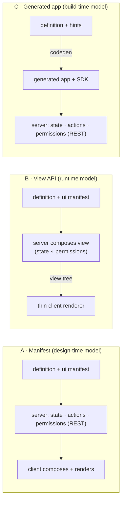

# Declarative Case UI — Proposal

We already have a declarative *behavioral* case model. This document maps the gap to a declarative
*presentation* model — where the front-end renders most case logic from the model, with pro-code
escape hatches — surveys how five competitors solved it, and puts forward three architectures.

Status: for discussion. Revision 2 (reassessed against the vendor-neutral portal integration in
PR #86 / commit `1a51cea`).

## What we have today — and what "declarative" currently stops at

The platform's case definition is already a declarative document: one JSON artifact per case type,
versioned on deploy, interpreted at runtime by `PlanModelEvaluator`. It answers **what work exists
and when it becomes available**. It does not answer **what the screen looks like** — the Lit
web-components shell hand-codes two generic panels and knows nothing about any particular case type.

| Layer | Declarative today? | Where it lives |
|---|---|---|
| Work model | Yes | Plan items: stages, human tasks, milestones, process tasks; entry/exit criteria (sandboxed JUEL); required / manual-activation / repetition semantics |
| Form validation | Yes | JSON Schema per `formKey`, enforced server-side on task completion (422 with RFC 6901 pointers) |
| Actions | Yes (runtime) | `AvailableAction`: server computes `action / name / href / method / formKey` per resource — a renderer never guesses what a caller may do |
| Authorization | Yes (runtime) | Worker-permission evaluator with per-field masking, already applied inside search providers |
| Form rendering | No | Schema validates payloads; nothing renders it. No uiSchema, no widget hints, no layout |
| Case data model | No | `vars` is an untyped bag; criteria reference it blind, the UI can't render what it can't name |
| Views & layout | No | No summary panel model, no tabs/sections, no worklist column config, no per-type theming or labels |
| Front-end | No | Hand-coded Lit shell (generic case list + task list) behind `PortalAdapter` — one vendor-neutral embedded host contract (`window.CASE_MANAGEMENT_HOST`) plus standalone |

So the honest answer to "did we implement a declarative case model?" is: **the engine half, yes;
the experience half, no.** The good news is that the two hardest prerequisites for a model-driven
UI — server-computed available actions and server-side field-level authorization — already exist.
Most vendors had to retrofit those.

## How the market solved it

Five relevant systems, read for one question: *where does the UI model live, and what happens when
the model isn't enough?*

| Platform | UI model lives | Composed | Pro-code escape hatch | Takeaway for us |
|---|---|---|---|---|
| Pega Constellation | View rules (metadata) on the server | Runtime, server-side — DX API v2 returns data + UI metadata per case/assignment | Custom DX components registered in the client engine; own front-end against the same API | The purest server-driven-UI play; one API serves web, mobile, and embedded renderers |
| ServiceNow (UI Builder) | Declarative pages + components, design time | Design time; client interprets page config | Custom Next Experience (web) components dropped into declarative pages; declarative actions | Design-time page model + component registry is enough for most workspace UIs |
| Appian Case Mgmt Studio | Out-of-box record types + SAIL interfaces, configured no-code | Design time (Studio) over a fixed app skeleton | Drop to low-code SAIL / process models beneath the studio layer | "Configurable product, escape to the platform beneath" — fast start, bounded ceiling |
| Salesforce OmniStudio | FlexCards / OmniScripts as JSON metadata | Design time; embeddable anywhere a Lightning page renders | Custom LWCs inside cards/scripts; Apex behind integration procedures | Small composable UI units embed well in someone else's portal — our exact situation |
| Flowable Work | Case model carries "case pages" + form model | Design time; generic Work UI interprets | Custom form components; build your own UI on the REST API | Closest to our stack: CMMN-lite model extended with view artifacts, one generic renderer |

Backbase — the nearest banking-portal analogue — is the counter-example: journeys are **pro-code
Angular micro-frontends that are configurable**, not model-rendered. That is the trade every vendor
makes somewhere on one axis: **where model-driven ends and code begins.** The three proposals below
are three defensible positions on that axis.

## Design goals

- **Model-first rendering:** a new case type ships a working UI with zero front-end code —
  worklist, case page, task forms, actions.
- **Pro-code where it matters:** a team can replace any rendered region with its own component
  without forking the shell.
- **One authorization story:** what a worker may see and do is decided server-side, once — never
  re-derived in a client.
- **Versioned with the case:** UI definitions deploy, version, and roll back exactly like the
  behavioral model (`{tenant}:{key}:{version}`).
- **Portal-embeddable, vendor-neutral:** everything renders through the existing Lit shell and
  `PortalAdapter` contract — any enterprise host via `window.CASE_MANAGEMENT_HOST`, or standalone.

The three proposals differ in exactly one thing: *where* the case model, live instance state, and
worker permissions are composed into a renderable UI — in the client (A), in the server per request
(B), or once at build time (C). Everything downstream of that choice follows.



## Proposal A — Case App Manifest (design-time model, client-interpreted)

**Thesis:** extend the case definition with a presentation section; the Lit shell becomes a generic
interpreter of it.

The definition JSON (or a versioned sibling artifact deployed with it) gains a `ui` section: a
typed data schema for `vars`, a summary layout, detail sections, worklist columns, per-form
uiSchema, and action placement. The shell stops being two hand-coded panels and becomes one
renderer that walks the manifest, calls the existing REST API for state, and honors
`AvailableAction` for every button it draws.

```json
"ui": {
  "dataSchema": { "amount": {"type":"number","format":"currency"},
                  "customerId": {"type":"string","label":"Customer"} },
  "summary":   { "fields": ["businessKey","state","amount","slaStatus"] },
  "sections": [
    { "id":"work",  "title":"Work",     "component":"plan-tree" },
    { "id":"docs",  "title":"Documents","component":"document-list" },
    { "id":"risk",  "title":"Risk",     "component":"acme-risk-panel" }
  ],
  "worklist":  { "columns": ["businessKey","title","assignee","slaStatus"] },
  "forms":     { "reviewForm": { "uiSchema": { "note": {"widget":"textarea"} } } }
}
```

**Pro-code escape hatch:** a component registry. Any `component:` value the shell doesn't recognize
resolves through `customElements` — the host registers a web component implementing a small slot
contract (`case`, `planItem`, api client, `PortalAdapter`). Unknown or failed components fall back
to the built-in renderer, so a manifest never hard-breaks a screen. This is ServiceNow's UI Builder
pattern and OmniStudio's LWC-in-FlexCard pattern, done with the web-components standard we already
ship.

**Strengths**
- No new runtime — one deployable artifact, versioned and rolled back with the behavioral model
- Authorable offline; a future studio/designer edits a document, not a system
- Smallest server change of the three (validation of the `ui` section on deploy)

**Costs**
- The client composes model + state + permissions itself — field masking must be re-honored in
  every renderer
- Manifest vocabulary tends to grow into a bad programming language; needs a hard scope line
- Every deployed manifest couples to the shell's interpreter version — upgrades ripple

Closest analogues: ServiceNow UI Builder, Salesforce OmniStudio, Flowable case pages.

## Proposal B — Composed View API (runtime model, server-driven UI)

**Thesis:** the server merges definition, instance state, and worker permissions into a
render-ready view tree; the client is a thin interpreter of ~15 primitives.

A new endpoint — `GET /case-api/v2/cases/{id}/view` (plus `/worklist/view`, `/tasks/{id}/form`) —
returns a fully composed descriptor: components, props, data *inline*, and actions attached where
they render. It is the natural completion of two contracts we already keep: `AvailableAction`
("everything a renderer needs on first read") and the worker-permission evaluator's field masking,
which today protects search results but not case pages. The composer is the one place both are
enforced.

```json
{ "type": "casePage", "title": "Widget Review · WR-0042",
  "children": [
    { "type": "summary", "fields": [
        { "id":"amount", "label":"Amount", "value":"€ 12,400", "format":"currency" },
        { "id":"slaStatus", "value":"WARNING", "semantic":"warning" } ] },
    { "type": "planTree", "items": [ "..." ],
      "actions": [ { "action":"start", "href":"...", "method":"POST" } ] },
    { "type": "acme-risk-panel", "props": { "caseId":"..." } }
  ] }
```

**Pro-code escape hatches, two layers:** server-side *view composers* — a Java SPI mirroring
`SearchProvider` (`ViewComposer.compose(caseSnapshot, caller)`) so a team contributes computed
sections (a risk score, an external-system panel) in code the platform orchestrates; and the same
client component registry as Proposal A for custom rendering of any descriptor type. A team that
wants full control ignores the shell entirely and consumes the view API from its own front-end —
the payload is the product, exactly Pega's DX API posture.

**Strengths**
- Permissions and masking enforced once, server-side — a field a worker may not see never leaves
  the building
- Logic changes land without redeploying any front-end; portal, mobile, and future channels
  consume one payload
- Thinnest possible client — best fit for embedding in portals we don't own

**Costs**
- The descriptor vocabulary is a public contract; versioning it is real work
- Chattier: a view round-trip per screen; needs caching + ETag discipline (we have ETags)
- Presentation logic migrates into the server — a cultural shift, and harder to preview in a
  designer without a running instance

Closest analogue: Pega Constellation / DX API v2 — the strongest reference implementation of this
pattern in case management.

## Proposal C — Generated App + Headless SDK (build-time model, pro-code-first)

**Thesis:** the model compiles to typed front-end code a team then owns; declarative at authoring
time, plain code at runtime.

Keep the behavioral model lean and add only minimal UI hints. A CLI (`casemgmt generate`) compiles
a definition into typed TypeScript: interfaces for `vars`, a form component per JSON Schema, a
routed case page and worklist assembled from a **headless SDK** — stores and controllers wrapping
the REST API, `AvailableAction`, and the event feed, with zero rendering opinions. The generated
app is a starting point the team edits; regeneration flows through git as an ordinary diff
(protected regions, or a base-branch merge like OpenAPI generators).

```
$ casemgmt generate --definition widget-review@7 --out apps/widget-review
  ✓ types/WidgetReviewVars.ts        # from ui.dataSchema
  ✓ forms/ReviewForm.ts              # from forms.reviewForm JSON Schema
  ✓ pages/case-page.ts, worklist.ts  # composed from @casemgmt/sdk primitives
  → edit anything; `generate --update` merges model changes as a git diff
```

**Pro-code escape hatch: everything, trivially** — it is code. The discipline problem inverts:
instead of asking "can we customize?", we must ask "how do N customized apps absorb model
changes?" The answer is the SDK boundary: generated code may only touch the API through
`@casemgmt/sdk`, so platform upgrades ship as an npm bump, and regeneration only touches the
declaratively-owned files.

**Strengths**
- Maximal flexibility and native performance; type-safe against the case's actual data model
- No runtime interpreter to build, version, or debug — the simplest platform surface
- Fits teams that already build pro-code portal front-ends (the Backbase-journey model)

**Costs**
- Model changes require a front-end build + deploy — business users never self-serve
- Drift: N generated apps age at N different rates against the platform
- "Render most of the case logic from the model" is only true on day one; it decays with every
  manual edit

Closest analogues: Backbase journeys (pro-code configurable), OpenAPI client generation applied to
UI, OutSystems-style scaffolding.

## Comparison

| Criterion | A · Manifest | B · View API | C · Generated |
|---|---|---|---|
| New case type → working UI, no FE code | Yes | Yes | Day one only |
| Change logic without FE deploy | Yes | Yes | No |
| Field-level authz enforced once | Client must re-honor | Server, by construction | Client must re-honor |
| Pro-code ceiling | Component slots | Slots + composers + own FE | Unlimited |
| Server investment | Small | Large (composer + contract) | Small |
| Front-end investment | Large (interpreter) | Small (thin renderer) | Medium (SDK + codegen) |
| Future no-code studio fits on top | Naturally (edits the manifest) | Yes (authors composer input) | Poorly |
| Multi-channel (portal/mobile) reuse | Per-client interpreter | One payload | Per-app |

## Recommendation

**Take B as the destination, A as the authoring format, and the component registry as the shared
escape hatch.** The manifest of Proposal A becomes the *input* the Proposal B composer consumes —
authored at design time, versioned with the definition, but merged with state and permissions on
the server, where our field masking and `AvailableAction` discipline already live. Proposal C's
headless SDK is worth building regardless (the thin renderer needs it anyway), but as an
integration option for teams that opt out — not the platform's main path.

This is deliberately the Pega-shaped answer with a ServiceNow-shaped authoring story: in a bank,
the argument that wins is that *a field a worker may not see never reaches the browser* — and only
B gives that by construction.

| Phase | Scope |
|---|---|
| 1 | Define the `ui` manifest section + deploy-time validation; typed `dataSchema` for `vars` (also fixes silent-typo criteria against undeclared vars, issue #28). |
| 2 | View composer service + `/view` endpoints behind the descriptor vocabulary (~15 primitives, versioned like the OpenAPI contract); thin renderer replaces the hand-coded panels in the Lit shell. |
| 3 | Component registry contract for custom elements (client) and `ViewComposer` SPI (server); conformance tests that assert masked fields never appear in any view payload. Give the embedded-host global the same treatment: export and document the `CASE_MANAGEMENT_HOST` contract type, since custom components will receive it. |
| 4 | Headless `@casemgmt/sdk` extracted from the renderer for opt-out teams; optional codegen on top if demand appears. |

## Revision 2 — reassessed against vendor-neutral portal integration

Since the first revision, main merged PR #86: the two vendor-specific portal adapters collapsed
into one generic `EmbeddedPortalAdapter` behind `window.CASE_MANAGEMENT_HOST`, and
organization-specific terminology left the docs. Three consequences for this proposal, none of
which change the recommendation:

- **It strengthens Proposal B.** The platform is now positioned as a product for *any* enterprise
  host, not one bank's two portals. One server-composed view payload consumed by N vendor-neutral
  hosts is exactly the multi-host story; per-host generated apps (Proposal C) multiply instead.
- **The manifest and descriptor vocabularies must be vendor-neutral from day one.** Component
  names, action ids, and theming hooks in the `ui` section follow the same rule the adapters just
  adopted: generic contract, host-specific behavior injected through the adapter — never named in
  the model.
- **The host contract is now a dependency of the escape hatch.** Custom components registered by a
  host will need typed access to the same normalized contract; today `CASE_MANAGEMENT_HOST`'s
  shape is neither exported nor documented (flagged in the PR #86 review). Folded into Phase 3
  above.

## Sources

- Pega — [Digital Experience (DX) API](https://community.pega.com/digital-experience-api) ·
  [Constellation DX API](https://academy.pega.com/topic/constellation-dx-api/v2) ·
  [Constellation architecture explained](https://medium.com/@harshsonionline/pega-constellation-architecture-explained-c1bbccba53e2)
- ServiceNow — [UI Builder](https://www.servicenow.com/products/ui-builder.html) ·
  [Declarative Actions guide](https://www.servicenow.com/community/developer-blog/declarative-actions-in-servicenow-the-complete-guide/ba-p/2781607)
- Appian — [Case Management Studio overview](https://docs.appian.com/suite/help/25.4/case-management-studio-overview.html) ·
  [Low-code configurations](https://docs.appian.com/suite/help/24.3/cms-low-code-configurations.html)
- Salesforce — [OmniStudio FlexCards](https://trailhead.salesforce.com/content/learn/modules/omnistudio-flexcard-fundamentals/get-to-know-omnistudio-flexcards) ·
  [Building Forms decision guide](https://architect.salesforce.com/docs/architect/decision-guides/guide/build-forms)
- Flowable — [Case Views](https://documentation.flowable.com/latest/reactmodel/cmmn/concept/case-view) ·
  [CMMN solution](https://www.flowable.com/solutions/cmmn)
- Backbase — [Journey architecture](https://manishpathak99.medium.com/backbase-journey-architecture-ac24672c5fa7) ·
  [Micro-frontends at Backbase](https://engineering.backbase.com/2024/05/15/maintaining-legacy-code-with-micro-frontends/)
