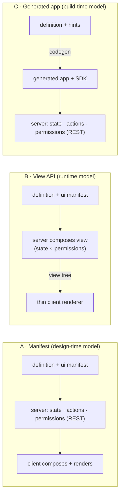

# Declarative Case UI — Proposal

We already have a declarative *behavioral* case model. This document maps the gap to a declarative
*presentation* model — where the front-end renders most case logic from the model, with pro-code
escape hatches — surveys how five competitors solved it, and puts forward three architectures.

The target authoring structure, canonical field model, search profiles and artifact boundaries are
defined in [`declarative-case-model-architecture.md`](declarative-case-model-architecture.md). The UI
manifest is one artifact in that bundle; it is not another source of data or authorization truth.

Status: **Scenario A selected for implementation.** Revision 5 records the client-interpreted
manifest as the platform architecture. Proposals B and C remain below only as decision history;
they are not implementation instructions.

## What we have today — and what "declarative" currently stops at

The platform's case definition is already a declarative document: one JSON artifact per case type,
versioned on deploy, interpreted at runtime by `PlanModelEvaluator`. It answers **what work exists
and when it becomes available**. It does not answer **what the screen looks like** — the Lit
web-components shell hand-codes two generic panels and knows nothing about any particular case type.

| Layer | Declarative today? | Where it lives |
|---|---|---|
| Work model | Yes | Plan items: stages, human tasks, milestones, process tasks; entry/exit criteria (sandboxed JUEL); required / manual-activation / repetition semantics |
| Form validation | Yes | JSON Schema per `formKey`, enforced server-side on task completion (422 with RFC 6901 pointers) |
| Actions | Yes (runtime) | `AvailableAction`: server computes `action / name / href / method / formKey` per resource — a renderer never guesses what a caller may do |
| Authorization | Partial (runtime) | Worker-permission evaluator provides resource and field decisions. Search and collaboration responses apply local masking, but ordinary case responses still expose the complete `variables` map and there is no central field-projection service yet |
| Form rendering | No | Schema validates payloads; nothing renders it. No uiSchema, no widget hints, no layout |
| Case data model | No | `vars` is an untyped bag; criteria reference it blind, the UI can't render what it can't name |
| Views & layout | No | No summary panel model, no tabs/sections, no worklist column config, no per-type theming or labels |
| Front-end | No | Hand-coded Lit shell (generic case list + task list) behind `PortalAdapter` — one vendor-neutral embedded host contract (`window.CASE_MANAGEMENT_HOST`) plus standalone |

So the honest answer to "did we implement a declarative case model?" is: **the engine half, yes;
the experience half, no.** Server-computed available actions are a strong foundation. The worker-
permission evaluator is also a useful foundation, but its field semantics and endpoint coverage
must be completed before the platform can claim that restricted fields never reach a client. That
completion is a prerequisite for the server-composed architecture below, not an existing guarantee.

## How the market solved it

Five relevant systems, read for one question: *where does the UI model live, and what happens when
the model isn't enough?*

| Platform | UI model lives | Composed | Pro-code escape hatch | Takeaway for us |
|---|---|---|---|---|
| Pega Constellation | View rules (metadata) on the server | Runtime, server-side — DX API v2 returns data + UI metadata per case/assignment | Custom DX components registered in the client engine; own front-end against the same API | The purest server-driven-UI play; one API serves web, mobile, and embedded renderers |
| ServiceNow (UI Builder) | Declarative pages + components, design time | Design time; client interprets page config | Custom Next Experience (web) components dropped into declarative pages; declarative actions | Design-time page model + component registry is enough for most workspace UIs |
| Appian Case Mgmt Studio | Out-of-box record types + SAIL interfaces, configured no-code | Design time (Studio) over a fixed app skeleton | Drop to low-code SAIL / process models beneath the studio layer | "Configurable product, escape to the platform beneath" — fast start, bounded ceiling |
| Salesforce OmniStudio | FlexCards / OmniScripts as JSON metadata | Design time; embeddable anywhere a Lightning page renders | Custom LWCs inside cards/scripts; Apex behind integration procedures | Small composable UI units embed well in someone else's portal — our exact situation |
| Flowable Work | Case model carries "case pages" + form model | Design time; generic Work UI interprets | Custom form components; build your own UI on the REST API | Closest to our stack: CMMN-lite model extended with view artifacts, one generic renderer |

Backbase — the nearest banking-portal analogue — is the counter-example: journeys are **pro-code
Angular micro-frontends that are configurable**, not model-rendered. That is the trade every vendor
makes somewhere on one axis: **where model-driven ends and code begins.** The three proposals below
are three defensible positions on that axis.

## Design goals

- **Model-first rendering:** a new case type ships a working UI with zero front-end code —
  worklist, case page, task forms, actions.
- **Pro-code where it matters:** a team can replace any rendered region with its own component
  without forking the shell.
- **One authorization story:** what a worker may see and do is decided server-side, once — never
  re-derived in a client. Field projection is centralized, defaults to deny, and is applied after
  every platform or extension composer has contributed data.
- **Versioned with the case:** UI definitions deploy, version, and roll back exactly like the
  behavioral model (`{tenant}:{key}:{version}`).
- **Portal-embeddable, vendor-neutral:** everything renders through the existing Lit shell and
  `PortalAdapter` contract — any enterprise host via `window.CASE_MANAGEMENT_HOST`, or standalone.
- **Semantic and channel-neutral:** descriptors carry canonical values, bindings, localization
  keys, and semantic formatting hints rather than preformatted web strings.
- **Governed extension model:** custom components and composers are trusted, registered deployment
  units with bounded capabilities, versioned contracts, and observable failure behavior.
- **One canonical field model:** forms, views, search, events, projections and policies reference
  stable field ids from the case-data catalog instead of copying types, paths or classifications.
- **Descriptor-driven discovery:** search and related-resource controls render from a caller-specific
  Search Descriptor compiled by the server from search profiles and field policy.

The three proposals differ in exactly one thing: *where* the case model, live instance state, and
worker permissions are composed into a renderable UI — in the client (A), in the server per request
(B), or once at build time (C). Everything downstream of that choice follows.



## Proposal A — Case App Manifest (design-time model, client-interpreted)

**Thesis:** extend the case definition with a presentation section; the Lit shell becomes a generic
interpreter of it.

The model bundle gains a view-manifest artifact containing summary layout, detail sections, worklist
columns, per-form `uiSchema`, search-profile placement and action placement. The canonical case-data
schema remains a separate bundle artifact; its governance annotations compile into the shared field
catalog used by UI, search, policy, and contract tooling. The shell stops being two hand-coded panels
and becomes one renderer that walks the manifest, calls the existing REST API for state, and honors
`AvailableAction` for every button it draws.

```json
{
  "data": {
    "schemaRef": "schemas/case-data.schema.json"
  },
  "ui": {
    "summary":   { "fields": ["system:business-key", "system:state",
                                 "field:amount", "system:sla-status"] },
    "sections": [
      { "id":"work",  "title":"Work",     "component":"plan-tree" },
      { "id":"docs",  "title":"Documents","component":"document-list" },
      { "id":"risk",  "title":"Risk",     "component":"risk-panel" },
      { "id":"related", "title":"Related cases", "component":"search",
        "searchProfile":"related-cases" }
    ],
    "worklist":  { "searchProfile":"case-workbench",
                    "columns": ["system:business-key", "system:title",
                                "system:assignee", "system:sla-status"] },
    "forms":     { "reviewForm": { "uiSchema": { "note": {"widget":"textarea"} } } }
  }
}
```

**Pro-code escape hatch:** a governed component registry. A manifest may reference only a logical
component id that is allowlisted for that platform deployment and case type. The registry maps that
id and an explicit contract version to a reviewed custom element. It validates component properties
against a schema and supplies only masked input data plus a case-scoped capability facade. It does
not pass an access token, unrestricted API client, or raw `PortalAdapter` contract to a component.
Unknown, incompatible, or failed components fall back to a built-in error or generic renderer so a
manifest does not hard-break the whole screen.

Custom components execute as trusted application code and follow the normal source review, signing,
release, CSP, Trusted Types, audit, and vulnerability-management controls. A component contributed
by an untrusted party requires a separate sandbox boundary, such as a restricted cross-origin iframe;
`customElements` alone is not a security boundary. This preserves the useful ServiceNow and
OmniStudio component-registry pattern without allowing a manifest author to select arbitrary
privileged code.

### Strengths

- No new runtime — one deployable artifact, versioned and rolled back with the behavioral model
- Authorable offline; a future studio/designer edits a document, not a system
- Smallest server change of the three (validation of the `ui` section on deploy)

### Costs

- The client composes model + state + permissions itself — field masking must be re-honored in
  every renderer
- Manifest vocabulary tends to grow into a bad programming language; needs a hard scope line
- Every deployed manifest couples to the shell's interpreter version — upgrades ripple

Closest analogues: ServiceNow UI Builder, Salesforce OmniStudio, Flowable case pages.

## Proposal B — Composed View API (runtime model, server-driven UI)

**Thesis:** the server merges definition, instance state, and worker permissions into a
render-ready view tree; the client is a thin interpreter of ~15 primitives.

A new endpoint — `GET /case-api/v2/cases/{id}/view` (plus `/worklist/view`, `/tasks/{id}/form`) —
returns a composed representation with canonical data and actions separated from the presentation
tree. View nodes bind to authorized data by RFC 6901 JSON Pointer. The server may attach action
references where they render, but the canonical action definition remains in one top-level list.
This avoids duplicating data, preserves numeric and temporal types, and lets each channel apply its
own locale, accessibility, and design-system behavior.

It is the natural completion of two contracts we already keep: `AvailableAction` ("everything a
renderer needs on first read") and the worker-permission evaluator. The latter currently protects
selected search and collaboration responses but not ordinary case variables. The composed endpoint
may be introduced only after the centralized authorization prerequisite below is complete.

```json
{
  "descriptorVersion": "1.0",
  "definitionRef": "default:widget-review:7",
  "locale": "en-GB",
  "data": {
    "case": {
      "id": "case-42",
      "businessKey": "WR-0042",
      "variables": { "amount": 12400 },
      "slaStatus": "WARNING"
    },
    "planItems": ["..."],
    "searchDescriptors": {
      "related-cases": {
        "profile": "related-cases",
        "parameters": ["relationship", "state"],
        "sorts": ["updated-at-desc"],
        "pagination": "cursor"
      }
    },
    "actions": [
      { "id": "start-review", "action": "start", "href": "...", "method": "POST" }
    ]
  },
  "view": {
    "type": "casePage",
    "title": { "key": "case.widgetReview.title", "args": { "businessKey": "WR-0042" } },
    "children": [
      { "type": "summary", "fields": [
          { "id": "amount", "labelKey": "case.amount",
            "bind": "/data/case/variables/amount",
            "format": { "type": "currency", "currency": "EUR" } },
          { "id": "slaStatus", "bind": "/data/case/slaStatus",
            "semantic": "warning" }
      ] },
      { "type": "planTree", "itemsBind": "/data/planItems",
        "actionRefs": ["start-review"] },
      { "type": "search", "descriptorBind": "/data/searchDescriptors/related-cases" },
      { "type": "extension", "componentId": "risk-panel",
        "contractVersion": "1", "props": { "caseId": "case-42" } }
    ]
  }
}
```

**Pro-code escape hatches, two layers:** server-side *view composers* — a Java SPI mirroring
`SearchProvider` (`ViewComposer.compose(scopedSnapshot, context)`) so a team contributes computed
sections (a risk score, an external-system panel) in code the platform orchestrates; and the same
governed client component registry as Proposal A. A team that wants full control can ignore the shell
and consume the view API from its own front-end. The API representation, rather than a particular
renderer, is the product boundary.

### Authorization composition prerequisite

Proposal B's security claim depends on one field-authorization contract used by every API response,
not a collection of provider-specific helper methods:

- Every field has a canonical resource-relative identifier expressed as an RFC 6901 JSON Pointer;
  nested objects and array elements have defined matching semantics.
- Read and write decisions are separate. A field visible in a descriptor is not automatically
  writable through a form or command.
- A missing or empty `allowedFields` decision means no fields. Unrestricted access requires an
  explicit `*` decision. Resource denial always overrides field decisions.
- A central projection service removes unauthorized data from case, task, document, collaboration,
  search, and view DTOs. It runs after all platform and extension composers have contributed data.
- Labels, formatting hints, validation messages, matched-field metadata, and action inputs must not
  disclose the existence or value of a restricted field.
- Conformance tests enumerate every response family and extension path and assert that restricted
  fields are absent, including nested values and error responses.

`AvailableAction` is a rendering hint, not delegated authority. Every command is authorized again at
execution time and retains the platform's optimistic-concurrency and idempotency requirements.

### Caching and concurrency

The existing resource ETag represents a mutable row version and must not be reused as a view ETag.
A view varies by case version, behavioral and UI definition versions, field-authorization decision,
locale, channel capabilities, component/composer contract versions, and external data revisions.

The initial implementation therefore returns `Cache-Control: private, no-store`. A later optimization
may introduce a view-specific validator derived from all representation inputs, including an
authorization-policy or decision revision supplied by Worker Permissions. A permission change must
invalidate a previously authorized representation even when the case itself did not change. Shared
caches must never reuse composed views across callers or tenants.

Mutating actions referenced by a view continue to require `If-Match` against the affected resource
and `Idempotency-Key` where the underlying command contract requires it. A stale view receives the
same conflict or precondition response as any other stale API client and refreshes the descriptor.

### Extension orchestration and failure behavior

`ViewComposer` implementations are trusted, registered deployment units. The orchestrator provides a
masked, case-scoped snapshot; validates every returned contribution; reapplies field projection to
the combined representation; and rejects undeclared descriptor types or properties. Composers cannot
mark their own fields as authorized.

Execution has bounded parallelism, per-composer timeouts, circuit breaking, deterministic ordering,
stable component ids, duplicate-id rejection, and distributed tracing. A non-essential composer
failure produces a typed warning and an unavailable section without failing the case page. Failure of
an essential security or core-data composer fails closed. Logs, metrics, and traces must not contain
unmasked case data.

### Descriptor governance

The authoring manifest and runtime descriptor each have a published JSON Schema and independent
semantic version. Additive changes remain compatible within a major version; removed or redefined
primitives require a new major version and a documented migration path. Published model versions are
immutable, and a case continues to resolve the UI definition version to which it is bound until an
explicit case migration occurs.

Primitive contracts include localization keys, raw values, semantic formatting, focus order,
validation linkage, accessible names, responsive behavior, and design-token hooks. Renderers must
reject unsupported major versions predictably and show an auditable compatibility error rather than
silently dropping required content.

### Search and discovery integration

Search is a first-class view primitive backed by the declarative model's versioned search profiles.
The UI manifest chooses a profile and placement; it does not list database fields, operators, facets,
providers, or authorization rules.

For each caller, the server compiles a Search Descriptor from the active profile, canonical field
catalog, provider capabilities, and Worker Permissions decisions. The descriptor exposes only the
parameters, operators, facets, sorts, result fields, and relationship expansions the caller may use.
The same descriptor drives a global workbench, related-cases section, document evidence picker, or
reference-data selector in standalone and embedded hosts.

Search requests use stable parameter ids and a typed expression tree. Raw JSON paths and arbitrary
provider-specific filter maps are not public contracts. Search results pass through centralized
resource and field projection before being attached to a view; matched-field metadata, highlights,
facets, suggestions, and counts follow the same disclosure rules as ordinary search responses.

The Search Descriptor is caller-specific and initially non-cacheable. A future validator includes
the search-profile, provider, model, locale, and authorization-policy revisions. Detailed model,
activation, and projection requirements are defined in
[`declarative-case-model-architecture.md`](declarative-case-model-architecture.md).

### Strengths

- Once the authorization prerequisite is complete, permissions and masking are enforced once,
  server-side — a field a worker may not see never leaves the server
- Logic changes land without redeploying any front-end; portal, mobile, and future channels
  consume one payload
- Thinnest possible client — best fit for embedding in portals we don't own

### Costs

- The descriptor vocabulary is a public contract; versioning it is real work
- A view round-trip is required per screen; safe caching needs a representation-specific validator,
  not the existing resource ETag
- Presentation logic migrates into the server — a cultural shift, and harder to preview in a
  designer without a running instance

Closest analogue: Pega Constellation / DX API v2 — the strongest reference implementation of this
pattern in case management.

## Proposal C — Generated App + Headless SDK (build-time model, pro-code-first)

**Thesis:** the model compiles to typed front-end code a team then owns; declarative at authoring
time, plain code at runtime.

Keep the behavioral model lean and add only minimal UI hints. A CLI (`casemgmt generate`) compiles
a definition into typed TypeScript: interfaces for `vars`, a form component per JSON Schema, a
routed case page and worklist assembled from a **headless SDK** — stores and controllers wrapping
the REST API, `AvailableAction`, and the event feed, with zero rendering opinions. The generated
app is a starting point the team edits; regeneration flows through git as an ordinary diff
(protected regions, or a base-branch merge like OpenAPI generators).

```text
$ casemgmt generate --definition widget-review@7 --out apps/widget-review
  ✓ types/WidgetReviewVars.ts        # from the canonical case-data schema
  ✓ forms/ReviewForm.ts              # from forms.reviewForm JSON Schema
  ✓ pages/case-page.ts, worklist.ts  # composed from @casemgmt/sdk primitives
  → edit anything; `generate --update` merges model changes as a git diff
```

**Pro-code escape hatch: everything, trivially** — it is code. The discipline problem inverts:
instead of asking "can we customize?", we must ask "how do N customized apps absorb model
changes?" The answer is the SDK boundary: generated code may only touch the API through
`@casemgmt/sdk`, so platform upgrades ship as an npm bump, and regeneration only touches the
declaratively-owned files.

### Strengths

- Maximal flexibility and native performance; type-safe against the case's actual data model
- No runtime interpreter to build, version, or debug — the simplest platform surface
- Fits teams that already build pro-code portal front-ends (the Backbase-journey model)

### Costs

- Model changes require a front-end build + deploy — business users never self-serve
- Drift: N generated apps age at N different rates against the platform
- "Render most of the case logic from the model" is only true on day one; it decays with every
  manual edit

Closest analogues: Backbase journeys (pro-code configurable), OpenAPI client generation applied to
UI, OutSystems-style scaffolding.

## Comparison

| Criterion | A · Manifest | B · View API | C · Generated |
|---|---|---|---|
| New case type → working UI, no FE code | Yes | Yes | Day one only |
| Change logic without FE deploy | Yes | Yes | No |
| Field-level authz enforced once | Client must re-honor | Server, after the authorization prerequisite | Client must re-honor |
| Pro-code ceiling | Component slots | Slots + composers + own FE | Unlimited |
| Server investment | Small | Large (composer + contract) | Small |
| Front-end investment | Large (interpreter) | Small (thin renderer) | Medium (SDK + codegen) |
| Future no-code studio fits on top | Naturally (edits the manifest) | Yes (authors composer input) | Poorly |
| Multi-channel (portal/mobile) reuse | Per-client interpreter | One payload | Per-app |

## Decision: implement Scenario A

**Implement Proposal A: a client-interpreted presentation manifest in the Lit shell.** The shell
loads the presentation release pinned to the case-definition version, fetches ordinary case API
resources, and renders a bounded primitive vocabulary. It renders only server-returned
`AvailableAction` values and never infers authorization from manifest metadata.

There is no composed `/view` endpoint and no `ViewComposer` SPI in this architecture. Restricted
values must still never reach the browser: the server centrally projects fields across every
ordinary API response, denies missing or empty field decisions, and reauthorizes commands when
they execute. Custom elements are allowlisted and receive masked properties plus a case-scoped
capability facade—not tokens, an unrestricted API client, or the raw portal adapter.

Presentation is published and versioned independently from orchestration and contract releases.
A case-definition version binds exact release references. A compatible presentation release may
later be applied to running cases without redeploying BPMN or changing the pinned contract.

| Phase | Scope |
|---|---|
| 0 | Publish the canonical case-data schema and stable field vocabulary; define read/write/discovery semantics; make missing or empty field decisions deny by default; implement one central projection service across case, task, document, collaboration, search, and error DTOs. |
| 1 | Publish presentation-manifest v1 and search-profile schemas; statically validate field, form, action, search, and component references when binding a case-definition version. |
| 2 | Replace the hand-coded Lit panels with the Scenario A interpreter for summary fields, grids, plan trees, lists, forms, actions, search placement, and extension slots. |
| 3 | Add JSON Schema form rendering with per-form `uiSchema`, localization, WCAG 2.2 behavior, responsive layout, design tokens, and predictable unsupported-major-version handling. |
| 4 | Add permission-aware search capabilities and the allowlisted, versioned custom-element registry with masked props and the case-scoped capability facade. |
| 5 | Add manifest, isolation, portal-adapter, browser-journey, accessibility, and negative-authorization conformance tests. |

## Decision gates

The following decisions must be recorded before implementation starts:

- **Worker Permissions contract:** confirm canonical field identifiers, separate read/write actions,
  explicit wildcard semantics, and a policy or decision revision suitable for cache invalidation. If
  the upstream API cannot supply them, define a fail-closed platform adapter and its limitations.
- **Extension trust level:** confirm that custom components and composers are platform-reviewed
  deployment units. Tenant-uploaded or third-party executable extensions are out of scope unless a
  separate sandbox architecture and operating model are approved.
- **Channel scope:** identify the first supported channels and their capability profiles. Web,
  embedded portal, and standalone Lit can share one primitive renderer; a native-mobile claim needs
  its own renderer, compatibility matrix, and conformance suite.
- **Availability behavior:** classify core and optional composers, define page-level latency and
  availability objectives, and agree which failures produce a partial view versus a fail-closed
  response.
- **Search contract:** confirm stable parameter naming, typed operators, cursor semantics, sensitive-
  identifier handling, profile approval, shadow-index activation, and whether Search Descriptors are
  served directly or embedded in composed views.

## Vendor-neutral portal reassessment

Since the first revision, main merged PR #86: the two vendor-specific portal adapters collapsed
into one generic `EmbeddedPortalAdapter` behind `window.CASE_MANAGEMENT_HOST`, and
organization-specific terminology left the docs. Three consequences for this proposal, none of
which change the recommendation:

- **It strengthens Proposal B.** The platform is now positioned as a product for *any* enterprise
  host, not one bank's two portals. One server-composed view payload consumed by N vendor-neutral
  hosts is exactly the multi-host story; per-host generated apps (Proposal C) multiply instead.
- **The manifest and descriptor vocabularies must be vendor-neutral from day one.** Component
  names, action ids, and theming hooks in the `ui` section follow the same rule the adapters just
  adopted: generic contract, host-specific behavior injected through the adapter — never named in
  the model.
- **The host contract is now a dependency of the platform renderer.** The platform needs an exported,
  documented `CASE_MANAGEMENT_HOST` type and a normalized internal adapter. Custom components do not
  receive that raw contract; the registry supplies only the scoped capabilities declared by the
  component contract. Folded into Phase 4 above.

## Sources

Vendor and standards links were verified on 2026-08-22. Primary vendor documentation is preferred
over community or third-party architecture summaries.

- Pega — [Digital Experience (DX) API](https://community.pega.com/digital-experience-api) ·
  [Constellation DX API](https://academy.pega.com/topic/constellation-dx-api/v2)
- ServiceNow — [UI Builder](https://www.servicenow.com/docs/r/application-development/ui-builder/ui-builder-overview.html) ·
  [Custom components](https://www.servicenow.com/docs/r/application-development/ui-builder/component-builder.html)
- Appian — [Case Management Studio overview](https://docs.appian.com/suite/help/25.4/case-management-studio-overview.html) ·
  [Low-code configurations](https://docs.appian.com/suite/help/24.3/cms-low-code-configurations.html)
- Salesforce — [OmniStudio FlexCards](https://trailhead.salesforce.com/content/learn/modules/omnistudio-flexcard-fundamentals/get-to-know-omnistudio-flexcards)
- Flowable — [Case Views](https://documentation.flowable.com/latest/reactmodel/cmmn/concept/case-view) ·
  [CMMN solution](https://www.flowable.com/solutions/cmmn)
- Backbase — [Micro-frontends at Backbase](https://engineering.backbase.com/2024/05/15/maintaining-legacy-code-with-micro-frontends/)
- Standards — [RFC 6901: JSON Pointer](https://www.rfc-editor.org/rfc/rfc6901) ·
  [RFC 9111: HTTP Caching](https://www.rfc-editor.org/rfc/rfc9111) ·
  [JSON Schema 2020-12](https://json-schema.org/draft/2020-12) ·
  [WCAG 2.2](https://www.w3.org/TR/WCAG22/)
