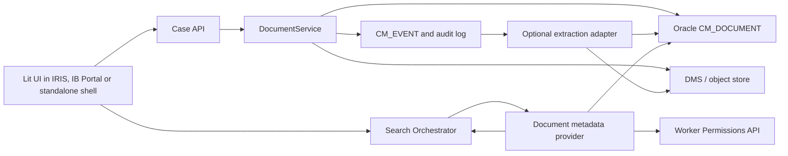

# Document Management and Search

Document management is implemented as document-reference management inside the case platform. The
platform stores case-linked metadata and a content reference; it does not store document binaries in
the case database.

## Responsibilities

| Responsibility | Owner |
|---|---|
| Case/document link, metadata, audit and events | Case management platform |
| Binary storage, retention and download controls | DMS or domain content service |
| Text extraction, OCR and classification enrichment | Document extraction adapter |
| Per-worker document access decisions | Worker Permissions API |
| Search orchestration and response shaping | Search API and providers |

`CM_DOCUMENT` is the local metadata table. It contains document id, case id, name, category, MIME
type, size, content reference, uploader and timestamp. The content reference is an external pointer;
it must not be treated as proof that the caller may download the document.

## End-to-End Flow

Linking a document writes one `CM_DOCUMENT` row, one `case.document.added` event and one audit
record in a single local transaction. Removing a document reference writes `case.document.removed`
and a matching audit record. Removing the platform reference does not delete the binary unless the
DMS integration explicitly supports and authorizes that operation.

## Search Extraction Model

The first implementation searches document metadata in Oracle. This covers exact document id,
filename, category and MIME type. User search text is treated literally: `%`, `_` and `~` are
escaped before Oracle `LIKE` matching.

Richer document-content search is a separate projection concern:

1. The document reference event is published.
2. An extraction adapter retrieves the binary from the DMS under a service identity.
3. The adapter applies document classification, redaction and field policy.
4. Approved searchable text or derived metadata is written to a rebuildable search projection.
5. Search providers query that projection and still apply Worker Permissions before disclosure.

This keeps the transactional case database free of binaries and avoids making extracted text an
uncontrolled second copy of regulated content.

## Authorization

Document search is fail-closed. The provider batches candidate document ids and calls the
Worker Permissions port for `document.read`. A result is returned only when the decision is
explicitly allowed.

Required behavior:

- Tenant filtering happens before Worker Permissions is called.
- Missing permission decisions are denied.
- Worker Permissions outages return no document results and include `authorization-unavailable`.
- Unauthorized documents must not appear in results, suggestions, facets, counts or highlights.
- Direct document mutations also use the case collaboration policy, so non-participants cannot
  link or remove document references.

## Implemented Slice

- `DocumentRepository` persists and searches `CM_DOCUMENT`.
- `DocumentService` links, lists and removes document references with event/audit publication.
- `CollaborationController` exposes `GET/POST /cases/{caseId}/documents` and
  `DELETE /cases/{caseId}/documents/{documentId}`.
- `DocumentMetadataSearchProvider` contributes `documents` scope results through the search
  orchestrator after Worker Permissions filtering.
- The starter exposes `WorkerPermissionsClient` as a replaceable bean and defaults to deny-all.
