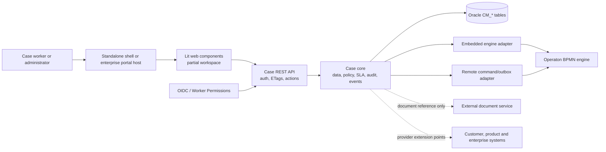

# Functional Requirements Support Assessment

**Assessment date:** 31 August 2026  
**Requirements source:** `/Users/ron/Downloads/functional_requirements.md`  
**Repository snapshot:** commit `f61ef0cafb8e284084021bfb96de165e020b4ba9`, branch `feat/bpmn-first-orchestration`

## 1. Executive conclusion

The repository contains a substantial **backend case-management platform**, not a complete case-management product. Its strongest capabilities are case and BPMN lifecycle handling, controlled task claim/completion, SLA clocks, events and audit writes, authorization boundaries, safe definition versioning, and embedded/remote Operaton integration.

The largest gaps are the business-facing experience around that foundation: customer/enterprise context, first-class business modules, complete task operations, configurable runtime search, linked cases, participant management, document content handling, an activity-history view, reporting/dashboarding, and AI-assisted modeling.

For the 15 detailed functional requirements:

| Verdict | Count | Requirements |
|---|---:|---|
| **Supported** | 0 | None are complete end to end as written. |
| **Partially supported** | 12 | FR-02, FR-03, FR-04, FR-05, FR-07, FR-08, FR-09, FR-10, FR-11, FR-12, FR-13, FR-14 |
| **Not supported** | 3 | FR-01, FR-06, FR-15 |

This is not a statement that the platform is weak. It is a distinction between **having reusable technical foundations** and **delivering the complete user outcome described in the requirements**.

## 2. How to read this assessment

The verdicts mean:

- **Supported:** all material behavior in the requirement has an implemented, usable path.
- **Partially supported:** a meaningful production implementation exists, but material behavior, scope, UI, or integration is missing.
- **Not supported:** no production implementation delivers the requested outcome.
- **Not assessable:** the source names a topic but does not state a testable requirement.

The assessment gives priority to production code. Tests are supporting evidence. Design proposals, plans, example HTML, target database tables without code, and statements of future intent are not counted as implemented behavior.

Two source limitations matter:

1. The “360 Customer Context” summary refers to a separate Case Management PPTX that was not supplied. This assessment uses FR-01 as the available definition of that capability.
2. Several non-functional rows have no description. They cannot honestly receive an unconditional “supported” verdict without measurable acceptance criteria.

## 3. Current implementation in one picture

In plain terms:

- Operaton decides how BPMN work progresses.
- The case service stores the business-facing case view, checks permissions, records audit/events, and manages SLA clocks.
- The UI and enterprise integrations consume the case API.
- Document binaries, customer information, product information, and most enterprise search sources are expected to live outside this service.
- Embedded engine mode is synchronous. Remote engine mode is deliberately asynchronous and uses durable commands, observations, and reconciliation.

The implemented module boundaries are documented in [`system-overview.md`](system-overview.md#L34-L75), and the embedded/remote consistency model is described in [`system-overview.md`](system-overview.md#L265-L301).

## 4. Summary-table requirements

This section assesses every row in the source summary table. Detailed FR references point to the deeper analysis in section 5.

| Summary item | Priority | Verdict | Plain-language conclusion |
|---|---:|---|---|
| 360 “Customer” Context | 1 | **Not supported** | There is no configurable customer/business-entity aggregate, product or communication integration, or grouped-context screen. See FR-01. |
| Search | 1 | **Partially supported** | Authorized case and document-metadata search exists. Business modules, tasks, worklists, document content, and related entities are not implemented search providers. See FR-09 and FR-10. |
| (SLA) Reporting & Dashboarding | 2 | **Not supported** | SLA records, states, warnings, breaches, and events are useful foundations, but there is no reporting query model or dashboard. |
| Task List | 0 | **Partially supported** | A personal/candidate-group pull worklist exists, but filtering, sorting, team views, SLA/priority indicators, assignment, and a complete task UI do not. See FR-08. |
| Participants | 1 | **Not supported** | Case creation automatically adds the creator as owner and participant roles are used internally, but users cannot list/add/change/remove participants through an API or UI. |
| Documents storage | 2 | **Partially supported** | The service stores authorized case-level document references and metadata, not document content. Module/task scoping and DMS upload/view/replace are absent. See FR-11. |
| Comments | 1 | **Partially supported** | Authorized case-level comments with internal/external visibility exist. Module/task comments and propagation rules do not. See FR-12. |
| Activity / Audit Log | 1 | **Partially supported** | Mutations write audit rows and domain events, but there is no user-facing audit/history query that combines them into the requested activity log. See FR-12. |
| Progress Tracker | 0 | **Partially supported** | Stage, task, process, and milestone states can be read as plan-item projections. There is no first-class module progress or aggregate progress measure, and plan items are deliberately read-only. See FR-04. |
| SLA Management | 1 | **Partially supported** | Typed `CASE`, `STAGE`, `TASK`, `MILESTONE`, and native-loop `OCCURRENCE` SLA targets, business calendars, pause/resume, warning, breach, and escalation behavior exist. “Business module” is not a modeled scope. |
| Case Creation | 0 | **Partially supported** | Authorized applications can create a case by API with type, business key, title, priority, and data. The delivered UI and inbound business-event initiation path are missing. See FR-02. |
| Case Level Actions | 2 | **Partially supported** | Update and cancel are available for eligible active cases. Case pause/resume and case linking do not exist; normal completion is controlled by the BPMN root process. See FR-03 and FR-05. |
| Linked Cases | 3 | **Not supported** | A target database table exists, but there is no production case-link repository, service, API, or UI. Linked processes are not linked cases. |
| Manual intervention / ad-hoc Actions | — | **Partially supported** | Predeclared, role-controlled ad-hoc process/message actions can execute in both engine modes. Human-task activation remains BPMN-only. They are not exposed as discoverable case actions in the delivered UI/API response. |

Supporting evidence for these cross-cutting conclusions includes automatic owner creation and root-process start in [`CaseService.java`](../case-management-core/src/main/java/org/casemgmt/service/CaseService.java#L57-L89), participant role storage in [`ParticipantRepository.java`](../case-management-core/src/main/java/org/casemgmt/repo/ParticipantRepository.java#L18-L42), typed SLA scopes in [`case-contract-v1.schema.json`](../case-management-core/src/main/resources/schemas/case-contract-v1.schema.json#L121-L142), and ad-hoc execution in [`AdHocActionService.java`](../case-management-core/src/main/java/org/casemgmt/service/AdHocActionService.java#L76-L174).

## 5. Detailed functional requirements

### FR-01 — Grouped Business Context

**Verdict: Not supported.**

**How it is supported today:** It is not. Users can search cases and document metadata, but the system does not assemble customer/entity details, products, communications, related cases, and entity-level actions into one context.

**Technical implementation:** The default search wiring registers only a case provider and a document-metadata provider ([`CaseManagementSearchConfiguration.java`](../case-management-spring-boot-starter/src/main/java/org/casemgmt/starter/CaseManagementSearchConfiguration.java#L19-L36)). Case search uses case ID, business key, title, and a limited set of case filters ([`CaseProjectionSearchProvider.java`](../case-management-core/src/main/java/org/casemgmt/search/CaseProjectionSearchProvider.java#L131-L146)).

**Honest limitations:**

- No customer or configurable grouping-entity model/provider exists.
- No product or recent-communications integration exists.
- No entity-level action policy or endpoint exists.
- No grouped-context UI exists.
- The unavailable PPTX may contain additional expectations that could not be assessed.

**Design decision and implication:** Search is provider-based and can be extended safely, including authorization and masking. That makes enterprise context possible later, but the integration providers and grouped view must still be built; an extension point is not delivered functionality.

### FR-02 — Case Initiation

**Verdict: Partially supported.**

**How it is supported today:** An authorized API caller can create a case with a case type, business key, title, priority, and initial data. Another application can therefore initiate a case through the REST API.

**Technical implementation:** `POST /case-api/v2/cases` checks create permission and supports idempotency before calling the case service ([`CaseController.java`](../case-management-rest/src/main/java/org/casemgmt/rest/controller/CaseController.java#L126-L157)). The service selects the latest active version, persists the case, makes the initiator owner, starts its pinned BPMN definition, and records event/audit evidence in one transaction ([`CaseService.java`](../case-management-core/src/main/java/org/casemgmt/service/CaseService.java#L57-L89); [`BpmnOrchestration.java`](../case-management-core/src/main/java/org/casemgmt/orchestration/BpmnOrchestration.java#L33-L60)). Engine observations then build task, activity/stage, and milestone projections ([`DefaultEngineObservationHandler.java`](../case-management-core/src/main/java/org/casemgmt/observation/DefaultEngineObservationHandler.java#L186-L256)).

**Honest limitations:**

- No case-creation screen exists in the supplied web components.
- No inbound business-event consumer or event-to-case mapping is implemented. Existing event APIs publish case events; they do not receive an approved business event to create a case.
- Creation is not initiated from a grouped customer/entity context because FR-01 is absent.

**Design decision and implication:** Case creation is API-first, idempotent, tenant-derived from the authenticated caller, and pinned to an active definition. This is safe for application integration, but business events require a separate authenticated ingestion adapter and mapping policy.

### FR-03 — Related-Case Decision

**Verdict: Partially supported.**

**How it is supported today:** A user can open a known case, create another case, and execute a preconfigured ad-hoc process or message action. Valid actions are computed from case/task state and caller rights.

**Technical implementation:** Case reads are available through the case controller. The policy currently advertises only update and cancel for an eligible active case ([`ActionPolicy.java`](../case-management-rest/src/main/java/org/casemgmt/rest/policy/ActionPolicy.java#L33-L45)). Declarative ad-hoc actions can start an exact process release or correlate a message; contracts cannot activate human tasks ([`AdHocActionService.java`](../case-management-core/src/main/java/org/casemgmt/service/AdHocActionService.java#L151-L174)).

**Honest limitations:**

- No related-case discovery or decision screen exists.
- No case-to-case link model, service, endpoint, or navigation exists.
- Case pause/resume is absent. SLA pause/resume is a different capability.
- Contract actions cannot create a human task; task activation must be modeled in BPMN. Free assignment is not supported.
- Ad-hoc actions are executable by known ID but are not included in case `availableActions`, so discovery is incomplete.

**Design decision and implication:** The system does not allow arbitrary runtime work creation; discretionary actions must be declared, authorized, form-validated, and optionally mapped to engine data. That improves control and auditability but is less flexible than the requirement implies.

### FR-04 — Case Composition

**Verdict: Partially supported.**

**How it is supported today:** A case exposes flat observed task, activity/stage, milestone, and linked-process projections. Completing engine work can advance BPMN and update those projections.

**Technical implementation:** BPMN is the sole authority for stage/task sequencing and lifecycle. The observation handler turns neutral engine task, activity, and milestone facts into projection inputs ([`DefaultEngineObservationHandler.java`](../case-management-core/src/main/java/org/casemgmt/observation/DefaultEngineObservationHandler.java#L186-L256)); the projection port upserts the corresponding task, stage, and milestone read-model rows ([`JdbcCaseProjectionPort.java`](../case-management-core/src/main/java/org/casemgmt/projection/JdbcCaseProjectionPort.java#L102-L163)).

**Honest limitations:**

- “Business module” is not a first-class entity or reusable aggregate.
- A task links to a case and optional observed plan-item projection, not a business module.
- There is no aggregate progress percentage/score; clients see individual states.
- Plan items are engine projections and cannot be manually transitioned through the API ([`PlanItemController.java`](../case-management-rest/src/main/java/org/casemgmt/rest/controller/PlanItemController.java#L16-L38)).

**Design decision and implication:** BPMN is the sole authority for stage/step flow. This prevents the case API and engine from disagreeing, but module composition, module ownership, and module-level progress must be modeled explicitly if they are business requirements rather than informal BPMN groupings.

### FR-05 — Case Workspace

**Verdict: Partially supported.**

**How it is supported today:** A generic case-detail component can load case summary/data, tasks, plan items, document references, milestones, SLAs, a pinned presentation manifest, and forms.

**Technical implementation:** The Lit component resolves the exact definition version attached to the case, retrieves presentation and contract artifacts, then loads case resources in parallel ([`case-detail.ts`](../case-management-web-components/src/components/case-detail.ts#L35-L79)). Server endpoints separately expose comments, documents, milestones, linked processes, SLAs, and case events.

**Honest limitations:**

- The workspace does not load comments, events/activity, processes, participants, notifications, linked cases, or business modules.
- No production-grade navigation/task focus experience is present.
- The generic action client does not send required `If-Match` headers ([`case-api-client.ts`](../case-management-web-components/src/api/case-api-client.ts#L93-L103)), so case mutations advertised by the API cannot reliably execute from this component.
- Product UX and detailed form behavior remain intentionally limited, as the implementation reference itself states ([`system-overview.md`](system-overview.md#L22-L30)).

**Design decision and implication:** The UI is manifest-driven and host-neutral rather than a hard-coded case application. That supports reuse, but it makes correctness dependent on complete API/client contracts; the current shell is a foundation, not the required workspace.

### FR-06 — Business-Module Workspace

**Verdict: Not supported.**

**How it is supported today:** It is not. Users can view case-level plan items and case-level tasks, comments, and document references, but cannot open a business module as its own workspace.

**Technical implementation:** The nearest concept is the read-only plan-item endpoint, which returns all engine-projected items for a case ([`PlanItemController.java`](../case-management-rest/src/main/java/org/casemgmt/rest/controller/PlanItemController.java#L20-L45)). `CaseTask` contains a case ID and optional plan-item ID, not a module ID ([`CaseTask.java`](../case-management-core/src/main/java/org/casemgmt/domain/CaseTask.java#L7-L16)).

**Honest limitations:** No module entity, repository, API, UI, module progress, module task boundary, module comment/document scope, module action policy, or module-specific authorization boundary exists.

**Design decision and implication:** Treating BPMN stages as projections is useful for process visibility but does not create a business-module aggregate. If business modules must be reusable, securable, searchable, and independently presented, they need an explicit model and contract.

### FR-07 — Task Processing

**Verdict: Partially supported.**

**How it is supported today:** Eligible users can list tasks, claim an open task, submit a validated form payload, and complete a claimed task. The action rules consider tenant, permission, task state, candidate group, participant role, and assignee.

**Technical implementation:** The task controller exposes worklist, per-case list, claim, and complete endpoints ([`TaskController.java`](../case-management-rest/src/main/java/org/casemgmt/rest/controller/TaskController.java#L85-L158)). Completion validates the task’s pinned form before calling the engine. The policy permits claim only on synced open work and complete only by the assignee of a claimed task ([`ActionPolicy.java`](../case-management-rest/src/main/java/org/casemgmt/rest/policy/ActionPolicy.java#L54-L71)).

**Honest limitations:**

- No task-detail endpoint or implemented task-focus UI exists.
- Task responses omit stored description/instructions, priority, due date, and outcome.
- Release/unclaim, assign, reassign, delegate, and escalate are absent.
- Comments and documents are case-only, not task-level.
- The web API client does not implement claim/complete or task-form processing.

**Design decision and implication:** Task operations are intentionally narrow and server-authorized. This is a safe core, but expanding the operation vocabulary requires coordinated policy, permissions, engine adapters, API responses, UI, and audit behavior.

### FR-08 — User and Team Worklists

**Verdict: Partially supported.**

**How it is supported today:** `/tasks` returns synced open/claimed work assigned to the caller or offered to one of the caller’s candidate groups, within the caller’s tenant and Worker Permissions.

**Technical implementation:** The repository filters by tenant, assignee/candidate group, state, and engine synchronization, while the controller applies per-task read decisions ([`TaskController.java`](../case-management-rest/src/main/java/org/casemgmt/rest/controller/TaskController.java#L85-L92) and [`TaskController.java`](../case-management-rest/src/main/java/org/casemgmt/rest/controller/TaskController.java#L205-L217)).

**Honest limitations:**

- Only a `limit` parameter is supported; there is no filtering, sorting, paging, or saved view.
- There is no explicit team-worklist endpoint or organizational hierarchy/grouping.
- No assignment or reassignment operation exists.
- Priority/due date exist internally but are missing from the response, so overdue/SLA indicators cannot be rendered.
- The shell shows only task name/state and routes to a task page that is not implemented.

**Design decision and implication:** Candidate-group eligibility is separated from case-local participant roles, preventing accidental privilege escalation. This produces a secure pull queue but not the full operational worklist product.

### FR-09 — Search and Case Selection

**Verdict: Partially supported.**

**How it is supported today:** Users can search authorized cases and document metadata using text and a small set of filters. The API also exposes suggestions, facets, paging, provider status, freshness, and warnings.

**Technical implementation:** Search is orchestrated across registered providers. The implemented providers cover case projections and document metadata. Each provider applies resource-level Worker Permission decisions and fails closed when authorization cannot be evaluated ([`search-architecture.md`](search-architecture.md#L139-L164)).

**Honest limitations:**

- No installed provider searches business modules, tasks/worklists, comments/timeline, related business entities, or document content.
- Case variables/business data are not generally full-text searchable.
- Range behavior and configurable operators are not executed from case-type search profiles.
- The web components contain no actual search client/result screen/navigation path.
- A `contextId` in a response is not the same as implemented navigation to the correct context.

**Design decision and implication:** Oracle projection-first search avoids making Elasticsearch a mandatory system of record and supports fail-closed authorization. Rich cross-domain/full-text search requires additional providers or a rebuildable external index.

### FR-10 — Configurable Search Fields

**Verdict: Partially supported.**

**How it is supported today:** A case contract can declare named search profiles, scopes, filters, operators, facets, and sorting. Publication checks that a presentation manifest references an existing profile.

**Technical implementation:** The JSON schema defines filters such as `EQ`, `IN`, `CONTAINS`, comparison operators, and `BETWEEN` ([`case-contract-v1.schema.json`](../case-management-core/src/main/resources/schemas/case-contract-v1.schema.json#L78-L118)). Cross-artifact validation rejects a presentation that names an unknown profile ([`CaseDefinitionVersionService.java`](../case-management-core/src/main/java/org/casemgmt/service/CaseDefinitionVersionService.java#L169-L197)).

**Honest limitations:** The runtime keeps only profile names for validation. The search controller accepts caller-supplied scopes/filters and does not load or enforce the relevant case definition’s profile. Configured result fields, methods, and context-specific behavior are therefore not implemented.

**Design decision and implication:** Configuration is validated early, which prevents broken references, but validation without runtime interpretation creates a misleading “declared but not effective” capability. Runtime search planning must be driven by the pinned profile.

### FR-11 — Documents

**Verdict: Partially supported.**

**How it is supported today:** Authorized users can link an external document reference to a case, list metadata, search permitted metadata, and remove the reference. Link/removal creates event and audit evidence.

**Technical implementation:** The document row stores name, category, MIME type, size, external `contentUrl`, creator, and timestamp ([`DocumentRepository.java`](../case-management-core/src/main/java/org/casemgmt/repo/DocumentRepository.java#L13-L38)). Link/removal is transactional and emits domain/audit records ([`DocumentService.java`](../case-management-core/src/main/java/org/casemgmt/service/DocumentService.java#L30-L68)). The REST layer applies document Worker Permissions before disclosure and mutation.

**Honest limitations:**

- No binary upload, download, preview, or DMS content retrieval is implemented.
- Documents are case-only; module and task association are absent.
- No replace/update endpoint exists.
- Classification is a free-text category, not a classification workflow/policy.
- Search covers metadata, not approved document content.

**Design decision and implication:** Document binaries deliberately remain in an external DMS/object store. This avoids duplicating protected content, but a real DMS adapter, content authorization, lifecycle operations, and optional extraction/indexing are required.

### FR-12 — Collaboration and History

**Verdict: Partially supported.**

**How it is supported today:** Authorized users can add/list case comments. Significant service mutations write append-only audit records and case events; case events can be read chronologically.

**Technical implementation:** Comments contain case, author, text, visibility, and timestamp. `AuditRepository` writes actor, action, resource, and before/after JSON ([`AuditRepository.java`](../case-management-core/src/main/java/org/casemgmt/repo/AuditRepository.java#L12-L23)). Events, audit, and entity changes participate in the caller’s transaction, so they commit or roll back together ([`EventPublisher.java`](../case-management-core/src/main/java/org/casemgmt/event/EventPublisher.java#L13-L24)).

**Honest limitations:**

- Comments are case-only; no module/task-level comments or propagation rules exist.
- Audit storage has no read/query method or user-facing REST endpoint.
- Case events are machine-oriented and are not assembled with audit changes into a business activity timeline.
- The delivered workspace does not load comments or events.

**Design decision and implication:** Compliance audit and integration events are kept as separate records with different audiences. That is a sound separation, but the product needs a read model that safely merges selected evidence into a worker-facing history.

### FR-13 — Dynamic Case Experience

**Verdict: Partially supported.**

**How it is supported today:** A generic renderer loads the case’s pinned presentation and contract, renders known section primitives and JSON-schema forms, and can host allowlisted extension components.

**Technical implementation:** Presentation supports summary fields, plan/task/document/milestone/SLA lists, search slots, forms, actions, and extension slots ([`presentation-manifest.ts`](../case-management-web-components/src/presentation/presentation-manifest.ts#L1-L53)). Requested actions are intersected with server-authorized `availableActions` ([`presentation-manifest.ts`](../case-management-web-components/src/presentation/presentation-manifest.ts#L111-L121)). Extensions require exact allowlisting.

**Honest limitations:**

- Sections have no role/state visibility conditions; only action availability is dynamic.
- Lists are basic display primitives and search is only an empty host slot.
- Extensions can read only four resource types and execute existing case actions.
- No proven connector model lets a component call arbitrary supporting systems.
- Current client concurrency handling is incomplete.

**Design decision and implication:** The system uses a controlled manifest and allowlisted extensions rather than arbitrary frontend code from configuration. This improves security and compatibility but requires an explicit capability API for every supported dynamic behavior.

### FR-14 — Declarative Case Configuration

**Verdict: Partially supported.**

**How it is supported today:** Administrators can publish BPMN orchestration, a case contract, and a presentation manifest; validate them; and bind exact artifact releases into a startable case-definition version. The contract covers fields, roles, forms, search profiles, SLA bindings, mappings, attachment categories, and ad-hoc actions.

**Technical implementation:** The contract is closed and versioned; unknown behavior-driving properties fail publication ([`case-contract-v1.schema.json`](../case-management-core/src/main/resources/schemas/case-contract-v1.schema.json#L1-L49)). Binding cross-validates BPMN form/group/SLA references and presentation field/form/action/search references before activation ([`CaseDefinitionVersionService.java`](../case-management-core/src/main/java/org/casemgmt/service/CaseDefinitionVersionService.java#L108-L197)). Release artifacts follow guarded states and are immutable after failure/retirement ([`ReleaseStatus.java`](../case-management-core/src/main/java/org/casemgmt/release/ReleaseStatus.java#L9-L44)). New cases persist the exact selected definition/version.

**Honest limitations:**

- No case-model administration UI exists; the interface is artifact upload/API and modeler templates.
- Business modules are not first-class reusable/importable artifacts.
- Notifications and general business-event definitions are not part of the executable case contract.
- Document configuration is limited mainly to categories.
- Search profiles are validated but not executed at runtime as configured.

**Design decision and implication:** Orchestration, business contract, and presentation are separate immutable artifacts bound into one version. This strongly protects running cases from unexpected change, but administrators must manage compatibility across three artifacts and the platform must keep their validators/runtime consumers aligned.

### FR-15 — Assisted Model Creation

**Verdict: Not supported.**

**How it is supported today:** No AI assistant generates case models, forms, or configuration.

**Technical implementation:** No production AI/LLM client, generation service, proposal model, review endpoint, or AI draft workflow exists. Existing release APIs accept supplied artifacts and validate/publish them ([`CaseDefinitionReleaseService.java`](../case-management-core/src/main/java/org/casemgmt/service/CaseDefinitionReleaseService.java#L60-L103)).

**Honest limitations:** The release lifecycle has `DRAFT` and `VALIDATED` states, but these are technical publication states, not an AI proposal/reviewer workflow.

**Design decision and implication:** The existing immutable release and explicit activation model is a suitable safety boundary for future AI assistance. AI output should enter as non-active proposal content, but that authoring and review capability remains to be designed and implemented.

## 6. Non-functional requirements

### NFR-01 — Declarative case model (including SLA)

**Verdict: Partially supported.**

**Business view:** Declarative BPMN, fields/forms, permissions vocabulary, SLA targets, mappings, ad-hoc actions, search-profile declarations, and presentation sections exist.

**Technical view:** The contract schema includes forms, role-controlled fields, search profiles, SLA scopes, data mappings, and typed ad-hoc actions ([`case-contract-v1.schema.json`](../case-management-core/src/main/resources/schemas/case-contract-v1.schema.json#L11-L49)). BPMN and all referenced artifacts are cross-validated before binding.

**Limitations:** Business modules, notifications, general integrations, and executable search-profile behavior are incomplete. UI generation exists at a basic manifest/form level, not as a complete production experience.

**Implication:** Declarative configuration is a strong platform direction, but each declared capability must have a runtime consumer; otherwise the model can promise behavior the product does not deliver.

### NFR-02 — Operating Model

**Verdict: Not assessable; the source contains no requirement.**

**Current design:** Each domain/DevOps team is expected to run its own case application and own its data, operations, and release lifecycle; the platform is a reusable starter/service layer, not a central service ([`system-overview.md`](system-overview.md#L15-L26)).

**Limitations:** Ownership boundaries, support model, service levels, deployment topology, data stewardship, release authority, and cross-team federation governance are not specified by the requirement.

**Implication:** Decentralized ownership reduces central coupling, but enterprise-wide views and standards require explicit governance and event/search federation contracts.

### NFR-03 — Standalone and IRIS / IBS operation

**Verdict: Partially supported.**

**Business view:** The UI package can operate in standalone mode or behind a normalized embedded enterprise-portal host contract.

**Technical view:** `PortalAdapter` separates token, user, tenant, and navigation behavior. An embedded host uses `window.CASE_MANAGEMENT_HOST`; standalone mode uses browser-local session values ([`case-management-web-components/README.md`](../case-management-web-components/README.md#L1-L20)).

**Limitations:** There is no IRIS-specific or IBS-specific adapter, integration test, packaging proof, identity mapping, navigation contract, or deployment evidence.

**Implication:** Host neutrality reduces the cost of integration, but “can run within IRIS/IBS” remains unproven until their real contracts are implemented and tested.

### NFR-04 — Auth model / CIT propagation

**Verdict: Partially supported; CIT specifically is not evidenced.**

**Business view:** The API supports authenticated tenants, enterprise groups, case roles, and fine-grained Worker Permission decisions. It denies when permission information is missing.

**Technical view:** The PoC supports local Basic Auth and OIDC/JWT; claim names for principal, tenant, groups, Worker Permissions, and engine permissions are configurable ([`PocSecurityProperties.java`](../case-management-poc-app/src/main/java/org/casemgmt/poc/PocSecurityProperties.java#L22-L52)). Tenant is derived from authenticated authority rather than request data, and case roles/group membership remain separate ([`system-overview.md`](system-overview.md#L200-L227)).

**Limitations:** CIT is not identified as an implemented identity provider or permission source. Production token acquisition, claims mapping, role lifecycle, policy administration, and failure expectations need bank-specific integration.

**Implication:** The fail-closed seams are sound, but identity/authorization integration is a mandatory deployment dependency, not a completed configuration detail.

### NFR-05 — Observability, management, and DevOps debugging

**Verdict: Partially supported.**

**Business view:** Administrators can inspect remote polling health, operation state, and dead letters; recover failed remote commands; inspect webhook dead letters; and consume case events.

**Technical view:** The orchestration operations controller exposes poller status, watermark, last error/success, active case count, command dead letters, and authorized retry ([`OrchestrationOperationsController.java`](../case-management-rest/src/main/java/org/casemgmt/rest/controller/OrchestrationOperationsController.java#L27-L103)). Events, webhooks, retries, and dead-letter storage provide operational evidence.

**Limitations:** No Actuator/Micrometer dependency, production metrics registry, traces, dashboard, alert rules, structured correlation standard, or SLOs are delivered. The documentation recommends metrics that the code does not expose ([`system-overview.md`](system-overview.md#L420-L425)). Error text in operational responses also needs production review for sensitive disclosure.

**Implication:** Repairability is better developed than observability. Operators have state and recovery endpoints, but proactive monitoring must still be implemented.

### NFR-06 — Distributed systems

**Verdict: Partially supported; the source contains no precise acceptance criteria.**

**Business view:** Remote Operaton operation is designed to avoid lying about success when the network outcome is uncertain. Work can be retried/reconciled from durable state.

**Technical view:** Remote commands use an outbox; engine observations are made durable and replay-safe; work is hidden while unsynchronized; ETags and idempotency protect client retries. Embedded mode joins the local transaction, while remote mode is eventually consistent ([`system-overview.md`](system-overview.md#L265-L301)).

**Limitations:** There is no proof of multi-region behavior, broker integration, disaster recovery, network partition targets, or full enterprise federation. Event sequence allocation serializes appends to preserve a safe cursor ([`system-overview.md`](system-overview.md#L334-L339)).

**Implication:** The design explicitly prefers visible pending/uncertain state over false confirmation. Clients and operations must therefore handle `202`, pending synchronization, stale projections, and repair workflows.

### NFR-07 — Storage / persistence / Elasticsearch

**Verdict: Partially supported; Elasticsearch is not implemented.**

**Business view:** Case data, tasks, audit, events, SLA, document references, and search projections are persisted in Oracle. Search can operate without a separate search cluster.

**Technical view:** Persistence uses Oracle tables and Spring JDBC; Liquibase applies the schema. Search is projection-first and provider-based, with external search infrastructure treated as optional ([`search-architecture.md`](search-architecture.md#L1-L22)).

**Limitations:** No Elasticsearch/OpenSearch client, index mappings, ingestion/rebuild job, retention sizing, backup/restore proof, or approved document-content index exists.

**Implication:** Oracle-first simplifies consistency and operations for local search, but broad full-text, semantic, or federated scale will require a rebuildable external index with the same authorization rules.

### NFR-08 — Performance

**Verdict: Not evidenced.**

**Business view:** Some query limits and batch-reading patterns prevent obvious unbounded behavior, but no performance target is stated or proven.

**Technical view:** API pages are capped and some repository paths avoid per-row queries. A remote history test proves correct pagination at 499–1,201 equal-timestamp rows ([`BpmnFirstRemoteHighVolumeIT.java`](../case-management-engine-remote/src/test/java/org/casemgmt/engine/remote/BpmnFirstRemoteHighVolumeIT.java#L10-L25)).

**Limitations:** This is correctness testing, not load testing. There are no response-time/throughput goals, concurrent-user tests, production-volume datasets, profiling evidence, capacity model, or database execution-plan baseline.

**Implication:** Performance cannot be accepted based on architecture or unit/integration tests; measurable workloads and service objectives are required.

### NFR-09 — Availability

**Verdict: Not evidenced end to end; resilience mechanisms exist.**

**Business view:** Durable commands, retries, dead letters, event pull recovery, idempotency, and remote reconciliation improve recovery from partial failures.

**Technical view:** Webhook delivery uses leases, retries, signatures, and dead-lettering; event consumers can recover through the ordered pull feed ([`system-overview.md`](system-overview.md#L304-L339)). Remote engine calls have configurable connect/read timeouts.

**Limitations:** No availability target, multi-instance deployment proof, load-balancer/readiness setup, database HA design, disaster recovery exercise, recovery-time/recovery-point target, or chaos/partition test is provided.

**Implication:** Durable workflow state helps recovery but does not itself make the service highly available. Infrastructure topology and operational objectives remain essential.

### NFR-10 — Scalability

**Verdict: Not evidenced; the architecture has partial scaling foundations.**

**Business view:** Domain-owned deployments can scale organizationally and isolate workloads. Database-backed leases/claims can support multiple workers if deployed carefully.

**Technical view:** The API is mostly stateless, scheduled delivery/command work is durably claimed, queries are bounded, and search providers can be added. CI runs realistic Oracle/engine integration tests ([`.github/workflows/ci.yml`](../.github/workflows/ci.yml#L15-L37)).

**Limitations:** No horizontal-scaling test, worker-contention benchmark, sharding/partition strategy, connection-pool sizing, capacity limits, or cross-domain search scale proof exists. Globally ordered event appends deliberately serialize one critical path.

**Implication:** Decentralization and claims reduce some bottlenecks, but actual scale limits will be dominated by Oracle, Operaton, polling, and ordered event writes until measured.

### NFR-11 — Versioning

**Verdict: Supported for case-definition artifacts and running-case pinning; broader versioning scope is unspecified.**

**Business view:** New model versions can be prepared and activated without silently changing existing cases. Failed or retired releases remain historically stable.

**Technical view:** Orchestration, contract, and presentation releases are immutable/content-addressed and follow guarded lifecycle states ([`ReleaseStatus.java`](../case-management-core/src/main/java/org/casemgmt/release/ReleaseStatus.java#L9-L44)). Binding validates the three exact artifacts, and new cases select only an active version ([`CaseDefinitionVersionService.java`](../case-management-core/src/main/java/org/casemgmt/service/CaseDefinitionVersionService.java#L49-L105)). Each case stores definition ID/key/version ([`CaseInstance.java`](../case-management-core/src/main/java/org/casemgmt/domain/CaseInstance.java#L7-L18)). Database changes use append-only Liquibase changesets ([`system-overview.md`](system-overview.md#L359-L368)).

**Limitations:** API compatibility policy, event-schema evolution, search-index migration, supported upgrade windows, rollback guarantees, and explicit running-case migration are not fully specified by the NFR.

**Implication:** Exact pinning is one of the platform’s strongest decisions. It favors safety and auditability over editing an active model in place, at the cost of release-management complexity.

## 7. Core business-rule validation

| Source business rule | Verdict | Assessment |
|---|---|---|
| A task belongs to a business module, and a module belongs to a case. | **Not supported as written** | A task belongs to a case and may link to a plan item; no business-module entity exists. |
| Completing a task can update module and case progress. | **Partially supported** | Completion advances engine/projection lifecycle, but there is no module or explicit aggregate progress. |
| Only valid actions are displayed and executable. | **Partially supported, strong backend pattern** | Case/task/SLA actions share projection and enforcement policy, but ad-hoc actions are not advertised and the UI cannot execute some ETag-protected actions. |
| Comments and documents retain their added level. | **Not supported as written** | Both are case-level only, so the required module/task levels cannot be retained. |
| Search results disclose only authorized information. | **Supported for implemented providers** | Case/document providers apply fail-closed resource and field decisions; absent providers cannot be credited. |
| Selecting a worklist/search result opens the correct context. | **Partially supported** | The shell navigates case/task rows, but task detail and search-result navigation are not implemented. |
| Historic cases remain available for reference and linking. | **Partially supported** | Closed/cancelled cases can remain stored/searchable, but case linking is absent. |

The “displayed and executable” pattern is architecturally important: `ActionPolicy` is intended to drive both `availableActions` and enforcement ([`ActionPolicy.java`](../case-management-rest/src/main/java/org/casemgmt/rest/policy/ActionPolicy.java#L11-L20)). Worker Permissions adds a second, fail-closed enterprise authorization layer.

## 8. Minimum end-to-end scenario validation

| Step | Verdict | Reason |
|---:|---|---|
| 1. Search for a business entity. | **Blocked** | No business-entity provider or grouped-context search exists. |
| 2. Show entity details, products, and related cases. | **Blocked** | No entity/product/communications aggregate exists. |
| 3. Open an existing case or create a new case. | **Partial** | Case list/read/create APIs exist; creation UI and grouped-context entry do not. |
| 4. Create configured business modules and tasks. | **Partial** | BPMN observations project plan-item/task read models; business modules do not exist. |
| 5. Show tasks in user/team worklists. | **Partial** | Personal/candidate-group worklist exists; complete team/worklist behavior does not. |
| 6. Open task, complete form, add task documents. | **Partial** | Backend form completion exists; task UI/detail and task-scoped documents do not. |
| 7. Update task, module, and case progress. | **Partial** | Engine/projection lifecycle updates task/plan/case state; module/aggregate progress is absent. |
| 8. Record completed work in activity history. | **Partial** | Events and audit rows are written; no worker-facing combined history is available. |

**Overall verdict:** the minimum end-to-end scenario is **not currently executable** because it is blocked at steps 1–2 and remains incomplete at every later business-facing step.

## 9. Fundamental design decisions and what they imply

| Design decision | Why it helps | What it implies / costs |
|---|---|---|
| **Decentralized, domain-owned case applications** | Teams own their data and releases; no central case database bottleneck. | Enterprise 360 views and search need federation, common contracts, and governance. |
| **BPMN is the sole orchestration authority** | Prevents two lifecycle engines from disagreeing. | Plan items are read-only projections; business modules and manual stage transitions are not automatically provided. |
| **Core is independent of Operaton** | Embedded and remote adapters can share one business layer. | Every new engine-facing operation needs parity and recovery behavior in both modes. |
| **Remote mode is eventually consistent** | Network uncertainty is represented honestly and can be repaired. | Clients must handle pending operations, delayed projections, dead letters, and reconciliation. |
| **Headless/API-first with a generic manifest UI** | Supports standalone and portal-hosted reuse. | A platform API and primitive renderer do not equal a complete operational workspace; client contracts must be finished. |
| **Immutable orchestration + contract + presentation releases** | Running cases stay pinned and auditable. | Release administration and cross-artifact compatibility are more complex. |
| **Oracle projection-first search** | Avoids mandatory Elasticsearch and keeps local data authoritative. | Rich full-text, document-content, entity, and federated search need more providers or an external rebuildable index. |
| **Document references, not document binaries** | Keeps protected content in the enterprise DMS. | Upload/view/replace/content search depend on external adapters and authorization. |
| **Fail-closed authorization with separate tenant, group, role, and Worker Permission concepts** | Reduces cross-tenant leakage and privilege mixing. | Production identity and permission services are hard dependencies; unavailable decisions deny work. |
| **Same policy for advertised and enforced actions** | UI and server are intended to agree about valid operations. | Any action not included in the shared vocabulary becomes undiscoverable or unusable; current ad-hoc/UI gaps are especially visible. |
| **ETags for mutations and idempotency for retries** | Prevents silent overwrites and duplicate creation/remote effects. | Every client must preserve ETags/idempotency keys; the current generic UI does not yet satisfy that contract. |
| **Row + event + audit in one local transaction** | Business state and evidence do not diverge on rollback. | Remote effects cannot join that transaction and need durable commands/observations. Ordered event appends also serialize a critical section. |
| **Canonical case data is separate from engine variables** | Prevents workflow internals from silently becoming business truth. | Every data movement must be declared and maintained through mappings. |

## 10. Practical delivery priorities

The source priorities suggest the following gap order:

1. **Priority 0:** finish the task/worklist experience and define explicit progress semantics. The backend claim/complete path exists, so this is the shortest route to a usable worker flow.
2. **Priority 1:** implement customer/business-entity federation and grouped context; runtime-enforce search profiles; add participant management; expose case/module/task collaboration and activity history.
3. **Priority 2:** add SLA reporting/dashboarding, DMS integration, and the remaining case lifecycle actions.
4. **Priority 3:** implement case-to-case relationships and navigation.
5. **Cross-cutting before production acceptance:** define measurable performance, availability, scalability, observability, CIT/identity integration, and IRIS/IBS integration criteria, then prove them in production-shaped tests.

These priorities do not require discarding the existing design. Most gaps can build on the current versioning, policy, event/audit, provider, portal-adapter, and engine-gateway seams. The main product decision is whether “business module” becomes a first-class aggregate or is deliberately redefined as a BPMN stage; leaving that ambiguous will continue to affect workspace, progress, search, SLA, documents, comments, and authorization simultaneously.
