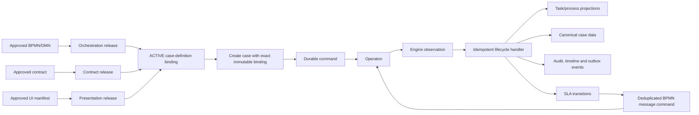
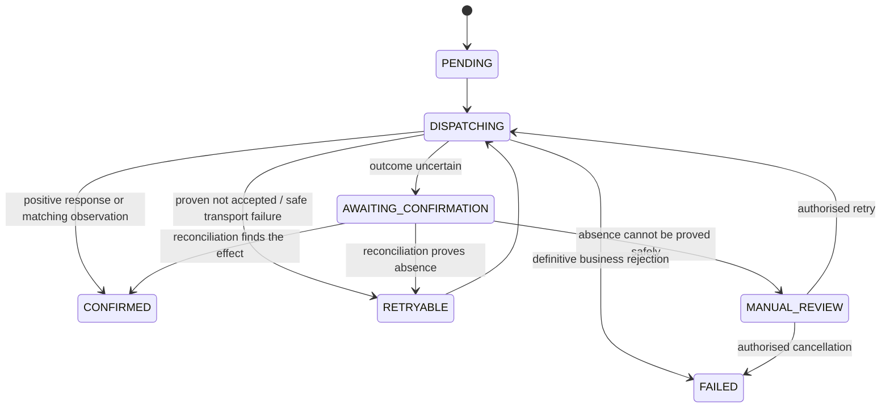

# BPMN-first case management: architecture decisions and production-readiness design

**Status:** Proposed decision document

**Date:** 27 August 2026

**Scope:** Pull request [#89 — BPMN-first orchestration](https://github.com/Ronrock/case-management-design/pull/89)

**Audience:** Business owners, product owners, architects, engineers, security, operations, and testers

**Decision objective:** Agree how to make the complete pull request production-ready without weakening the BPMN-first direction or breaking existing `PLAN_MODEL` users.

## 1. Executive summary

Pull request #89 is directionally correct. It establishes BPMN as the source of truth for process execution, keeps case data and security in the case-management platform, and introduces both embedded and remote Operaton integration. The reviewer's overall architecture comment is valid because the pull request contains several places where two parts of the system can both appear to own the same fact, or can disagree about whether an action succeeded.

These are not cosmetic issues. They affect whether the business can trust what users see:

- The platform can start a newer process definition than the case definition approved by the business.
- A remote action can be shown as completed locally before Operaton has accepted it.
- Operaton can complete a task while the canonical case data remains unchanged.
- The worklist, audit trail, timeline, and actual engine state can tell different stories.
- A case can finish while its SLA continues and later reports a false breach.
- A busy remote engine can return more records than one polling page, causing events to be missed permanently.
- Modelers can use names or namespaces that validators and runtime code interpret differently.

The recommended approach is to keep the whole pull request in scope but make it production-ready in controlled layers. We should first establish the ownership rules and closed contracts, then make release activation and exact-version execution safe, then route embedded and remote observations through one idempotent lifecycle handler, and finally complete SLA and advanced ad-hoc behavior on top of that foundation.

The core business rule is simple:

> Operaton decides what happens next in a BPMN process. The case-management platform decides what the case means to the business, who may do what, how it is presented, and how it is reported. Every fact copied from Operaton must be traceable, replay-safe, and auditable.

### Recommendation

Pick up all nine inline review comments and the overall architecture concern. They are valid and mutually reinforcing. Do not merge the pull request until the production-readiness acceptance gates in this document pass for both embedded and remote modes.

## 2. What decision is being made

This document is designed to support a decision meeting. It separates decisions from implementation detail and makes the trade-offs visible.

The proposed decisions are:

1. Keep BPMN-first orchestration as the target architecture.
2. Keep `PLAN_MODEL` as a supported legacy mode; do not silently reinterpret it as BPMN.
3. Use one authority for each kind of fact.
4. Start only an explicitly activated, exact Operaton process-definition version.
5. Treat remote commands as pending until the engine confirms them or the platform observes their effect.
6. Process embedded callbacks and remote observations through the same idempotent lifecycle rules.
7. Update canonical case data only through explicit, validated mappings.
8. Make projections, audit entries, business events, and SLA transitions part of one reliable lifecycle transaction.
9. Give SLA ownership to the SLA service; BPMN reacts to SLA events through idempotent messages.
10. Use complete, replay-safe remote polling and reconciliation.
11. Standardise the modeling vocabulary and publish closed JSON Schemas.
12. Deliver advanced ad-hoc actions only with the same release pinning, authorization, idempotency, and audit guarantees as normal work.

## 3. Sources used

This design consolidates:

- The accepted architecture in [`docs/bpmn-first-orchestration-proposal.md`](../bpmn-first-orchestration-proposal.md).
- The declarative contract design in [`docs/declarative-case-model-architecture.md`](../declarative-case-model-architecture.md).
- The Scenario A presentation decision in [`docs/declarative-case-ui-proposal.md`](../declarative-case-ui-proposal.md).
- Current runtime and operational behavior in [`docs/system-overview.md`](../system-overview.md).
- User-facing concepts and authoring guidance in [`docs/guide/concepts.md`](../guide/concepts.md) and [`docs/guide/case-definitions.md`](../guide/case-definitions.md).
- The combined bundle format in [`docs/schemas/combined-case-definition-v1.md`](../schemas/combined-case-definition-v1.md).
- The code and database changes in pull request #89.
- The overall requested-changes review and its nine inline comments.
- Follow-up analysis of exact release selection, remote command behavior, projection consistency, canonical data, SLA lifecycle, polling, and model vocabulary.

When this document conflicts with descriptive documentation of the current implementation, this document describes the proposed target decision. Once approved and implemented, the other documents must be aligned with it.

## 4. Plain-language glossary

| Term | Plain meaning |
|---|---|
| BPMN | The process diagram that determines the sequence of work, decisions, waits, timers, and completion. |
| Operaton | The workflow engine that runs BPMN processes. |
| Embedded mode | Operaton and case management run in the same application and can share a transaction. |
| Remote mode | Operaton runs separately and is called over a network. Calls can be delayed, repeated, or lose their response. |
| Canonical case data | The official business values for the case, such as customer, amount, priority, or decision. |
| Projection | A local, read-optimised copy of engine state used by APIs, worklists, timelines, and search. |
| Contract release | The approved definition of fields, forms, mappings, search, actions, and policy references. |
| Orchestration release | The approved BPMN and DMN artifacts deployed to Operaton. |
| Presentation release | The approved UI layout and composition rules. |
| Binding | The immutable record that says which orchestration, contract, and presentation releases form one case-definition version. |
| Idempotent | Safe to receive or process more than once without creating duplicate business effects. |
| Observation | A fact received from Operaton, such as “task completed” or “process ended.” |
| Reconciliation | A periodic comparison that repairs differences between Operaton and the platform. |
| SLA | A measured business commitment, with a calendar, start rule, pause rules, warnings, and an outcome. |

## 5. Why the overall architecture review is valid

The review is valid because the pull request crosses a distributed-system boundary. Embedded execution can often succeed or fail as one database transaction. Remote execution cannot: the platform may send a request, Operaton may complete it, and the response may be lost. The platform then cannot safely assume either success or failure.

The pull request currently handles several remote operations as though they were local operations. It also introduces projections and release bindings without yet enforcing all of the rules needed to keep them authoritative. Each individual issue is fixable, but together they indicate an architectural concern rather than a collection of unrelated defects.

### 5.1 Main implications

#### Business truth can split across systems

If Operaton says a task is still open while the platform shows it as complete, users may start downstream work too early. If the reverse happens, users may repeat work or miss a deadline. Reports, audit evidence, and customer communications can then be based on different versions of reality.

**Risk if left as is:** Incorrect decisions, duplicate work, missed work, misleading dashboards, and difficult incident investigation.

#### An approved release may not be the release that runs

Starting a process by its definition key asks Operaton for the latest matching version. The approved case-definition binding may point to an older version. A newer deployment can therefore change live business behavior without a new case-definition activation.

**Risk if left as is:** Unapproved process behavior, failed compliance evidence, inconsistent cases created minutes apart, and unsafe rollback.

#### Network uncertainty can create duplicate business effects

In remote mode, a timeout does not prove that Operaton rejected a command. Blindly retrying a process start or a message can create two processes or trigger the same business action twice.

**Risk if left as is:** Duplicate cases, duplicate payments or notifications, repeated escalation, and manual data repair.

#### Audit cannot be reconstructed reliably

Some engine observations update projections directly without producing an equivalent audit record and domain event. The current state may look correct, but there is no complete explanation of how it got there.

**Risk if left as is:** Weak regulatory evidence, incomplete timelines, support teams unable to explain changes, and downstream systems missing events.

#### SLA can disagree with process completion

SLA clocks are not consistently started and stopped from the process lifecycle. A finished case can retain a running clock and later appear breached. BPMN timers and SLA targets can also represent the same deadline twice.

**Risk if left as is:** False breach reporting, duplicated escalations, distorted service performance, and disputes over contractual obligations.

#### Incomplete polling creates permanent data loss

A fixed page of 500 remote records combined with a checkpoint that advances beyond the unread records can skip the remainder permanently.

**Risk if left as is:** Missing tasks, incomplete timelines, cases that never close locally, and discrepancies that grow under production load.

#### Open contracts move errors from publication time to runtime

An open `slaBindings` object and loosely defined search/action structures accept misspelled or structurally invalid content. The release can be marked valid even though the runtime cannot interpret it consistently.

**Risk if left as is:** A model appears successfully published but fails only when a customer case reaches the affected path.

### 5.2 Why this should be addressed in this pull request

The pull request establishes new ownership boundaries, database records, and public behavior. Leaving the guarantees for a later change would make unsafe behavior part of the supported contract and create data that must later be migrated. It is cheaper and safer to establish the invariants before production activation.

This does not mean building every possible workflow feature. It means the functionality included by the pull request must be internally complete, observable, recoverable, and testable.

## 6. Options considered

### Option A — Patch each review comment independently

**Description:** Fix each named line with the smallest local code change.

**Pros**

- Smaller individual diffs.
- Can make the visible review threads appear resolved quickly.
- Lower short-term design effort.

**Cons**

- Leaves embedded and remote modes with different lifecycle semantics.
- Does not solve the shared root cause: unclear authority and acknowledgement.
- Encourages more direct projection writes and special cases.
- Makes replay, audit, and recovery harder to prove.
- Likely produces further review rounds as interactions are discovered.

**Decision:** Do not choose. It treats architectural symptoms as isolated defects.

### Option B — Stabilise the architecture, then complete every included runtime path

**Description:** Define the authority and invariants first, then implement exact release execution, a common lifecycle handler, safe commands and observations, SLA integration, and advanced ad-hoc actions in dependency order.

**Pros**

- One consistent mental model for business and engineering.
- Embedded and remote behavior can be tested against the same outcomes.
- Audit, event, projection, and SLA consistency are solved once.
- Safe replay and recovery become designed behavior.
- Preserves a clean path for future engine adapters.

**Cons**

- Larger pull request and longer review cycle.
- Requires additive database and API changes.
- Needs failure-injection and high-volume integration tests.
- Requires careful migration of existing PoC records.

**Decision:** Choose. This is the recommended production-readiness approach.

### Option C — Let APIs and UI query Operaton directly

**Description:** Reduce local projection logic by treating Operaton as the read source for worklists and status.

**Pros**

- Fewer copied engine records.
- Current engine state is visible immediately when Operaton is available.

**Cons**

- Couples the public product API to Operaton concepts and availability.
- Makes search, authorization, tenancy, audit, and canonical data composition harder.
- Weakens engine neutrality.
- Does not solve command uncertainty or SLA ownership.
- Remote engine outages become user-facing platform outages.

**Decision:** Do not choose. Local projections remain necessary, but must be reliable.

## 7. Target architecture

### 7.1 One owner for each fact

| Concern | Authority | What other components may do |
|---|---|---|
| Sequence, gateways, token flow, structured task activation, process timers, subprocesses, compensation | BPMN running in Operaton | Project and present the result; never independently decide the next BPMN step. |
| Executable business decisions called from BPMN | DMN running through the orchestration | Store inputs/outputs and evidence; do not duplicate decision logic in UI or projections. |
| Official business values | Canonical case data in the platform | Operaton may receive variables and return outputs only through explicit mappings. |
| Fields, forms, mappings, search profiles, action definitions, presentation references, policy references | Declarative contract release | Validate at publication and interpret consistently at runtime. |
| Layout and composed case workspace | Presentation release | May display only actions and data authorised by the platform. |
| Authorization and worker eligibility | Platform authorization and Worker Permissions | BPMN candidate metadata may supply context, but is not the final security decision. |
| Business SLA measurement, calendars, warnings, breach, pause, meet, cancel | SLA service | BPMN may react to a deduplicated SLA event; it must not measure the same business deadline independently. |
| Worklists, API status, timeline, audit feed, search | Platform projections | Derived from idempotently processed engine and platform facts. |
| Legacy lifecycle/task activation | `PLAN_MODEL` only | Remains supported and isolated; it is not mixed into BPMN-first execution. |

### 7.2 End-to-end flow

The lifecycle handler is the key architectural addition. It gives both adapters one business-semantic path:

- Embedded mode can invoke it inside the engine transaction.
- Remote mode stores observations durably, then invokes it.
- Replayed observations reach the same handler and have no duplicate effect.
- Audit, events, projections, canonical mappings, and SLA changes are committed together.

### 7.3 Required invariants

The implementation is production-ready only when all of these are true:

1. Only an `ACTIVE` case-definition version can start a new case.
2. Every BPMN-first case is pinned to an exact Operaton process-definition ID, deployment, and tenant context.
3. A case has at most one confirmed root process instance.
4. A remote action is not shown as confirmed until it is acknowledged or observed.
5. Each engine observation produces its projection, audit, event, canonical-data, and SLA effects atomically.
6. Only contract-approved mappings may change canonical case data.
7. Commands and observations are safe to replay.
8. A polling checkpoint never advances beyond unread or uncommitted data.
9. Terminal case outcomes meet or cancel all applicable SLA occurrences.
10. One business deadline is measured in one place.
11. The modeler, schema, validator, runtime, and authoring guide use the same vocabulary.
12. Every uncertain or failed operation is visible and recoverable without direct database editing.

## 8. Decision register

| ID | Decision | Reason | Status |
|---|---|---|---|
| D1 | Adopt the authority table in section 7.1. | Prevents two components from making competing business decisions. | Proposed for approval |
| D2 | Keep the complete PR scope, delivered through internal quality gates. | The user requested the whole PR be production-ready; partial enablement would leave unsafe paths. | Agreed scope |
| D3 | Introduce `DRAFT`, `VALIDATED`, `DEPLOYING`, `ACTIVE`, `FAILED`, and `RETIRED` release states. Only `ACTIVE` may be selected. | A created or deploying release is not proof that Operaton can run the exact artifact. | Proposed for approval |
| D4 | Store and use exact engine deployment, process-definition, and tenant identities. | A definition key alone means “latest,” not “approved.” | Proposed for approval |
| D5 | Use durable command states and quarantine uncertain non-idempotent remote outcomes instead of blindly retrying. | Stock remote Operaton cannot atomically deduplicate every network request with the platform database. | Proposed for approval |
| D6 | Route embedded events and remote observations through one lifecycle handler. | Ensures outcome parity and one place for business side effects. | Proposed for approval |
| D7 | Use explicit input/output mappings and detect canonical-data conflicts. | Prevents engine variables from silently overwriting business data. | Proposed for approval |
| D8 | Persist projection, audit, outbox event, and SLA changes in one platform transaction. | Prevents incomplete history and downstream divergence. | Proposed for approval |
| D9 | Use per-stream paged checkpoints with overlap, deduplication, and reconciliation. | Prevents missed remote history under load or equal timestamps. | Proposed for approval |
| D10 | Make the SLA service authoritative and notify BPMN by idempotent message. | Avoids duplicate clocks and keeps business calendars out of process mechanics. | Proposed for approval |
| D11 | Use `operaton` for engine attributes and `casemgmt` for platform attributes. | Aligns with Operaton and keeps vendor-neutral platform metadata separate. | Proposed for approval |
| D12 | Hold advanced ad-hoc actions to normal production guarantees. | Discretionary work can have the same business impact as planned work. | Proposed for approval |
| D13 | Use additive migrations and compatibility-safe API additions; preserve `PLAN_MODEL`. | Reduces rollout risk and protects existing integrations. | Agreed constraint |
| D14 | Require automated embedded, remote, database, schema, replay, and failure tests before merge. | The current PR has no reported GitHub checks and cannot be accepted on inspection alone. | Proposed for approval |

## 9. Detailed production design

### 9.1 Publication, validation, and activation

Publication and activation must be separate business events.

1. A release is uploaded as `DRAFT`.
2. Its JSON Schema, cross-artifact references, BPMN rules, tenant rules, and hashes are validated.
3. A successful artifact becomes `VALIDATED`.
4. Deployment to Operaton moves it to `DEPLOYING`.
5. The deployment response is checked: the exact expected root process definition exists, its hash/key/tenant match, and ambiguous multiple roots are rejected.
6. The exact `engineDeploymentId`, `engineProcessDefinitionId`, and `engineTenantId` are stored.
7. Only then may the release and its complete case-definition binding become `ACTIVE`.
8. A replacement can retire the old binding for new cases, but existing cases retain their immutable binding.

Failure at any step moves the release to `FAILED` with a safe diagnostic. A failed or deploying release is never the “latest usable” release.

#### Pros

- The approved artifact is provably the artifact that runs.
- Rollback means reactivating a known immutable binding for new cases.
- Support can identify exactly which model executed a case.
- Remote deployment delay cannot expose a half-created release.

#### Cons

- More release states and operational screens are required.
- Existing releases need a one-time backfill or validation.
- Activation takes an extra verification step.

#### Business risk if omitted

An unapproved model version can run, or a release still being deployed can be offered to users. This undermines change control.

### 9.2 Exact process-version execution

The start command must use `engineProcessDefinitionId`, not only the BPMN key. The case stores the immutable case-definition version and the resolved exact engine identity. The engine identity is never recomputed from “latest” after case creation.

Tenant identity is part of the binding. A definition in one tenant cannot accidentally satisfy a binding in another tenant. In embedded mode and remote mode, the same exact identity rule applies.

The root link should distinguish:

- A platform-generated correlation/command ID, available before the engine responds.
- The real Operaton process-instance ID, which is nullable until confirmed.

A placeholder must not be written into a field that claims to hold a real engine process-instance ID. When the start is confirmed, the linked-process record and `CM_CASE.ROOT_PROC_INST_ID_` are updated atomically.

#### Required proof

- Deploy version 1 and version 2 under the same BPMN key.
- Activate a binding to version 1.
- Start a case and prove version 1 runs even though version 2 is the latest deployment.
- Repeat for embedded and remote mode, including tenant-specific definitions.

### 9.3 Durable remote command protocol

Remote commands need a lifecycle that describes what the platform actually knows:

The current PoC command table and statuses must be promoted or replaced by a supported production lifecycle through additive database migrations. Applied Liquibase changesets must not be edited.

Every command contains:

- A stable operation ID and idempotency key.
- Tenant and case IDs.
- Exact target release or engine resource identity.
- Command type and validated payload.
- Created, claimed, dispatched, next-attempt, and terminal timestamps.
- Attempt count and last safe diagnostic.
- Correlation information used to find a matching engine effect.
- A version for safe concurrent claiming.

Workers claim commands with database locking and a lease so a crashed worker can be recovered. Retrying an already confirmed command has no effect.

#### Important limitation: “exactly once” over the network

A stock, separately hosted Operaton engine and the platform database cannot provide a universal exactly-once transaction. Operaton may accept a request while the network loses the response. The platform cannot atomically record success at the same instant.

For process starts and messages, the recommended stock-Operaton policy is:

- Put the platform operation ID into process variables or the message payload.
- Correlate by exact process definition, tenant, business key, and operation ID.
- On an uncertain result, do not immediately resend.
- Reconcile first.
- Retry only when absence is provable; otherwise place the command in manual review.

This trades a small amount of operational intervention for protection against duplicate business effects. If the business requires strict automatic exactly-once starts, a unique business-key/deduplication extension inside Operaton is required. That is a deliberate move away from an entirely stock remote engine and should be decided separately.

#### Task actions

Task create can use a caller-supplied stable task ID. Claim and complete target an existing task ID, but a lost response is still uncertain. The platform must not mark the local task final before confirmation. It exposes the requested operation as pending and reconciles against engine state.

### 9.4 Public API behavior for pending remote work

Remote commands should return `202 Accepted` with an operation resource. Existing response fields and enums remain compatible. Additive fields may include:

- `operationId`
- `pendingAction`
- `projectionStatus`
- `lastConfirmedAt`
- A link to operation status

While a mutating task action is pending, `availableActions` is empty for conflicting mutations. The UI may show “completion requested” or “claim requested,” but it must not say “completed” until confirmation.

The API distinguishes:

- **Requested:** the platform accepted responsibility for attempting the action.
- **Confirmed:** Operaton acknowledged it or its effect was observed.
- **Failed:** Operaton definitively rejected it.
- **Uncertain/manual review:** the platform cannot safely decide whether to retry.

This makes temporary uncertainty visible without lying about business state.

### 9.5 Common lifecycle handler

All engine facts are expressed as versioned internal observations, for example:

- Process started, ended, cancelled, or failed.
- User task created, assigned, claimed, completed, or deleted.
- Stage entered or exited.
- Milestone reached.
- Boundary event or message observed.

Each observation has a stable fingerprint. For remote mode, it is first stored in an observation inbox with a uniqueness constraint. For embedded mode, the adapter creates the same observation shape in the engine transaction.

The handler then performs one platform transaction:

1. Reject or ignore an already-applied fingerprint.
2. Validate tenant, case, release, and linked-process identity.
3. Update process, task, stage, and milestone projections.
4. Apply contract-approved canonical mappings.
5. Perform relevant SLA transitions.
6. Write a human-readable audit record.
7. Append domain events to the transactional outbox.
8. Mark the observation applied.

If any step fails, none of the business effects commit and the observation remains recoverable. Events are published from the outbox after commit.

#### Why audit and events are both needed

- Audit explains the change to people and compliance teams.
- Domain events reliably notify other systems.
- Projections make the current state fast to read.

They serve different purposes, but they must originate from the same accepted fact.

### 9.6 Canonical case-data mappings

Engine variables are not automatically canonical business data. The contract must explicitly state which values move in each direction.

A mapping identifies:

- Source form field, case field, or process variable.
- Target canonical field ID or JSON pointer.
- Direction: case-to-engine input or engine-to-case output.
- Expected data type and optional transformation reference.
- Write mode, such as replace or merge where supported.
- Whether the field is required and who may submit it.

At task completion:

1. Validate the submitted form and permissions.
2. Build the engine variables and a canonical-data patch from the same approved mapping.
3. In embedded mode, apply both within the shared transaction through the lifecycle path.
4. In remote mode, store the intended canonical patch with the pending command.
5. Apply the patch only after task completion is confirmed.

#### Concurrent update policy

The platform records the expected prior value or case version with the pending patch. If the canonical field changed while the remote command was pending, it must not silently overwrite the newer value. The operation becomes `CONFLICT` and is resolved through an authorised workflow or support action.

This policy prefers visible conflict over silent data loss. Locking the entire case until remote confirmation would reduce conflicts but harms availability and user productivity, so it is not recommended.

### 9.7 Reliable remote observations, paging, and reconciliation

Remote polling must be complete even when more than 500 records are produced between polls.

Use a checkpoint per observation stream, such as tasks, activity history, process completion, and deployments. For each stream:

1. Define a bounded upper time for the poll.
2. Read every page in a deterministic order.
3. Use a compound cursor such as engine timestamp plus stable ID where the API supports it.
4. Overlap a small time window on the next poll.
5. Deduplicate by observation fingerprint.
6. Commit each page to the inbox safely.
7. Advance the stream checkpoint only after all pages up to the bound are stored.

Equal timestamps, late visibility, and restarts must not lose data. An overlapping read may produce duplicates; duplicates are safe because ingestion and lifecycle handling are idempotent.

Polling is complemented by reconciliation:

- Frequently reconcile commands in `AWAITING_CONFIRMATION`.
- Reconcile active cases whose last observation is stale.
- Periodically compare every active linked process and open task against Operaton.
- Surface differences as metrics and repair them through the same observation handler.
- Never “repair” by directly changing projections without audit and events.

### 9.8 SLA contract and runtime

The current open `slaBindings` structure must become a closed, versioned schema. Each SLA target defines:

- Stable target ID and target version.
- Scope: case, stage, task, milestone interval, or named business occurrence.
- Occurrence key rules for repeatable work.
- Calendar ID and immutable calendar revision.
- Duration or due-date rule.
- Start anchor.
- Meet anchor.
- Cancel anchor.
- Warning thresholds.
- Pause and resume rules.
- Breach actions.
- Optional BPMN reaction message contract.

At runtime, each occurrence snapshots the target and calendar revisions. Its unique identity includes case, target, and occurrence key. Replaying the same start, pause, resume, meet, cancel, or breach transition produces no duplicate effect.

Supported terminal states are:

- `MET`: the commitment was satisfied.
- `CANCELLED`: the commitment no longer applies because of an approved terminal outcome or scope cancellation.
- `BREACHED`: the commitment expired while applicable.

`RUNNING` and `PAUSED` are non-terminal. Root process completion must transition every remaining applicable occurrence according to its contract before the case is presented as terminal.

#### SLA and BPMN interaction

BPMN technical timers remain appropriate for process mechanics such as retrying a service task or waiting three days before opening a follow-up step. The SLA service owns contractual/business-time measurement, including calendars and warnings.

When an SLA event must alter the process:

1. The SLA transition commits an outbox event with an occurrence/event ID.
2. A durable message command sends the defined BPMN message.
3. The operation ID is included for deduplication and audit.
4. BPMN handles the business reaction.

The same business deadline must not also be modeled as an independent BPMN deadline timer. Publication validation should flag duplicate ownership.

### 9.9 Closed contract schemas

The contract is validated with JSON Schema 2020-12 during publication, before cross-reference validation. The runtime must use the published schema, not only handwritten checks.

Objects that drive behavior use `additionalProperties: false` unless an explicit extension point exists. This applies especially to:

- `slaBindings`
- Ad-hoc action variants
- Search profiles and parameters
- Form and field mappings
- Orchestration references
- Permission and policy references

Ad-hoc actions should use a discriminator such as `type: TASK | PROCESS | MESSAGE`, with a closed schema for each type. Unknown fields are rejected with a path, expected shape, and safe explanation.

The BPMN-first contract must not define an alternative lifecycle, gateways, task activation rules, or process timers. Those remain valid only in the separate `PLAN_MODEL` schema. A published bundle must explicitly identify its orchestration mode so the correct schema is unambiguous.

#### Pros

- Modeling errors fail before activation.
- Tooling and editors can guide authors.
- Runtime code receives a known shape.
- Contract changes become reviewable API changes.

#### Cons

- Existing permissive examples may need correction.
- Extensions require a deliberate namespace/versioning policy.

### 9.10 Standard modeling vocabulary

Use two clearly separated namespaces:

- `operaton` (`http://operaton.org/schema/1.0/bpmn`) for engine-owned attributes such as `formKey` and `candidateGroups`.
- `casemgmt` (`https://casemgmt.org/bpmn`) for platform metadata such as the `stage` marker, `milestoneId`, and `slaTargetId`. A projected stage keeps the subprocess BPMN `id` as its identifier; `casemgmt:stage="true"` marks the subprocess as a stage.

The chosen SLA attribute is `casemgmt:slaTargetId`. The modeler template, samples, authoring guide, validator, release publisher, embedded adapter, and remote adapter must all use that exact name and namespace.

Validation must be namespace-aware, not merely based on a local XML attribute name. A modeler round-trip test must prove that opening, editing, and saving a BPMN file retains every supported platform property.

### 9.11 Advanced ad-hoc actions

Advanced ad-hoc behavior remains in scope, but is built on the production command and observation foundation.

#### `TASK`

- Creates a discretionary task with a stable platform-supplied ID.
- Requires an approved task type, form, role/policy, and mapping.
- Rechecks authorization and availability at execution time.
- Emits requested and confirmed audit events.

#### `PROCESS`

- Starts an explicitly permitted subprocess or related process.
- References an exact pinned orchestration release or approved process-definition ID, not the latest key.
- Uses the durable remote command protocol and creates a linked-process record on confirmation.
- Defines how its completion affects the parent case, if at all.

#### `MESSAGE`

- Uses an explicitly declared message name, correlation contract, and allowed payload.
- Carries an operation ID and is replay-safe at the platform boundary.
- Remains pending until correlation is acknowledged or observed.
- Cannot bypass authorization or mutate unmapped canonical fields.

For all variants, `availableActions` is an authorised server decision, not a UI guess. An action can disappear between display and execution; therefore authorization and preconditions are checked again when invoked.

### 9.12 Authorization and tenancy

Candidate groups in BPMN describe intended workers, but the platform remains the authorization authority. Every command validates:

- Authenticated actor or service identity.
- Tenant ownership of case, release, task, and engine target.
- Required action policy and Worker Permissions decision.
- Current task/case state and optimistic version.
- Allowed fields and form submission.

Remote credentials are tenant-scoped where possible and are never exposed in audit payloads or errors. Audit records retain the requesting actor and, separately, the technical worker that dispatched the command.

### 9.13 Operations and support

Production support needs first-class visibility into distributed state. Provide dashboards and alerts for:

- Oldest pending command and queue depth by type/tenant.
- Commands awaiting confirmation and manual review.
- Retry and dead-letter rates.
- Observation inbox backlog and apply failures.
- Poll lag per stream and tenant.
- Reconciliation differences.
- Projection age for active cases.
- Duplicate observations ignored.
- SLA transition and BPMN-notification failures.
- Release activation failures.

Support actions must use audited APIs for replay, reconcile, retry, confirm, or cancel. Direct database edits are not a recovery procedure.

## 10. Review-comment traceability

### Comment 1 — Exact pinned BPMN release is ignored

**Comment:** Case start uses the process-definition key, which makes Operaton select the latest matching definition rather than the exact approved version.

**Review link:** [discussion r3867075850](https://github.com/Ronrock/case-management-design/pull/89#discussion_r3867075850)

**Intent:** Ensure that release approval has real meaning and that a case always runs the orchestration version recorded in its immutable binding.

**Why valid:** The binding stores release and deployment information, but the start request uses `definition.key()`. Operaton's start-by-key behavior selects the latest version. A version 2 deployment can therefore override an active binding to version 1.

**Implications:** Store the exact engine process-definition ID and tenant during activation; start by that ID; add version 1/version 2 tests; retain the exact identity for the full case lifetime.

**Recommendation:** Pick up. Blocking.

### Comment 2 — A `DEPLOYING` release can be bound and selected

**Comment:** Release lookup rejects only `FAILED`, and latest-version selection can return a newly created or deploying version.

**Review link:** [discussion r3867081127](https://github.com/Ronrock/case-management-design/pull/89#discussion_r3867081127)

**Intent:** Prevent half-published artifacts from being used for live cases.

**Why valid:** “Not failed” is weaker than “verified and active.” Creation time does not prove deployment or validation success.

**Implications:** Add an explicit release lifecycle, make selectors return only `ACTIVE`, verify engine deployment before activation, and migrate existing rows safely.

**Recommendation:** Pick up. Blocking.

### Comment 3 — Remote start acknowledgement does not update the case root

**Comment:** The remote flow replaces the placeholder in the linked-process record but does not update `CM_CASE.ROOT_PROC_INST_ID_`.

**Review link:** [discussion r3867081290](https://github.com/Ronrock/case-management-design/pull/89#discussion_r3867081290)

**Intent:** Keep case identity, process linkage, and completion guards consistent after a remote start.

**Why valid:** Later root-completion logic compares the real engine process ID with the case root ID. If the case keeps a placeholder, completion may never close the case.

**Implications:** Separate correlation ID from engine ID; leave the engine root nullable until confirmed; atomically update both case and link on acknowledgement; reconcile old placeholders.

**Recommendation:** Pick up. Blocking.

### Comment 4 — Declarative documents create a second process authority

**Comment:** Some documentation says the declarative model controls lifecycle and task activation for all modes, contradicting the accepted BPMN-first boundary.

**Review link:** [discussion r3867081429](https://github.com/Ronrock/case-management-design/pull/89#discussion_r3867081429)

**Intent:** Give business and engineering one unambiguous source of truth.

**Why valid:** If both BPMN and the declarative contract can activate tasks or advance lifecycle, they can disagree. The accepted proposal assigns those decisions to BPMN, except for legacy `PLAN_MODEL`.

**Implications:** Update architecture, guide, schema, and examples together; make orchestration mode explicit; reject lifecycle/task activation rules in BPMN-first contracts.

**Recommendation:** Pick up. Blocking architectural clarification.

### Comment 5 — BPMN task outputs do not update canonical case data

**Comment:** Completing a BPMN task sends variables to Operaton but does not update the platform's official case fields.

**Review link:** [discussion r3867081847](https://github.com/Ronrock/case-management-design/pull/89#discussion_r3867081847)

**Intent:** Ensure a user's completed form changes the business record, not only transient engine variables.

**Why valid:** APIs, search, rules, audit, and UI read canonical case data. Without an output-mapping path, the task can be complete while those values remain old.

**Implications:** Define validated mappings; build canonical patches at submission; apply on confirmed completion; detect concurrent conflicts; audit old/new values safely.

**Recommendation:** Pick up. Blocking for any task that captures business data.

### Comment 6 — `slaBindings` and related contracts are open-ended

**Comment:** The JSON Schema accepts an arbitrary object and publication relies on manual checks.

**Review link:** [discussion r3867082029](https://github.com/Ronrock/case-management-design/pull/89#discussion_r3867082029)

**Intent:** Catch model mistakes before a release is activated.

**Why valid:** An open object does not define required properties, allowed values, or unknown-field behavior. Similar looseness exists in action and search structures.

**Implications:** Publish closed JSON Schema 2020-12 definitions; validate full documents before semantic references; provide precise errors; version schema changes.

**Recommendation:** Pick up. Blocking for reliable publication.

### Comment 7 — Root completion leaves SLA clocks running

**Comment:** Process completion closes the case projection but does not meet or cancel active SLA occurrences.

**Review link:** [discussion r3867082220](https://github.com/Ronrock/case-management-design/pull/89#discussion_r3867082220)

**Intent:** Keep operational and contractual reporting aligned with the real case outcome.

**Why valid:** The sweeper can breach any occurrence still marked `RUNNING`; a completed case can therefore receive a later false breach.

**Implications:** Model terminal SLA transitions explicitly; invoke them in the common lifecycle transaction; add `CANCELLED`; make replay safe; test each case terminal outcome.

**Recommendation:** Pick up. Blocking for SLA-enabled cases.

### Comment 8 — Fixed 500-row polling can lose remote history

**Comment:** The poller reads at most 500 records and advances a global checkpoint to the poll start time.

**Review link:** [discussion r3867082510](https://github.com/Ronrock/case-management-design/pull/89#discussion_r3867082510)

**Intent:** Guarantee that production load does not create silent gaps.

**Why valid:** If 501 records exist, the last record is not read but can fall behind the new checkpoint. A single checkpoint also combines streams with different ordering and visibility behavior.

**Implications:** Page every stream to a bounded end; use per-stream compound cursors, overlap and deduplication; reconcile; test more than 500 records and equal timestamps.

**Recommendation:** Pick up. Blocking for remote production use.

### Comment 9 — Modeling vocabulary is inconsistent

**Comment:** Templates, samples, guide, accepted proposal, and validator do not consistently use the same prefixes or SLA attribute name.

**Review link:** [discussion r3867082669](https://github.com/Ronrock/case-management-design/pull/89#discussion_r3867082669)

**Intent:** Ensure a model created with the supported tooling survives publication and behaves as documented.

**Why valid:** Prefixes are only shorthand; namespace URIs determine meaning. Local-name-only validation can accidentally accept the wrong vocabulary, while template properties can fail to reach runtime.

**Implications:** Standardise namespaces and names; make validation namespace-aware; update all examples and guides; add modeler round-trip and runtime tests.

**Recommendation:** Pick up. Blocking for a supported modeling experience.

## 11. Data and API changes

All database changes are additive Liquibase migrations. Existing applied changesets remain unchanged.

### 11.1 Required data additions

Conceptually, add or extend records for:

- Release validation/activation state and diagnostics.
- Exact engine deployment, process-definition, and tenant identity.
- Separate root correlation ID and confirmed engine process-instance ID.
- Production command lifecycle, lease, attempts, correlation, and manual-review state.
- Durable observation inbox, fingerprint, source stream, receive/apply status, and diagnostic.
- Per-tenant/per-stream polling checkpoints.
- SLA target/calendar revision snapshots and occurrence keys.
- Pending canonical-data patch and expected prior case version/value.

Unique constraints enforce:

- Observation fingerprint processed once.
- One confirmed root process per case.
- One SLA occurrence per case/target/occurrence key.
- Stable operation/idempotency key within its tenant and action scope.
- Immutable release identity and binding version.

### 11.2 Compatibility rules

- Existing `PLAN_MODEL` definitions and APIs continue to work.
- Existing public fields and enum values are not removed or reinterpreted.
- New remote-operation state is added through optional fields and an operation resource.
- Existing synchronous embedded behavior may still return a final result when it commits in one transaction.
- Remote mutations return `202` where confirmation is asynchronous.
- Old active releases are backfilled only when their exact deployed definition can be identified unambiguously; ambiguous releases remain unavailable until repaired and reactivated.

## 12. Failure and recovery behavior

| Failure | User-visible behavior | Automatic recovery | Operator action |
|---|---|---|---|
| Operaton unavailable before dispatch | Request accepted as pending when safe | Retry with backoff | Monitor prolonged backlog |
| Response lost after dispatch | Show awaiting confirmation | Reconcile by operation/business correlation | Decide only if absence cannot be proven |
| Definitive engine rejection | Show failed operation; original state remains | None unless error is classified retryable | Correct model/data or retry authorised action |
| Duplicate observation | No duplicate business change | Unique fingerprint ignores it | None |
| Observation handler error | Projection remains at last consistent state; lag visible | Retry whole transaction | Resolve poison data/model issue |
| Poller restart mid-page | No checkpoint past incomplete page | Re-read overlap and deduplicate | None |
| Canonical-data conflict | Engine task may be complete; patch is flagged conflict | No silent overwrite | Resolve through audited workflow |
| Release deployment incomplete | Release is not selectable | Retry deployment/verification | Repair or mark failed |
| SLA message delivery uncertain | SLA state remains authoritative; process reaction pending | Reconcile/retry with event ID | Review persistent delivery failure |

## 13. Verification and acceptance gates

### Gate 1 — Contract and authority

- BPMN-first, `PLAN_MODEL`, SLA, security, and projection ownership are documented consistently.
- All behavior-driving JSON structures validate against published JSON Schema 2020-12.
- Invalid and unknown properties fail publication with exact paths.
- BPMN-first contracts containing lifecycle or task-activation rules are rejected.
- Modeler template round-trip preserves supported `operaton` and `casemgmt` attributes.

### Gate 2 — Release safety

- Only `ACTIVE` versions can create cases.
- Deployment and activation are separate and observable.
- Version 1 remains executable after version 2 is deployed under the same key.
- Tenant mismatch, ambiguous deployment, and deploying/failed release tests pass.
- Existing active release migration is repeatable and reports ambiguity rather than guessing.

### Gate 3 — Embedded outcome parity

- Start, task create/claim/complete, stage, milestone, subprocess, and root completion update projection, audit, outbox, canonical data, and SLA as applicable.
- A forced failure rolls back the complete lifecycle transaction.
- Replaying an observation has no duplicate effect.

### Gate 4 — Remote command safety

- Commands are durably claimed with lease recovery.
- Lost-response tests cover process start, message, claim, and completion.
- Uncertain non-idempotent commands are not blindly retried.
- API and UI distinguish requested from confirmed state.
- Remote root acknowledgement updates both link and case atomically.

### Gate 5 — Remote observation completeness

- Tests ingest more than 500 records without loss.
- Equal timestamps, late records, duplicates, restart mid-page, and independent streams are covered.
- Checkpoints advance only after durable ingestion.
- Reconciliation repairs deliberately introduced differences through the lifecycle handler.

### Gate 6 — SLA integrity

- SLA clocks start from declared anchors.
- Pause/resume uses the correct calendar revision.
- Warning, meet, cancel, and breach are idempotent per occurrence.
- Every root terminal outcome closes applicable SLA occurrences.
- SLA-to-BPMN messages are deduplicated.
- Publication rejects duplicate ownership of the same business deadline.

### Gate 7 — Advanced ad-hoc behavior

- `TASK`, `PROCESS`, and `MESSAGE` use closed schemas.
- Authorization and current availability are rechecked at execution.
- Process actions use exact pinned definitions.
- Requested/confirmed/failed audit history is complete.
- Form mappings and canonical conflict handling match structured tasks.

### Gate 8 — Compatibility, security, and operations

- Existing `PLAN_MODEL` characterization tests pass unchanged.
- Public API compatibility tests pass.
- Cross-tenant access and engine-correlation tests fail safely.
- Metrics, alerts, support APIs, and runbooks cover all recoverable states.
- Database migration and rollback rehearsal succeeds on a production-like copy.
- CI executes Java, web/schema, database, embedded-engine, remote-engine, and failure-injection suites with no required check missing.

## 14. Delivery plan within the pull request

The entire scope remains in the pull request, but review and implementation follow dependencies. A gate is completed before dependent behavior is considered ready.

### [Workstream 1 — Authority, vocabulary, and contracts](2026-08-27-workstream-1-authority-vocabulary-contracts.md)

- Approve the authority matrix and decisions.
- Close the contract schemas.
- Separate BPMN-first and `PLAN_MODEL` validation.
- Standardise modeler vocabulary, samples, and guides.
- Add publication and modeler round-trip tests.

### [Workstream 2 — Release lifecycle and exact identities](2026-08-27-workstream-2-release-lifecycle-exact-identities.md)

- Add release states and selectors.
- Persist exact deployment/process-definition/tenant identities.
- Change start commands to use exact IDs.
- Migrate and validate existing bindings.
- Add multi-version and multi-tenant tests.

### [Workstream 3 — Common embedded lifecycle](2026-08-27-workstream-3-common-embedded-lifecycle.md)

- Define the internal observation contract and fingerprint.
- Implement the common lifecycle handler.
- Route embedded callbacks through it.
- Make projections, mappings, audit, outbox, and SLA atomic.

### [Workstream 4 — Remote commands](2026-08-27-workstream-4-remote-commands.md)

- Promote the PoC queue to the production command lifecycle.
- Add leases, operation resources, safe retries, uncertainty, and manual review.
- Correct root correlation and acknowledgement.
- Change task APIs/projections to requested versus confirmed behavior.

### [Workstream 5 — Remote observations and reconciliation](2026-08-27-workstream-5-remote-observations-reconciliation.md)

- Add the durable observation inbox.
- Implement complete per-stream pagination and checkpoints.
- Route all observations through the common handler.
- Add active-case and uncertain-command reconciliation.

### [Workstream 6 — SLA completion](2026-08-27-workstream-6-sla-completion.md)

- Publish the closed SLA schema.
- Snapshot target/calendar revisions per occurrence.
- Connect anchors and terminal case outcomes.
- Add deduplicated SLA-to-BPMN messages.

### [Workstream 7 — Advanced ad-hoc completion](2026-08-27-workstream-7-advanced-ad-hoc-actions.md)

- Implement closed and authorised `TASK`, `PROCESS`, and `MESSAGE` variants.
- Use exact process references and production command semantics.
- Add mapping, audit, and failure tests.

### [Workstream 8 — Production verification](2026-08-27-workstream-8-production-verification.md)

- Run every gate in section 13.
- Exercise database migration and operational recovery.
- Complete security and compatibility checks.
- Require green CI and resolve every review conversation with evidence.

## 15. Rollout and rollback

### Rollout

1. Deploy additive schema changes while old code can still operate.
2. Backfill release identities and mark only unambiguous releases active.
3. Deploy lifecycle and observation infrastructure with processing disabled.
4. Enable embedded mode and compare new lifecycle evidence with expected behavior.
5. Enable remote ingestion in shadow/observe mode and measure differences.
6. Enable remote commands per tenant after backlog, lag, and reconciliation checks pass.
7. Enable SLA reactions and advanced ad-hoc variants separately.
8. Remove “PoC-only” operational status only after the relevant gates pass.

Feature switches control new remote dispatch, observation application, SLA process messages, and advanced ad-hoc variants. They are operational rollout controls, not substitutes for completing the design.

### Rollback

- Stop new remote dispatch without deleting queued commands.
- Keep observation ingestion active so already accepted engine work can be reconciled.
- Retire a faulty binding for new cases; existing cases remain pinned and need an explicit migration decision.
- Disable SLA-to-BPMN delivery without changing the authoritative SLA occurrence state.
- Retain additive columns/tables during code rollback so evidence is not lost.
- Never redeploy a different artifact under an existing immutable release identity.

## 16. Key trade-offs for business approval

### Safety versus immediate completion in remote mode

The UI may sometimes show “requested” for longer than users expect. This is intentional: it is safer than saying work completed when the engine response is unknown. Operations must have a clear path for rare manual-review cases.

### Strict stock Operaton versus automatic exactly-once behavior

Keeping the remote engine unmodified means some uncertain process starts/messages may require reconciliation or manual review. Eliminating that possibility requires engine-side deduplication and creates a supported customization obligation.

### Closed contracts versus unrestricted extensions

Closed schemas reject typos and unclear additions early, but new features require deliberate schema versions or extension points. This is a favorable trade for regulated or long-lived case definitions.

### One large PR versus staged production enablement

Keeping all functionality in one PR raises review effort. Internal gates and separate rollout switches keep the implementation reviewable and prevent incomplete paths from being enabled. The alternative—merging unsafe placeholders—creates migration and incident risk.

### Visible conflicts versus silent overwrites

Canonical-data conflicts may require user or support resolution. Silent last-write-wins behavior looks smoother but can destroy newer business information without evidence.

## 17. Risks if the pull request is merged unchanged

| Risk | Likelihood | Impact | Example outcome |
|---|---|---|---|
| Wrong process version starts | Medium to high after any redeployment | High | A case bypasses an approval introduced or removed in a newer model. |
| Duplicate remote process or message effect | Medium during network incidents | High | A customer receives two actions or two related processes are opened. |
| False local task completion | Medium | High | Downstream users act while Operaton still considers work open. |
| Canonical case data stays stale | High for mapped forms | High | Search, decisions, and documents use an old value after task completion. |
| Incomplete audit/event history | High for directly projected observations | High | The platform cannot explain or broadcast a state change. |
| False SLA breach after completion | High when SLA is used | High | Reports and escalations claim a completed case breached later. |
| Lost observations over polling limit | Low in tests, high at scale or after outage | Critical | Tasks or completion events disappear permanently from the platform. |
| Invalid contract accepted | Medium | Medium to high | A live case fails only when an uncommon action or SLA path is reached. |
| Modeling tool/runtime mismatch | Medium | Medium | A valid-looking diagram loses or ignores required metadata. |

The combined risk is higher than any one row because failures interact. For example, a lost task-completion observation can leave canonical data stale, the task open in the worklist, the audit incomplete, and the SLA running—all from one missed record.

## 18. Definition of done

Pull request #89 is ready to merge when:

- The decision register is approved or explicitly amended.
- Every inline comment is implemented and resolved with a test or documentation reference.
- The authority boundary is consistent across code, schema, templates, examples, and guides.
- Exact release execution is proven for embedded and remote modes.
- Remote uncertainty never creates a false confirmed state or an automatic unsafe retry.
- All engine facts flow through the idempotent lifecycle handler.
- Canonical mappings, audit, events, projections, and SLA transitions remain consistent under failure and replay.
- Polling and reconciliation prove no loss beyond 500 records and across restarts.
- SLA and advanced ad-hoc behavior meet their acceptance gates.
- `PLAN_MODEL` and existing public API compatibility tests pass.
- Additive migrations, rollout controls, metrics, support actions, and rollback have been rehearsed.
- Required CI checks are green.

## 19. Questions to settle in the decision meeting

Most architecture choices have a recommendation above. The following require explicit business or platform-owner agreement:

1. **Remote exactly-once policy:** Accept rare manual review for uncertain non-idempotent commands with stock Operaton, or fund and support an engine-side deduplication extension?
2. **SLA terminal policy:** For each case outcome, which targets are `MET` and which are `CANCELLED`? This must be contractual, not inferred by code.
3. **Canonical conflict ownership:** Which role resolves a task that completed in Operaton but whose canonical patch conflicts with a newer case update?
4. **Activation authority:** Which role may activate, retire, or reactivate a three-release case-definition binding?
5. **Operational thresholds:** What maximum command age, observation lag, reconciliation difference, and manual-review backlog are acceptable before new work is paused?
6. **Rollout order by tenant/process:** Which low-risk case type is the production pilot for remote mode, SLA reactions, and advanced ad-hoc work?

Approval of these points turns the document into an executable architecture agreement. The implementation can then be reviewed against explicit outcomes rather than personal interpretations of BPMN-first.
