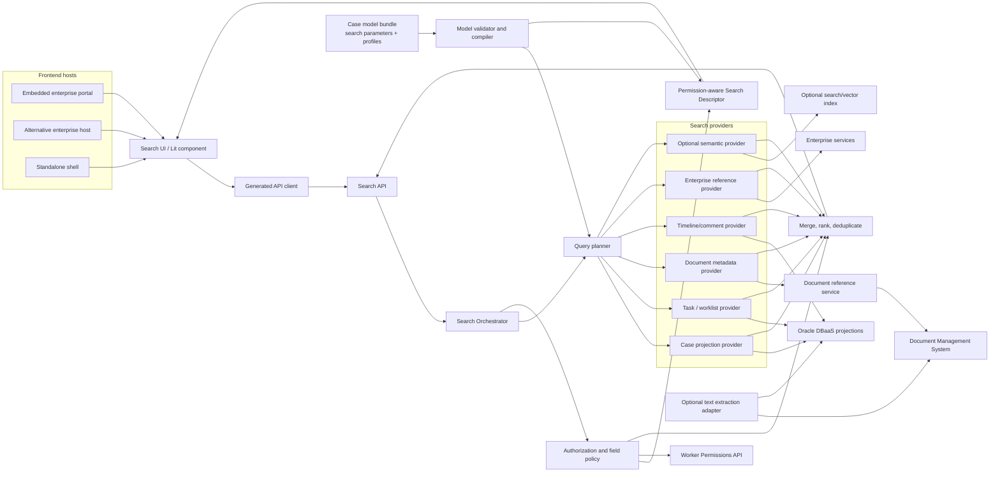
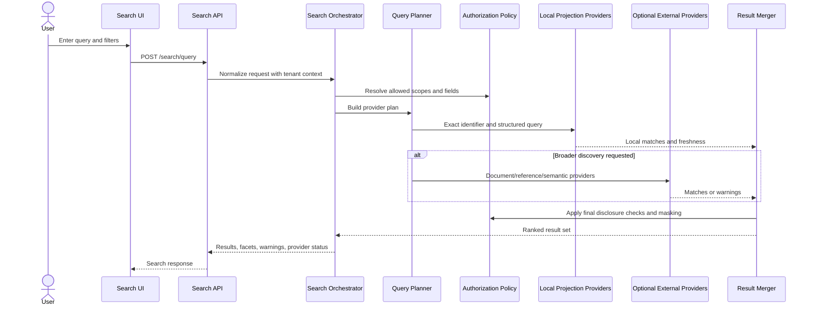
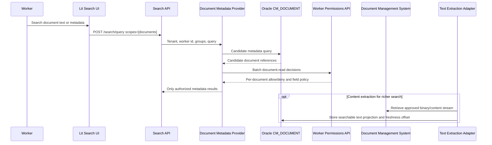

# Search Architecture

Search is a reusable platform capability embedded in each domain-owned case application. It gives
workers one consistent way to find cases, tasks, worklist items, document references, timeline
entries and related business references without turning search into the system of record.

This document distinguishes the implemented provider foundation from the target declarative search
contract. The target model is defined in
[`declarative-case-model-architecture.md`](declarative-case-model-architecture.md). It replaces raw
field paths and arbitrary filter maps with stable search parameters, profiles, permission-aware
descriptors, and generated projection plans.

The default implementation is projection-first: local Oracle-backed projections and indexes are
used before any external search infrastructure is introduced. External search platforms, enterprise
reference providers and semantic/vector search are extension points, not MVP dependencies.

## Principles

| Principle | Requirement |
|---|---|
| Projection first | Default search uses domain-owned Oracle projections and indexes. |
| Provider based | Each searchable module exposes a `SearchProvider` contract instead of coupling the orchestrator to module internals. |
| Authorization before disclosure | Search may match on sensitive fields only when policy permits returning, counting or highlighting them. |
| Rebuildable indexes | Search indexes are read models and must be rebuildable from reliable events or agreed authoritative state. |
| Explicit freshness | Search results include provider status and warning metadata when projections or providers are stale or partial. |
| Host neutral | Embedded enterprise portals and standalone shells consume the same Search API and typed client. |
| Optional federation | Cross-domain search is an event-fed projection concern, not central ownership of domain case data. |
| Controlled semantic search | AI/vector search is optional and only over approved indexed content with audit and masking controls. |
| Stable query contract | Clients use versioned search parameter ids, never storage columns or mutable JSON paths. |
| Capability-specific policy | Match, disclose, filter, sort, facet, suggest, highlight, export and semantic use are authorized independently. |
| Model-compiled plans | Domain models describe intent; provider-specific projection and index plans are generated and reviewed. |

## Component Model



`SearchOrchestrator` owns provider selection, bounded execution, ranking, deduplication, provider
status reporting and warnings. Providers own their own query implementation, source freshness and
result enrichment. The model compiler and Search Descriptor are target components; the current
implementation registers providers and accepts filters directly in code.

## Declarative Search Contract

A field is not simply `searchable`. The canonical field catalog declares the maximum discovery
capabilities policy permits. Versioned search parameters define stable client-facing names and typed
operators. Search profiles assemble those parameters into a workbench, document picker, related-case
view, or other search experience.

| Model element | Responsibility |
|---|---|
| Canonical field | Type, stable id, current JSON Pointer, owner, classification, purpose and policy. |
| Discovery ceiling | Maximum query modes and whether filtering, sorting, facets, suggestions, highlights, result disclosure or semantic use can ever be enabled. |
| Search parameter | Stable query id, type, operators, source field/expression, aliases and provider. |
| Search profile | Scopes, selected parameters, ranking, result view, pagination and availability behavior for one experience. |
| Relationship | Authorized edge definition for related cases, duplicates, references or evidence. |
| Physical plan | Generated provider mapping, projection schema, index strategy, backfill and activation plan. |

Search profile capabilities can narrow a field's discovery ceiling but cannot expand it. A model with
an unsupported operator/type combination, a missing source, or a downstream capability exceeding a
field ceiling is rejected before publication.

Stable parameter ids decouple clients from model evolution. For example, parameter `customer` may
map to `/customerId` in one case-data version and `/customer/id` in the next without changing saved
queries or UI bindings. Deprecated aliases are explicit, and retired ids are never reused.

The target query contract is a typed expression tree:

```json
{
  "profile": "case-workbench",
  "text": "late review",
  "where": {
    "all": [
      { "parameter": "state", "operator": "in", "value": ["open", "in-review"] },
      { "parameter": "customer", "operator": "eq", "value": "customer-42" }
    ]
  },
  "sort": ["updated-at-desc"],
  "cursor": null,
  "limit": 25
}
```

The query compiler validates parameter existence, type, operator, profile membership, provider
capability and caller authorization before invoking a provider. Provider-specific SQL, JSON paths,
search syntax and index names never cross the Search API boundary.

## Cascading Query Flow

Search is planned as a cascade, not a blind fan-out.



Recommended cascade order:

1. Exact identifiers: case id, business key, task id, document id, customer id or account id.
2. Structured filters: case type, state, SLA state, queue, assignee, date range, priority and owner.
3. Approved full-text fields: case title, summaries, comments, timeline labels and document metadata.
4. Relationship expansion: linked cases, duplicate cases, related customers, accounts and documents.
5. Optional semantic search over approved indexed content with audit, masking and explainability.

The planner may stop early for a visible exact case id. It may continue when the UI asks for related
results, facets or broader discovery.

## Provider Contract

The core provider contract is intentionally small:

```text
SearchProvider
  providerId()
  supportedScopes()
  estimateCost(query)
  status()
  search(query)
```

Provider results must include stable ids, result type, title, source provider, matched fields,
optional highlights after masking, freshness and warning metadata. Providers must not return
resources or fields the caller cannot access.

The current implementation starts with `CaseProjectionSearchProvider`, which searches the local
case projection by tenant, state, assignee, case definition key, exact case id, exact or partial
business key and title. User input is treated as literal text: Oracle `LIKE` wildcard characters
such as `%`, `_` and `~` are escaped before query execution. Task, timeline, enterprise reference
and semantic providers are extension points.

The document provider follows the same contract, but with an additional rule: document results are
filtered through the Worker Permissions port before they are returned. Missing or unavailable
authorization produces an `authorization-unavailable` warning and no document results.

## Generated Projection and Index Plans

Domain authors declare search semantics, not DDL. The model compiler combines parameter operations,
data shape, cardinality hints, provider capabilities and the deployment profile into a reviewable
physical plan.

For the Oracle profile, likely strategies are:

| Search need | Candidate implementation |
|---|---|
| Exact or range query on selected scalar fields | Relational projection column with B-tree or function-based index. |
| Repeated scalar values in arrays | Multivalue JSON index or normalized child projection. |
| Approved ad-hoc structural and full-text JSON queries | JSON search index or Oracle Text projection. |
| Heavy cross-domain relevance and aggregation | Optional external search projection with separate justification. |

The generated plan includes projection schema, source mappings, index DDL, transformation version,
tombstone handling, idempotency key, checkpoint strategy, backfill, parity tests, alias activation,
rollback and provenance. Backend index names, analyzers and JSON paths are not public model or API
identifiers.

## Document Search and Extraction

The platform does not store document binaries in the case database. A case stores document
references and approved metadata in `CM_DOCUMENT`; the binary remains in a DMS, object store or
domain-owned content service. Search works in layers:

1. Metadata search over local Oracle rows: document id, filename, category, MIME type, case id,
   linked timestamp and external content reference.
2. Optional extracted-text search over a separate projection owned by a document extraction adapter.
3. Optional semantic search over approved extracted text or summaries, disabled by default.



Document content extraction is deliberately outside the transaction that links a document to a
case. The transaction writes the document reference, a domain event and an audit record. Extraction
workers consume that event or run a rebuild, retrieve content from the DMS through an approved
adapter, apply classification/masking rules, and write only approved searchable text or derived
metadata into a rebuildable projection. Search must remain useful when extraction is delayed by
returning metadata results with explicit freshness and provider status.

Document search authorization requirements:

- Evaluate `document.read` through Worker Permissions before returning document results.
- Treat missing permission decisions as deny.
- Fail closed when Worker Permissions is unavailable.
- Do not return, count, suggest or highlight unauthorized documents.
- Do not expose extracted snippets unless the field policy allows the caller to read that field.
- Keep DMS download URLs or content references out of unauthenticated redirects and logs.

## API Surface

The Search API lives under `/case-api/v2/search`.

| Endpoint | Purpose |
|---|---|
| `GET /search/cases` | Simple case search for case-list and workbench screens. |
| `POST /search/query` | Orchestrated search across selected scopes, filters and providers. |
| `GET /search/suggestions` | Tenant-scoped suggestions for authorized visible results. |
| `GET /search/facets` | Authorized facets for selected scopes and filters. |
| `GET /search/providers` | Provider capabilities, health and freshness. |

Responses include items, page metadata, warnings and provider status. Facets are returned when a
registered provider supports them.

The target contract adds `GET /search/capabilities?profile={id}` (or the equivalent through the
server-composed View API). It returns a caller-specific Search Descriptor containing only authorized
parameters, operators, facets, sorts, result fields and relationship expansions. The Lit search
component renders from this descriptor and never derives field permissions locally.

The current arbitrary `filters` map remains a transitional implementation detail. The target
`POST /search/query` uses stable parameter ids and the typed expression tree above. Orchestrated
search uses an opaque cursor over a stable global ordering; offset/page windows remain available
only on bounded single-provider compatibility endpoints. Exact total counts are optional because
they can be expensive, inconsistent across providers, or disclosure-sensitive.

## Security

Search is a disclosure-sensitive surface because existence, counts, suggestions, facets and
highlights can leak information. All search endpoints derive tenant scope from the authenticated
principal. Request bodies and query parameters do not select tenant.

Required safeguards:

- Apply case/task/document authorization before returning results.
- Apply field-level masking before returning highlights.
- Authorize match, disclosure, aggregation, suggestion, highlight, export and semantic use as
  separate operations; field read permission is the default prerequisite for matching.
- Reject unknown, undeclared or unauthorized search parameters before provider execution.
- Suppress or mask facet counts when counts would reveal hidden records.
- Suppress suggestions that reveal unauthorized resource existence.
- Include negative authorization tests for results, suggestions, facets and highlights.
- Audit search activity where data classification or policy requires it.
- Do not log raw sensitive query values; use approved redaction or keyed audit correlation.

An exception that allows matching without disclosing a field requires a named policy, purpose,
threat analysis and explicit leakage tests. Missing field decisions deny every search operation.
For approved highly sensitive identifiers, a provider may use a keyed exact-match token instead of
plaintext projection storage; that representation cannot support prefix, full-text, suggestion,
facet or highlight operations.

## Operations

Search indexes and projections are read models. They must be observable and rebuildable.

Operational requirements:

- Provider latency, timeout count, partial-result count and error rate.
- Projection lag and rebuild status per provider.
- Bounded provider timeouts.
- Explicit warnings for stale, partial or failed providers.
- Rebuild runbooks for local projections and optional external indexes.
- Multi-instance safe rebuild and indexing jobs, or an explicit single-instance constraint.
- Shadow projection/index creation, backfill checkpoints, parity verification and atomic activation.
- Rollback to the previous active profile and physical alias without rewriting case instances.
- Privacy deletion, retention expiry and document removal propagation to every derived index.

Declarative profile activation follows `draft -> validated -> approved -> materializing -> verifying
-> active -> retired`. A failed build or verification never replaces the active profile. Materialized
versions record the model, search profile, transformation, provider and authorization-policy
revisions that produced them.

## Implementation Status

This repository currently implements the first slice:

- `SearchProvider` and `SearchOrchestrator` in core.
- Local case projection provider with exact id, exact/partial business-key and title matching.
- Document metadata provider over `CM_DOCUMENT`, with Worker Permissions filtering and
  fail-closed authorization warnings.
- Document reference endpoints for linking, listing and removing DMS-backed metadata records.
- Search REST endpoints for cases, orchestrated queries, provider status, suggestions and facets.
- Tenant scope derived from the principal.

### Result ordering and paging

Search results are ranked globally by provider score, then by `updatedAt` descending, and finally
by stable title and identifier tie-breakers. Public requests are limited to 200 items per page and
a 10,000-item result window; requests beyond that window receive `400 invalid-request`. Providers
may receive a larger internal fetch window so orchestration can merge and paginate correctly.

Still to implement:

- Declarative model bundle, canonical field catalog and model compiler.
- Stable search parameters, profiles, relationships and typed query expressions.
- Permission-aware Search Descriptor and capability endpoint.
- Cursor-based global pagination and descriptor-driven Lit search controls.
- Governed shadow-index activation, parity verification and rollback.
- Task/worklist provider.
- Extracted document-text provider.
- Timeline/comment provider.
- Facet-producing projections.
- External search platform integration.
- Semantic search, disabled by default and subject to explicit approval.
