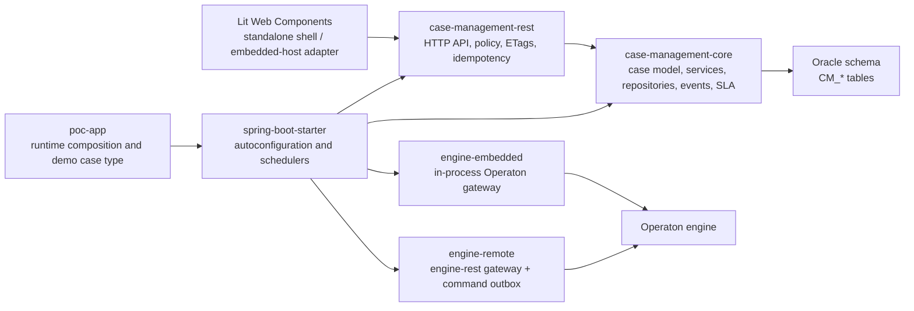
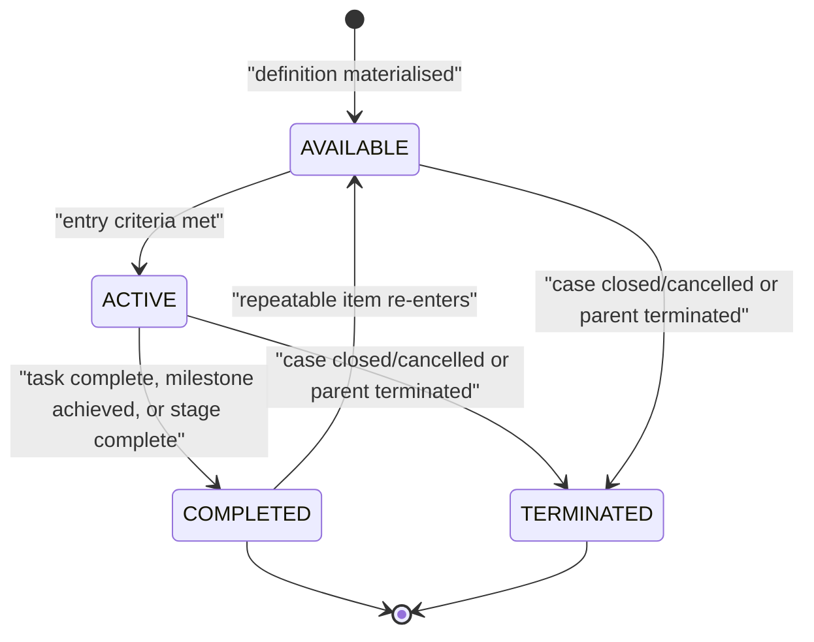
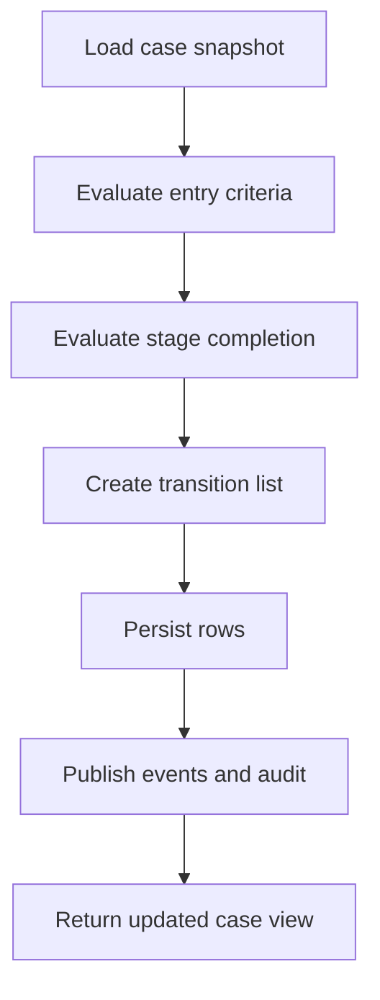
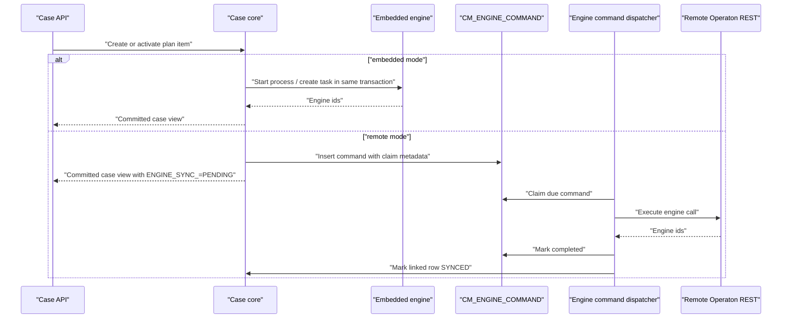

# System Documentation — Case Management on Operaton

> **Status: implementation reference.** This document describes the current architecture,
> runtime contracts, and remaining production-hardening decisions for the case-management
> platform.
>
> Companion documents: [`FINDINGS.md`](../FINDINGS.md) (risk verdicts and known defects),
> [`openapi-specs.md`](../openapi-specs.md) (the published API contract),
> [`db-design.md`](../db-design.md) / [`db-design.sql`](../db-design.sql) (schema),
> [`design principles.md`](../design%20principles.md) (design rationale),
> [`search-architecture.md`](search-architecture.md) (search provider architecture),
> [`declarative-case-model-architecture.md`](declarative-case-model-architecture.md) (target model
> bundle and discovery contract), and
> [`declarative-case-ui-proposal.md`](declarative-case-ui-proposal.md) (target presentation model).

---

## 1. Purpose and scope

This service provides a reusable case-management layer for long-running, human-driven work.
Domain teams deploy it with their own case definitions and own their domain data, operations and
release lifecycle. The platform supplies the common lifecycle, task, event, SLA, authorization,
webhook and UI-integration mechanics; it is not a centrally operated case-management service.

**What exists today:** a backend case-management service built on the Operaton process engine.
It manages *cases* (long-running, human-driven work items) whose structure is described by a
declarative **case definition** rather than by code. The engine is used for human tasks and BPMN
sub-processes; the case lifecycle itself is owned by this service.

**UI scope:** the backend remains the main implemented surface, but a Lit Web Components package
now provides the standalone shell and a generic enterprise portal-adapter contract.
Detailed product UX and form-rendering decisions remain outside this PoC. The model bundle,
server-composed View API, Search Descriptor and generic renderer are target architecture and are not
implemented by the current runtime.

---

## 2. Module map

| Module | Responsibility | Depends on |
|---|---|---|
| `case-management-core` | Domain model, plan-item state machine, criterion evaluation, persistence, services, transactional outbox, webhook dispatch, SLA clocks | — (no Operaton engine types) |
| `case-management-engine-embedded` | `EngineGateway` over the in-process Operaton Java API | core |
| `case-management-engine-remote` | `EngineGateway` over Operaton `engine-rest` HTTP | core |
| `case-management-rest` | HTTP layer: controllers, authorization policy, problem+json, ETag, idempotency | core |
| `case-management-spring-boot-starter` | Auto-configuration, properties, schedulers, architecture rules | core, rest, both gateways (optional) |
| `case-management-poc-app` | Runnable demo application and the complaint case type | starter |
| `case-management-web-components` | Lit shell, generated-client entry point and adapters for standalone and embedded enterprise portal hosting | API contract |

**Architectural invariant, enforced by ArchUnit:** `case-management-core` must not depend on any
`org.operaton.bpm.engine` type. The one exception is `org.operaton.bpm.impl.juel` — an expression
library, not the engine. Enforced repo-wide by `CrossModuleArchitectureTest` in `poc-app`.

**Second invariant, enforced by `NoCaseTypeVocabularyTest`:** no case-type vocabulary
(`complaint`, and terms derived from the deployed definition) outside `case-management-poc-app`.

---

## 3. HTTP API

All endpoints are under `/case-api/v2`. The authoritative contract is
[`openapi-specs.md`](../openapi-specs.md); this table is the implementation inventory.

### 3.1 Cases — `CaseController`

| Method | Path | Notes |
|---|---|---|
| `POST` | `/cases` | Accepts `Idempotency-Key`. Returns `201` + `ETag` |
| `GET` | `/cases` | `Page` envelope; filters: `state` (repeatable), plus others. `pageSize` capped at 200 |
| `GET` | `/cases/{caseId}` | Returns `availableActions[]` |
| `PATCH` | `/cases/{caseId}` | `application/merge-patch+json`; requires `If-Match` |
| `POST` | `/cases/{caseId}/close` | Requires `If-Match` |
| `POST` | `/cases/{caseId}/cancel` | Requires `If-Match` |

### 3.2 Plan items — `PlanItemController`

| Method | Path |
|---|---|
| `GET` | `/cases/{caseId}/plan-items` |
| `POST` | `/cases/{caseId}/plan-items/{itemId}/enable` |
| `POST` | `/cases/{caseId}/plan-items/{itemId}/start` |
| `POST` | `/cases/{caseId}/plan-items/{itemId}/complete` |
| `POST` | `/cases/{caseId}/plan-items/{itemId}/terminate` |

All four actions funnel through a single `act` method — the only route to `PlanItemService`.

### 3.3 Tasks — `TaskController`

| Method | Path | Notes |
|---|---|---|
| `GET` | `/tasks` | Worklist. Tenant-scoped; hides unsynced tasks |
| `GET` | `/cases/{caseId}/tasks` | |
| `POST` | `/tasks/{taskId}/claim` | Requires `If-Match` |
| `POST` | `/tasks/{taskId}/complete` | Requires `If-Match`; validates the form payload |

### 3.4 Collaboration — `CollaborationController`

| Method | Path | Notes |
|---|---|---|
| `GET` / `POST` | `/cases/{caseId}/comments` | |
| `GET` / `POST` | `/cases/{caseId}/documents` | Document metadata references; binary content remains in DMS/S3 |
| `DELETE` | `/cases/{caseId}/documents/{documentId}` | Removes the case document reference |
| `GET` | `/cases/{caseId}/milestones` | |
| `POST` | `/cases/{caseId}/milestones/{milestoneId}/achieve` | Requires `If-Match` |
| `GET` / `POST` | `/cases/{caseId}/processes` | `POST` accepts `planItemId`; requires `If-Match` |

### 3.5 SLA — `SlaController`

| Method | Path |
|---|---|
| `GET` | `/cases/{caseId}/slas` |
| `POST` | `/cases/{caseId}/slas/{slaId}/pause` |
| `POST` | `/cases/{caseId}/slas/{slaId}/resume` |

### 3.6 Case definitions — `CaseDefinitionController`

| Method | Path | Notes |
|---|---|---|
| `POST` | `/case-definitions` | Admin-gated. Tenant derived from the principal |
| `GET` | `/case-definitions` | Tenant-scoped |
| `GET` | `/case-definitions/{key}` | |
| `GET` | `/case-definitions/{key}/forms/{formKey}` | Tenant-scoped through the authenticated principal |

### 3.7 Events and webhooks — `EventController`

| Method | Path | Notes |
|---|---|---|
| `GET` | `/events` | Tenant-scoped cursor feed over serialized event sequence |
| `GET` | `/cases/{caseId}/events` | |
| `GET` / `POST` | `/webhooks` | `POST` admin-gated; tenant from the principal |
| `GET` | `/webhooks/{webhookId}/dead-letters` | Admin-gated; pageable and capped at 200 rows per page |
| `POST` | `/webhooks/{webhookId}/dead-letters/redeliver` | Admin-gated; resets all DEAD rows for the subscription to PENDING |

### 3.8 Search — `SearchController`

| Method | Path | Notes |
|---|---|---|
| `GET` | `/search/cases` | Tenant-scoped case search over local projections |
| `POST` | `/search/query` | Orchestrated search across requested scopes and registered providers |
| `GET` | `/search/suggestions` | Tenant-scoped suggestions over visible provider results |
| `GET` | `/search/facets` | Facet endpoint; returns warnings when no provider supplies facets |
| `GET` | `/search/providers` | Provider capabilities, status and freshness |

Search is provider-based rather than a direct dependency from the REST layer to every searchable
module. The first providers search the local case projection and document metadata references.
The document provider calls the Worker Permissions port before returning document results and
fails closed with an `authorization-unavailable` warning when authorization cannot be evaluated.
Task, timeline, enterprise-reference and semantic providers are extension points. See
[`search-architecture.md`](search-architecture.md).

The target declarative contract adds stable search parameters and profiles, a permission-aware Search
Descriptor, typed query expressions and generated projection/index plans. These remain proposed
capabilities; current requests use the implemented provider and filter contracts described above.

---

## 4. Cross-cutting HTTP concerns

### 4.1 Errors — `ProblemDetailHandler`

RFC 9457 `application/problem+json` on every error path. Extends
`ResponseEntityExceptionHandler`, so framework-raised errors (malformed body) use the same shape.

Codes in use: `not-found`, `version-conflict`, `precondition-failed`, `if-match-required`,
`form-invalid`, `invalid-request`, `case-definition-invalid`, `idempotency-conflict`,
`forbidden`, `model-error`, `server-error`.

`form-invalid` carries a `violations[]` array whose `pointer` is a real **RFC 6901 JSON Pointer**
(`/outcome`, `/nested/outcome`, and `""` for a missing required field at the document root), so a
renderer can bind messages to inputs without domain knowledge.

### 4.2 Concurrency — `ETagSupport`

Every mutable row carries `VERSION_`. Updates are
`UPDATE … SET VERSION_ = VERSION_ + 1 WHERE ID_ = :id AND VERSION_ = :expected`; zero rows means
conflict, never retry. The version is the `ETag`, and it is **always constructed locally** as
`version + 1` — never re-read, because a re-read is a second statement a concurrent writer can
commit in front of.

`If-Match: *` is supported (proceed if a representation exists, else `412`).

### 4.3 Idempotency — `IdempotencySupport`

`Idempotency-Key` on `POST /cases`, scoped per caller. Claim → execute → complete. Replay returns
the original status and body. Duplicate requests against an unfinished claim receive `409` and do
not execute business work; client-error failures release their own claim with an owner token.

### 4.4 Identity, roles and tenancy — `CallerResolver`, `ActionPolicy`

- **Tenant** is derived from a `tenant:<id>` authority on the principal — **never from a request
  body**. Exactly one is required; zero or several is a `403`.
- **Case roles** come from `CM_PARTICIPANT` (`owner`, `handler`, `watcher`).
- **Identity groups** come from the principal and are matched against a task's candidate groups.

`ActionPolicy` is the single source of truth for both **projection** (`availableActions[]`) and
**enforcement** (`assertAllowedOn*`). Both surfaces delegate to the same rule so they cannot
disagree — but **enforcement lives in the service layer too**, because a client that POSTs a URL
directly never reads the projection.

Action vocabulary: `update`, `close`, `cancel`, `enable`, `start`, `complete`, `terminate`,
`claim`, `comment`, `add-document`, `remove-document`, `achieve`, `pause`, `resume`,
`start-process`, `deploy-case-definition`, `subscribe-webhook`.

Production deployments should keep three authorization concerns separate:

- **Tenant membership** decides which tenant-scoped records a caller may see. The API derives this
  from identity-provider authorities such as `tenant:t1`; request bodies never choose a tenant.
- **Enterprise groups** decide pool eligibility, for example whether a caller can claim a task whose
  candidate group is `complaints-handlers`.
- **Case participants** decide case-local rights such as owner, handler, reviewer or watcher.

The PoC keeps this compact, but the intended production model is OIDC/JWT at the boundary, a
tenant-aware `CallerResolver`, and an `ActionPolicy` backed by Worker Permissions or an equivalent
enterprise authorization source. Case-definition deployment rejects candidate groups that collide
with reserved participant role names, so a global group cannot accidentally become a case-local role.

---

## 5. Core domain

### 5.1 Model

`CaseDefinition` (+ `PlanItemDefinition`) is the declarative template. `CaseInstance` is a running
case; `PlanItem` is a running element within it; `CaseTask` is a human task mirrored from the engine.

Enums: `CaseState`, `CasePriority`, `PlanItemState`, `PlanItemType` (`STAGE`, `HUMAN_TASK`,
`PROCESS_TASK`, `MILESTONE`), `TaskState`.

### 5.2 The plan model engine — `rules/`

| Component | Responsibility |
|---|---|
| `PlanModelInstantiator` | Materialises plan items from a definition; handles repetition |
| `PlanModelEvaluator` | One evaluation pass: entry criteria, stage completion, cascade termination |
| `StageCompletion` | Containment, blocking items, cascade-to-subtree, cycle guard |
| `JuelCriterionEvaluator` | Sandboxed JUEL expression evaluation for sentries |
| `CaseSnapshot` | The read model an evaluation pass and the policy both operate on |
| `Transition` | A state change the service layer persists and publishes |

The evaluator defers autocomplete for a stage that just became active, giving contained children
one evaluation round to materialise before leftover-child termination is considered.

One evaluation pass is intentionally deterministic:

1. The service loads one `CaseSnapshot` containing the case, plan items, tasks, milestones and
   relevant variables.
2. `PlanModelEvaluator` evaluates entry criteria against inactive items and emits transitions for
   items that may become active.
3. `StageCompletion` evaluates active stages only after their children have had a chance to
   materialise in a previous pass.
4. The service persists emitted transitions through `TransitionApplier`, which creates mirrored human
   tasks, starts process commands, achieves milestones and publishes events as needed.
5. Repetition is bounded by `MAX_REPETITIONS_PER_ITEM`; hitting the cap is treated as a model-design
   warning, not as unbounded runtime work.

### 5.3 Services

`CaseService`, `PlanItemService`, `CaseTaskService`, `CommentService`, `DocumentService`,
`MilestoneService`, `LinkedProcessService`, `WebhookService`, `CaseDefinitionService`,
`SlaService`.

The module pattern for a mutation is **row + event + audit in one transaction**, applied via
`TransitionApplier`. `case-management-core` has a real `DataSourceTransactionManager`, so
`@Transactional` genuinely works — **but only through a Spring proxy**.

---

## 6. Engine integration

`EngineGateway` is the only seam. Two implementations pass one shared contract suite
(`EngineGatewayContract`), which is what makes two-mode equivalence a tested property rather than
an assertion.

| Mode | Gateway | Transaction semantics |
|---|---|---|
| `embedded` | `EmbeddedEngineGateway` | The engine call joins the case transaction |
| `remote` | `RemoteEngineGateway` behind `OutboxEngineGateway` | Cannot join; commands go to `CM_ENGINE_COMMAND` and are drained by `EngineCommandDispatcher` |

In remote mode a row is written with `ENGINE_SYNC_ = PENDING` and an engine id is written back on
success. The worklist hides unsynced tasks; linked processes deliberately do not.

---

## 7. Events, outbox and webhooks

### 7.1 The transactional outbox

A mutation writes the domain row, a `CM_EVENT` row, a `CM_AUDIT_LOG` row and any
`CM_WEBHOOK_DELIVERY` fan-out **in one local transaction**. Proven under rollback by mutation
testing (R4 in `FINDINGS.md`).

Events are CloudEvents. `source` is hard-set from the configured engine id.

Event types: `case.created`, `case.updated`, `case.closed`, `case.cancelled`,
`case.planitem.transitioned`, `case.task.created`, `case.task.claimed`, `case.task.completed`,
`case.comment.added`, `case.document.added`, `case.document.removed`,
`case.milestone.achieved`, `case.process.started`, `case.sla.started`, `case.sla.paused`,
`case.sla.resumed`, `case.sla.warning`, `case.sla.breached`,
`case.sla.escalated`.

### 7.2 Webhook delivery

`WebhookDispatcher` claims due deliveries with a claim-by-`UPDATE` protocol (per-call token +
lease), signs the body with HMAC-SHA256 (`X-Case-Signature: sha256=…`), POSTs it, and applies a
retry ladder before dead-lettering.

Secrets are stored as both a one-way verification hash (`SECRET_HASH_`) and encrypted signing
material (`SECRET_KEY_ID_`, `SECRET_CIPHERTEXT_`). The plaintext is returned exactly once at
subscription time; the dispatcher resolves the encrypted material through `WebhookSecretStore`, so
existing subscriptions survive application restarts when the same encryption key is configured.

### 7.3 The pull feed

`GET /events` is the designated recovery path for consumers that missed a webhook. `EventRepository`
serializes sequence allocation with a transaction-held append lock before writing `CM_EVENT`, so a
later sequence cannot become visible before an earlier committed one. This keeps the numeric cursor
safe for pull recovery at the cost of serializing event appends.

---

## 8. SLA

`SlaService` starts, pauses and resumes clocks; `SlaSweeper` emits warnings, breaches and
escalation events on a schedule; `BusinessCalendar` does working-time arithmetic.

The calendar deliberately **rejects** overnight/inverted intervals and overlapping same-day
intervals at parse time, and rejects negative durations — an earlier overlap bug *deflated* due
dates, which is the dangerous direction for a breach calculation.

Resume re-derives the deadline through the calendar rather than adding wall-clock time.

SLA targets may whitelist pause reasons. The legacy database column is named
`PAUSED_STATES_JSON_`, but it is interpreted as pause reasons, not lifecycle states.

---

## 9. Persistence

Schema source of truth: [`db-design.sql`](../db-design.sql), executed by an applied Liquibase
changeset and **never re-typed**. PoC-only additions go in `cm-poc-additions.xml`; an applied
changeset is never edited.

**Access pattern:** Spring `JdbcClient`, no ORM. One repository per aggregate.

### 9.1 Tables with a code path

`CM_CASE`, `CM_CASE_DEF`, `CM_PLAN_ITEM`, `CM_PLAN_ITEM_DEF`, `CM_TASK`, `CM_PARTICIPANT`,
`CM_COMMENT`, `CM_MILESTONE`, `CM_LINKED_PROCESS`, `CM_EVENT`, `CM_AUDIT_LOG`, `CM_WEBHOOK_SUB`,
`CM_WEBHOOK_DELIVERY`, `CM_ENGINE_COMMAND`, `CM_IDEMPOTENCY_KEY`, `CM_SLA_POLICY`,
`CM_SLA_TARGET`, `CM_SLA_RECORD`, `CM_BUSINESS_CALENDAR`.

### 9.2 Tables with DDL and no code path

`CM_BULK_OPERATION`, `CM_BULK_OPERATION_ITEM`, `CM_CASE_LINK`, `CM_DEF_IDENTITY_LINK`,
`CM_DOCUMENT`, `CM_QUEUE`, `CM_SAVED_FILTER`.

Deliberate scope — `db-design.sql` is the full target schema and the PoC implements a subset.
Recorded so unused DDL is not mistaken for a missing implementation.

`FINDINGS.md` now aligns to this table inventory.

### 9.3 Identifier formats

- Case definition: `{tenant}:{key}:{version}` — tenant-qualified so two tenants can share a key.
- Case instance: `{engineId}:{uuid}`.

---

## 10. Configuration

| Property | Default | Meaning |
|---|---|---|
| `casemgmt.enabled` | `true` | Master switch; `false` leaves a plain Operaton app untouched |
| `casemgmt.engine-id` | — | Stamped as CloudEvent `source` |
| `casemgmt.engine.mode` | `embedded` | `embedded` \| `remote` |
| `casemgmt.engine.remote.base-url` | — | `engine-rest` root |
| `casemgmt.engine.remote.auth-mode` | `auto` | `auto` \| `none` \| `basic` \| `bearer` |
| `casemgmt.engine.remote.username` / `.password` | — | Basic auth credentials when `auth-mode=basic` |
| `casemgmt.engine.remote.bearer-token` | — | Static bearer token for controlled deployments; prefer a `RemoteEngineBearerTokenProvider` bean for OIDC/client-credential integration |
| `casemgmt.engine.remote.connect-timeout-ms` | `5000` | |
| `casemgmt.engine.remote.read-timeout-ms` | `10000` | Bounds a hung-but-connected engine |
| `casemgmt.events.type-prefix` | **none** | **Startup fails if webhooks are enabled and this is unset** |
| `casemgmt.webhooks.secret-encryption-key` | **none** | Base64 AES key for encrypted webhook signing material |
| `casemgmt.webhooks.secret-key-id` | `default` | Key identifier stored with encrypted webhook secrets |
| `casemgmt.security.mode` | `basic` | PoC local mode; set `oidc` for JWT/OIDC resource-server mode |
| `casemgmt.security.oidc.*` | claim defaults | Principal, tenant, group and Worker Permissions claim mapping |
| `casemgmt.schedulers.enabled` | `true` | |
| `casemgmt.schedulers.webhook-interval-ms` | `5000` | |
| `casemgmt.schedulers.engine-command-interval-ms` | `5000` | |
| `casemgmt.schedulers.sla-sweep-interval-ms` | `60000` | |
| `casemgmt.schedulers.idempotency-purge-interval-ms` | `3600000` | |

**Substitutable beans** (declared `@ConditionalOnMissingBean`): `CallerResolver`, `ActionPolicy`,
`CriterionEvaluator`, `FormValidator`, `EventPublisher`. Controllers arrive via `@Import` and are
**not** overridable.

Production deployments should monitor scheduler lease age, dead-letter volume, engine-command
backlog, SLA sweep lag, webhook signing-secret key configuration, and event cursor lag.

---

## 11. Testing strategy

- **Real Oracle 23ai via Testcontainers** for anything touching the schema. No H2 — the DDL uses
  `IS JSON` constraints H2 does not implement.
- **Real Operaton engines** in both modes; the remote-mode IT boots two application contexts.
- **One shared gateway contract** executed by both gateway implementations.
- **Mechanism stripping**: every test asserting a failure or a guard was proven able to fail by
  removing the mechanism and observing the expected failure.
- **Architecture rules** (`CrossModuleArchitectureTest`, `NoCaseTypeVocabularyTest`) run repo-wide.
- **OpenAPI conformance** validates live responses against the published contract, including case
  creation, case reads, task reads, case-definition discovery and dead-letter responses.

The test suite requires Docker for Oracle Testcontainers and, for the PoC module, embedded and
remote Operaton integration contexts.

---

## 12. Known limitations

Do not treat this section as complete — [`FINDINGS.md`](../FINDINGS.md) and the
[issue tracker](https://github.com/Ronrock/case-management-design/issues) remain the working risk
register. The items that most affect production use after the structural fixes are:

1. **Detailed UX/form-rendering behavior is still limited** — the Lit package provides shell and
   portal contracts, not a production-grade bank workflow UI.
2. **Remote engine authentication still needs bank integration** — OIDC/resource-server support and
   bearer-token hooks exist, but production deployments must plug in the bank's token source and
   Worker Permissions mapping.
3. **Direct Operaton Tasklist writes are blocked for ordinary users, not reconciled** — managed
   tasks should still be operated through the case API; if Tasklist must stay available for writes,
   an engine-side reconciliation listener is required.

---

## 13. Glossary

Glossary: case, case definition, plan item, stage, sentry/criterion, milestone, discretionary
item, worklist, outbox, tenant, participant role and identity group.
